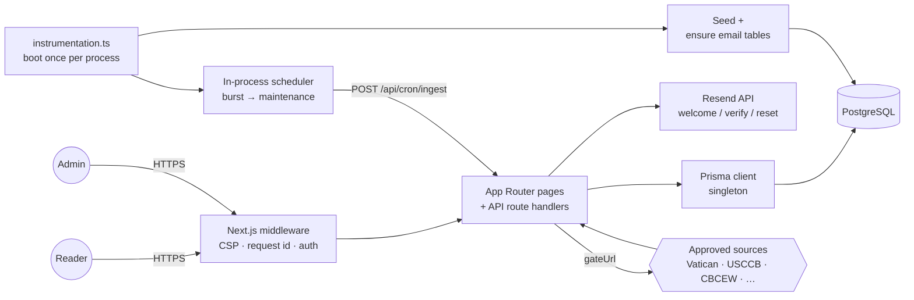

# Via Fidei

> _The Way of Faith._ A multilingual Catholic platform — prayers, saints,
> sacramental guidance, liturgy, and parish discovery — presented with reverence
> and clarity.

**Live site: [etviafidei.com](https://etviafidei.com)**

Via Fidei is a Next.js 14 application that pairs a public, reader-facing site
with an authenticated admin console for curating Catholic content. It supports
twelve locales, persists data in PostgreSQL via Prisma, and ingests material
from a curated allowlist of credible Catholic sources through a cron pipeline
that auto-publishes new records (they reach the public site directly) and only
sends content into a moderation queue when an admin manually edits it.

The public site exposes nine tabs — **Home**, **Prayers**, **Sacraments**,
**Spiritual Life**, **Spiritual Guidance** (the parish finder), **Liturgy**,
**History**, **Saints & Our Lady**, and the authenticated **Profile** — plus an
admin console under `/admin` that operates with its own chrome (the public
navigation is suppressed automatically on every `/admin` route).

## Site, domain, and email facts

A few infrastructure facts that don't change very often and shouldn't be
edited blindly:

- **Official site name.** The official website name is **Via Fidei** and is
  used everywhere in copy, metadata, and templates.
- **Canonical domain.** The canonical production domain is
  **`https://etviafidei.com`**. It is hardcoded in `src/lib/config.ts` and
  used for metadata, sitemap, robots, and email links — no environment
  variable required.
- **Admin dashboard.** The admin console is served at **`/admin`** and only
  at `/admin`. The login screen is at `/admin/login`. Admin credentials are
  managed exclusively through the existing `ADMIN_USERNAME` / `ADMIN_PASSWORD`
  server environment variables — there is no admin UI for credential changes.
- **Sitemap.** The sitemap is served at **`/sitemap.xml`**. There is **one**
  authoritative source: `src/app/sitemap.ts`. Next's metadata route handler
  generates the XML dynamically (static public pages plus published-content
  detail entries pulled from the database with `updatedAt` as `lastmod`).
  Do not add a static `public/sitemap.xml` — that creates two conflicting
  sources. Google Search Console fetches `/sitemap.xml`.
- **Google Search Console verification.** The file
  `public/google0292583cfdf40074.html` is intentionally kept in the public
  folder. **Do not rename, move, or remove it** — Google revalidates the
  property by fetching that exact path.
- **Transactional sender address.** The official transactional sender address
  is **`notifications@etviafidei.com`**, hardcoded in `src/lib/config.ts`.
  It is the only address used for account-related email (welcome, password
  reset, email verification). Email is delivered via **Resend** when
  `RESEND_API_KEY` is set; without it, email features are safely skipped
  and the rest of the auth flow still succeeds.
- **Email DNS records are managed externally.** SPF, DKIM, DMARC, and
  return-path records live at the DNS provider and authoritatively belong
  there. **App code must not generate, write, or overwrite DNS records.**

---

## Stack

| Area               | Choice                                                                                 |
| ------------------ | -------------------------------------------------------------------------------------- |
| Framework          | Next.js `15.5.18` (App Router, async cookies/headers, `output: "standalone"`)          |
| Runtime            | Node.js `>= 20`                                                                        |
| Language           | TypeScript `5.6` (strict)                                                              |
| UI                 | React `18.3`, Tailwind CSS `3.4`, Framer Motion                                        |
| Database           | PostgreSQL via Prisma `5.22`                                                           |
| Sessions           | `iron-session` (encrypted cookie, `vf_session`)                                        |
| Password hashing   | `argon2id`                                                                             |
| Validation         | `zod`                                                                                  |
| Locale negotiation | `negotiator` + cookie override                                                         |
| Container          | Multi-stage `Dockerfile` (deps → builder → runner)                                     |
| Deployment         | Railway-ready (`railway.json`, healthcheck on `/api/health/live`)                      |
| Email              | Resend transactional sends (welcome, password reset, email verification)               |
| Startup            | `instrumentation.ts` auto-seeds an empty DB and schedules in-process Vatican ingestion |
| Unit / API tests   | Vitest 3 + v8 coverage (mocked Prisma, Next route handler imports)                     |
| Component tests    | React Testing Library 15 + jsdom + jest-axe                                            |
| End-to-end tests   | Playwright (chromium + mobile-chromium) with visual + perf smoke                       |

---

## Engineering highlights

The repository is intentionally scoped as a portfolio-grade reference for the
kind of trade-offs a small team makes when they want a production-leaning
Next.js application that is honest about its boundaries. The pieces I
would call attention to:

- **Ingestion as a first-class subsystem.** A curated allowlist of Vatican,
  USCCB, and dicastery hosts gates every fetch (`gateUrl` /
  `isApprovedUrl`). Adapters write through a single persistence layer that
  enforces content-hash dedupe, source attribution, and per-run summary
  logs (created / updated / skipped / failed / review-required). The
  in-process scheduler runs in burst mode while the catalog is below
  target and drops to a maintenance interval afterward — no external
  cron service required.
- **Admin diagnostics designed around troubleshooting.** Diagnostics are
  split into five sections — Email; Ingestion & Data Management; Sitemap
  & Link Paths; Accounts; and Homepage Saints Feast Day — and each
  result carries severity (pass / warn / fail / skipped), a timestamp,
  a request id, and a short explanation so failures can be
  cross-referenced against the structured log stream. Secrets, database
  URLs, and token values are explicitly stripped before any value is
  rendered to the browser. Every diagnostic page is backed by a
  matching `/api/admin/diagnostics/...` route.
- **Real per-item Data Management logs.** Every ingestion run writes
  one DataManagementLog row per accepted, skipped, rejected, or
  category-fixed item — with the reason, source, job, and triggeredBy
  flag — so the admin Logs page can answer "why is the count not
  changing?" precisely instead of showing an unexplained zero.
- **Ingestion run logs and per-item action logs are both
  first-class.** `/admin/logs/ingestion` reads from `IngestionJobRun`
  (per-run picture: source, job, status, counts, duration, error
  message). `/admin/logs/data-management` reads from
  `DataManagementLog` (per-item picture: add / update / dedupe /
  reject / cleanup / category-fix). Each has its own admin page with
  filtering.
- **Manual "Run ingestion now" and "Run data cleanup now" buttons.**
  Both surface clear success or failure feedback inline — counts on
  success, error message on failure — and write to AdminAuditLog so
  the action is traceable.
- **Security headers and observability baked into middleware.** The
  edge middleware sets CSP, X-Frame-Options, X-Content-Type-Options,
  Referrer-Policy, Permissions-Policy, and HSTS (production only), and
  generates / validates an `X-Request-Id` header for every request so
  it can ride through every log line.
- **A strict approved-source posture for ingestion.** Anything not on the
  Vatican-allowlist is rejected before it reaches the database. The same
  helper gates outbound fetches so adapters cannot accidentally call an
  off-list host. Tests exercise the allowlist directly so the boundary
  cannot regress quietly.
- **Tooling matches the merge bar.** `npm run verify` is the local
  short-form gate (typecheck + lint + format:check + unit tests).
  `npm run verify:full` adds integration + e2e + production build for
  pre-release runs. CI runs the same checks plus a high-severity audit
  gate and a moderate-severity advisory job.

## Screenshots

> 📷 _Screenshot placeholders — replace with rendered captures of each
> surface before publishing. Suggested filenames live under
> `docs/screenshots/` (gitignored by default; commit only the rendered
> versions you intend to ship)._

| Surface                          | Image                                                        |
| -------------------------------- | ------------------------------------------------------------ |
| Home — public landing            | `docs/screenshots/home.png` _(placeholder)_                  |
| Saints calendar — today          | `docs/screenshots/saints-today.png` _(placeholder)_          |
| Prayers index with rite filter   | `docs/screenshots/prayers.png` _(placeholder)_               |
| Spiritual Guidance parish finder | `docs/screenshots/parish-finder.png` _(placeholder)_         |
| Admin console — data management  | `docs/screenshots/admin-data-management.png` _(placeholder)_ |
| Admin diagnostics                | `docs/screenshots/admin-diagnostics.png` _(placeholder)_     |

## Architecture at a glance



The full content lifecycle — ingestion → moderation → publish — is laid
out in [`## Content injection (ingestion) pipeline`](#content-injection-ingestion-pipeline)
below.

---

## Repository layout

```
.
├── prisma/
│   ├── schema.prisma          # Postgres schema (users, content, ingestion, audit, rate limits)
│   ├── migrations/            # Prisma migrations
│   ├── seed.ts                # `npm run db:seed` entrypoint
│   └── seeds/                 # Domain seed data (prayers, saints, apparitions, devotions,
│                              #                   parishes, liturgy entries, spiritual-life
│                              #                   guides, site settings)
├── public/                    # Static assets (favicon, Search Console verification file)
├── src/
│   ├── app/                   # App Router routes
│   │   ├── (public pages)     # /, /prayers, /prayers/[slug], /saints,
│   │   │                      # /saints/[slug], /saints/today, /devotions,
│   │   │                      # /devotions/[slug], /sacraments, /sacraments/[slug],
│   │   │                      # /spiritual-life, /spiritual-life/[slug],
│   │   │                      # /spiritual-guidance, /spiritual-guidance/[slug],
│   │   │                      # /liturgy, /liturgy-history, /liturgy-history/[slug],
│   │   │                      # /history, /search, /login, /register,
│   │   │                      # /forgot-password, /reset-password, /verify-email,
│   │   │                      # /privacy
│   │   ├── profile/           # /profile, /profile/journal, /profile/goals,
│   │   │                      # /profile/goals/completed (preserved
│   │   │                      # history of finished goals + their
│   │   │                      # checklists and journal entries),
│   │   │                      # /profile/milestones, /profile/prayers,
│   │   │                      # /profile/saints, /profile/apparitions,
│   │   │                      # /profile/devotions, /profile/parishes,
│   │   │                      # /profile/settings
│   │   ├── admin/             # 17-card admin dashboard (see Admin console section)
│   │   └── api/               # Route handlers (auth, admin, cron, internal,
│   │                          # journal, settings, health, search, saints/today,
│   │                          # data-management, ingestion-status)
│   ├── components/
│   │   ├── icons/             # Cross ornament, Marian monogram, search, hamburger,
│   │   │                      # user silhouette, spiritual-life icons, logo
│   │   ├── layout/            # Header, footer, brand, nav, mobile menu, search,
│   │   │                      # user menu, route error
│   │   ├── profile/           # Avatar, save button, unverified-email notice
│   │   └── ui/                # ConfirmDialog, PageHero, RemoveSavedButton,
│   │                          # AccountRequiredButton, LoginRequiredPopup,
│   │                          # ExpandablePrayer, ExpandableTimelineEvent
│   ├── lib/
│   │   ├── auth/              # Session, password, schemas, user/admin helpers, tokens
│   │   ├── audit/             # AdminAuditLog writer
│   │   ├── concurrency/       # Lock helpers
│   │   ├── content/           # Review workflow + Catholic-rite filtering
│   │   ├── data/              # Per-entity repositories + admin catalog + goal templates
│   │   ├── db/                # Prisma client, table diagnostics, init
│   │   ├── email/             # Resend client, link builders, templates,
│   │   │                      # send helpers, locale-aware translations
│   │   ├── http/              # Fetch client, retries, timeouts, JSON responses,
│   │   │                      # admin-catalog + saved-item route factories
│   │   ├── i18n/              # 12-locale dictionaries, negotiator, translator,
│   │   │                      # locale / theme / rite cookies
│   │   ├── ingestion/         # Adapters, registry, runner, scheduler, persist
│   │   ├── observability/     # Structured logger + request-id propagation
│   │   ├── security/          # Rate limit, hashing, crypto, request helpers,
│   │   │                      # cron-auth, key resolution
│   │   └── startup/           # Auto-seed bootstrap + content seeder
│   ├── instrumentation.ts     # Next.js startup hook (auto-seed + ingestion schedule)
│   └── middleware.ts          # Request-id + CSP / security headers
├── tests/                     # Vitest unit + component + API + ingestion + DB tests
│   ├── auth/                  # Auth module (password, schemas, user, tokens, admin)
│   ├── api/                   # Route handler tests (mocked Prisma)
│   ├── components/            # RTL tests with `@vitest-environment jsdom`
│   ├── data/                  # Repository tests (admin-users, etc.)
│   ├── db/                    # checkRequiredTables / checkSeedContent
│   ├── email/                 # Resend client, templates, link builders, send helpers
│   ├── fixtures/              # Factories + mock SourceAdapter / fetch
│   ├── helpers/               # Prisma + cookie mocks
│   ├── ingestion/             # validateItem + sanitize boundary tests
│   ├── integration/           # Real-DB tests, gated behind VITEST_INTEGRATION=1
│   ├── routes/                # Static route coverage check
│   ├── security/              # Rate limit DB + memory fallback
│   └── middleware.test.ts     # Request-id + security headers
├── e2e/                       # Playwright smoke + visual regression + perf
├── scripts/
│   ├── start.sh               # Container entrypoint (wait for DB → migrate deploy → exec server)
│   └── test-db.sh             # Reset isolated test DB (refuses prod URLs)
├── playwright.config.ts       # E2E + visual regression config
├── vitest.config.ts           # Unit + component test config (coverage thresholds)
├── TESTING.md                 # Test stack reference (commands, layout, isolation)
├── Dockerfile                 # Multi-stage production image
├── railway.json               # Railway deploy + healthcheck config
├── next.config.js             # standalone output, image hosts, security headers
├── tailwind.config.ts         # Liturgical palette + Cormorant/Inter typography
├── tsconfig.json              # `@/*` → `src/*`
└── .env.example               # All recognized environment variables
```

---

## Getting started

### Prerequisites

- Node.js 20+
- npm (the repo ships a `package-lock.json`)
- A reachable PostgreSQL database

### Install and configure

```bash
npm install
cp .env.example .env
```

Edit `.env` and set at minimum `DATABASE_URL`. For local development the
session secret and admin credentials may be omitted (the app falls back to a
dev-only secret), but they are **required** in production — see
[Environment](#environment).

### Database

```bash
npm run db:push     # applies schema.prisma to a fresh database
# or, against a database tracked by Prisma migrations:
npm run db:migrate  # prisma migrate deploy
npm run db:seed     # loads prayers, saints, apparitions, devotions, parishes,
                    #        liturgy entries, spiritual-life guides, site settings
```

`postinstall` automatically runs `prisma generate`.

### Run

```bash
npm run dev         # next dev on http://localhost:3000
npm run build       # prisma generate && next build
npm start           # next start on $PORT (default 3000)
```

### Quality gates

```bash
npm run typecheck         # tsc --noEmit
npm run lint              # next lint (ESLint)
npm run lint:fix          # next lint --fix
npm run format            # prettier --write .
npm run format:check
npm run test              # Vitest: unit + component + API + DB + email + data + route tests
npm run test:watch        # Vitest watch mode
npm run test:coverage     # Vitest with coverage + threshold gate
npm run test:integration  # Real-Postgres tests (requires TEST_DATABASE_URL)
npm run test:e2e          # Playwright (requires `npx playwright install`)
npm run test:db:setup     # Reset the isolated test DB from migrations
npm run verify            # typecheck + lint + format:check + test (CI parity)
npm run verify:full       # verify + integration + e2e + production build
```

CI (`.github/workflows/ci.yml`) runs five jobs on Node 22 LTS:

1. **verify** — `prisma validate`, typecheck, lint, format check, Vitest, production build
2. **audit** — `npm audit --audit-level=high` (high-severity is the merge gate)
3. **advisories** — `npm audit --audit-level=moderate` (advisory only, non-blocking)
4. **integration** — applies migrations to a Postgres service container and runs `tests/integration/**` on PRs and `main`
5. **e2e** — installs Chromium, runs Playwright, uploads the HTML report (push to `main` only)

See [TESTING.md](TESTING.md) for the full layout, fixtures, and test-DB isolation details.

---

## Environment

The app deliberately ships with a **minimal** production environment surface.
Anything that is not a private secret or deployment-specific value lives in
`src/lib/config.ts` as a hardcoded default.

### Required (production)

Only these four variables must be set for a production deployment to start:

| Variable         | Notes                                                                                      |
| ---------------- | ------------------------------------------------------------------------------------------ |
| `DATABASE_URL`   | PostgreSQL connection string. Private and deployment-specific.                             |
| `SESSION_SECRET` | 32+ chars of high-entropy randomness. Encrypts session cookies and derives the cron token. |
| `ADMIN_USERNAME` | Admin login username.                                                                      |
| `ADMIN_PASSWORD` | Admin login password. At least 12 characters.                                              |

### Optional

| Variable         | Purpose                                                                                                            |
| ---------------- | ------------------------------------------------------------------------------------------------------------------ |
| `NODE_ENV`       | `development` \| `test` \| `production`                                                                            |
| `RESEND_API_KEY` | Resend API key. When unset, transactional email is silently skipped — auth flows succeed without delivering email. |

`getEnv()` validates these with Zod at first access; in production an invalid
configuration throws, in development it logs a warning and continues.

### Hardcoded configuration (no environment variables)

The following values are baked into `src/lib/config.ts`. They used to be
environment variables; they are now safe internal defaults so production
deployments do not need to set them:

| Setting                             | Hardcoded value                                                         |
| ----------------------------------- | ----------------------------------------------------------------------- |
| Canonical / app URL                 | `https://etviafidei.com`                                                |
| Email sender address                | `notifications@etviafidei.com`                                          |
| Search provider (echoed by reindex) | `postgres`                                                              |
| Server port / hostname              | `3000` / `0.0.0.0`                                                      |
| Logger floor                        | `info` in production, `debug` otherwise                                 |
| Ingestion HTTP timeout              | 15000 ms                                                                |
| Ingestion User-Agent                | `ViaFideiBot/1.0 (+https://etviafidei.com/bot; ingestion@viafidei.com)` |
| Ingestion initial status            | `REVIEW`                                                                |
| Ingestion scheduler interval        | 30 min (initial delay 5 min)                                            |
| In-process ingestion scheduler      | **Disabled by default.** Edit `src/lib/config.ts` to enable.            |

The list above is the **complete** runtime surface — there are no additional
credentials to configure.

---

## Internationalization

Twelve locales are supported (`src/lib/i18n/locales.ts`):

`en`, `es`, `fr`, `it`, `de`, `pt`, `pl`, `la`, `tl`, `vi`, `ko`, `zh`.

Selection order:

1. The `vf_locale` cookie, if set to a supported locale.
2. `Accept-Language` negotiation via `negotiator`.
3. `DEFAULT_LOCALE` (`en`).

`POST /api/settings/locale` updates the cookie. Each content entity (prayers,
saints, apparitions, devotions, liturgy entries, spiritual-life guides) has a
`*Translation` table keyed by `(entityId, locale)` with `MACHINE` /
`HUMAN_REVIEWED` / `LOCKED` workflow status.

### Catholic rites

Beyond locale, readers can choose a Catholic rite (`src/lib/content/rites.ts`)
so liturgical content can be filtered to their tradition. Twelve rites are
recognised — `roman` (Latin) is the default, with `byzantine`, `maronite`,
`chaldean`, `coptic`, `syroMalabar`, `syroMalankara`, `armenian`, `ethiopic`,
`melkite`, `ukrainian`, and `ruthenian`. The `vf_rite` cookie is set via
`POST /api/settings/rite`. Rite-neutral content is shown to everyone; only
rite-tagged slugs are filtered out when the reader's selection differs.

---

## Authentication

- Reader accounts: `POST /api/auth/register`, `POST /api/auth/login`,
  `POST /api/auth/logout`. Passwords are hashed with `argon2id`
  (memory cost 19456, time cost 2).
- Password reset: `POST /api/auth/forgot-password` issues a token (always
  returns OK so addresses can't be enumerated); `POST /api/auth/reset-password`
  consumes the token, resets the password, and revokes existing sessions.
  Tokens are SHA-256 hashed before storage and expire after 60 minutes.
- Email verification: `POST /api/auth/verify-email` consumes a token;
  `PUT /api/auth/verify-email` issues a fresh one for the signed-in user.
  Verification tokens expire after 24 hours.
- Sessions: encrypted cookie via `iron-session` (`vf_session`,
  `httpOnly`, `sameSite=lax`, `secure` in production).
- Admin: a single operator account configured through `ADMIN_USERNAME` /
  `ADMIN_PASSWORD`. Login at `/admin/login` (`POST /api/admin/login`) sets
  `session.role = "ADMIN"` and `session.adminSignedInAt`. Use `requireAdmin()`
  to gate server logic.
- Rate limiting (`src/lib/security/rate-limit.ts`) is persisted in
  `RateLimitBucket`; if the database is unreachable the limiter falls back
  to an in-memory bucket. Named policies cover `login`, `register`,
  `passwordReset`, `emailVerification`, `adminLogin`, `adminWrite`,
  `userWrite`, `savedItem`, `goalWrite`, `profileWrite`, `mediaUpload`,
  `search`, `publicRead`, and `ingestionTrigger`.

---

## Testing

The test suite lives under `tests/` (Vitest) and `e2e/` (Playwright). For the
full reference — fixtures, factories, mock SourceAdapter helpers, test-DB
isolation guards — see [TESTING.md](TESTING.md). The short version:

- **Unit + component + API + ingestion + DB + route tests** run via
  `npm run test`. Component tests opt into jsdom via the
  `@vitest-environment jsdom` doc-comment at the top of the file.
  Prisma is mocked through `tests/helpers/prisma-mock.ts` so the default
  test run never touches a real database.
- **Integration tests** live under `tests/integration/**` and are excluded
  from the default run. They execute under
  `VITEST_INTEGRATION=1 npm run test:integration` against
  `TEST_DATABASE_URL`. Two layers of safety guards (`scripts/test-db.sh`
  and `tests/setup.integration.ts`) refuse to run if the URL contains
  `prod`, lacks `test` in the database name, or points off-localhost
  (override with `TEST_DB_ALLOW_REMOTE=1`).
- **End-to-end + visual regression + perf smoke** runs via
  `npm run test:e2e` (Playwright). The `e2e/smoke.spec.ts` suite covers
  every primary nav route, asserts the header survives tab navigation
  (regression guard), pins visual snapshots for home / search / login,
  and verifies `/api/prayers` respects its 200-item server cap.
- **Coverage thresholds** (`vitest.config.ts`) require 80% lines / 80%
  functions / 75% branches on the security-critical surface (auth,
  rate-limit, middleware, DB diagnostics, destructive-confirm UI). The
  threshold gate fails the build if coverage regresses.
- **Accessibility smoke** uses `jest-axe` against rendered components
  (`tests/components/ConfirmDialog.test.tsx`).

---

## Security

- `src/middleware.ts` ensures every request has an `x-request-id`, sets a
  Content-Security-Policy and the usual hardening headers
  (`X-Frame-Options: DENY`, `X-Content-Type-Options: nosniff`,
  `Referrer-Policy: strict-origin-when-cross-origin`,
  `Permissions-Policy`, and HSTS in production).
- `next.config.js` re-asserts security headers at the framework level and
  disables `x-powered-by`.
- `/api/cron/ingest` requires a constant-time match against the per-deployment
  cron token derived from `SESSION_SECRET` (HMAC-SHA-256 with a domain-separation
  tag), supplied via `Authorization: Bearer <token>` or `X-Cron-Secret`.
- Admin actions write to `AdminAuditLog` (`src/lib/audit`).

---

## Content model

The Prisma schema (`prisma/schema.prisma`) defines, among others:

- **Identity**: `User`, `Session`, `Profile`, `PasswordResetToken`,
  `EmailVerificationToken`.
- **User content**: `JournalEntry` (with an optional `goalId` so entries
  can be attached to a goal and preserved as part of that goal's
  spiritual history), `Goal` (with a `journalEntries` back-relation
  and a `status` of `ACTIVE` → `COMPLETED` / `OVERDUE` / `ARCHIVED`),
  `GoalChecklistItem`, `Milestone`. **Completed goals are never
  deleted automatically** — they leave the active `/profile/goals`
  list the moment they are completed and migrate to a dedicated
  `/profile/goals/completed` page that preserves the original
  checklist, the completion date, and every journal entry the user
  wrote inside the goal. Archived goals remain on the active page
  in a collapsed `<details>` block so they can be un-archived
  without leaving.
- **Catalog**: `Prayer`, `Saint`, `MarianApparition`, `Parish`, `Devotion`,
  `LiturgyEntry`, `SpiritualLifeGuide`, `DailyLiturgy`, each with a
  `*Translation` sibling where applicable.
- **Saved items**: `UserSavedPrayer`, `UserSavedSaint`, `UserSavedApparition`,
  `UserSavedParish`, `UserSavedDevotion`.
- **Curation**: `ContentReview`, `Tag`, `EntityTag`, `Category`,
  `MediaAsset`, `EntityMediaLink`.
- **Pages / settings**: `HomePage`, `HomePageBlock`, `SiteSetting`.
- **Ops**: `IngestionSource` (with `isActive`, `reliabilityScore`,
  `lastSuccessfulSync`, `lastFailedSync`), `IngestionJob`,
  `IngestionJobRun`, `AdminAuditLog` (per-user admin actions, with
  indexes on `(actorUserId, createdAt)` and `(action, createdAt)`),
  `DataManagementLog` (structured record of every automatic /
  manually-triggered cleanup action — `action` is one of `ADD`,
  `UPDATE`, `DELETE`, `REJECT`, `CLEANUP`, `DEDUPE`,
  `CATEGORY_FIX`, with `contentType`, `contentRef`, `reason`, and
  `triggeredBy`), `RateLimitBucket`.

Catalog entities all carry a `ContentStatus` (`DRAFT` → `REVIEW` →
`PUBLISHED` / `ARCHIVED`) plus a `contentChecksum` so the ingestion pipeline
can short-circuit unchanged records.

---

## Reader-facing pages

The public site renders entirely from the catalog tables, with a small
in-app fallback spine so pages stay alive if a table happens to be
empty:

- **Prayers** (`/prayers`, `/prayers/[slug]`). Categorised prayer
  catalogue with pagination, filtered by the user's selected Catholic
  rite (rite-neutral prayers always render; rite-tagged prayers from
  another rite are hidden). A single **Filter** dropdown at the top of
  the grid lists the canonical Catholic prayer types — **Marian**,
  **Christ-centered**, **Angelic**, **Eucharistic**, **Sacramental**,
  **Rosary**, **Chaplets**, **Novenas**, **Litanies**, **Liturgical**,
  **Seasonal**, **Daily**, **Lord's Prayer**, and **Traditional
  Prayers**. The dropdown is used on every breakpoint — mobile and
  desktop — so the page stays calm even as the catalog grows.
  Selecting an option is a real server navigation
  (`?filter=<category>`); the matching category is resolved per-prayer
  via `resolvePrayerCategory` (`src/lib/data/prayers.ts`), which runs
  the same `categorizePrayer` heuristic used by the ingestion pipeline
  so the public filter and the seed-time category never disagree.
  Each prayer detail page shows the actual prayer text — pages that
  carry only a source byline (e.g. "Catholic Australia, a work of
  the Australian Catholic Bishops Conference") are now rejected at
  ingestion and never reach this list. At the bottom of every prayer
  / saint / apparition / devotion / liturgy / sacrament detail page
  the `<OfficialSourceLink>` component renders a direct link back to
  the original Holy See / bishops'-conference URL when the row was
  ingested with an `externalSourceKey`.
- **Sacraments** (`/sacraments`, `/sacraments/[slug]`). Surfaces the
  seven sacraments and the four major personal consecrations (Marian
  de Montfort, St. Joseph, Holy Family, Sacred Heart) as
  `SpiritualLifeGuide` rows whose slug starts with `sacrament-` or
  `consecration-`. Each card carries a hand-drawn SVG badge
  (water-and-shell for Baptism, dove for Confirmation, chalice for
  the Eucharist, confessional grille for Reconciliation, vial of oil
  for Anointing of the Sick, chasuble for Holy Orders, interlocking
  rings for Matrimony, crowned M for Marian consecration, lily +
  carpenter's square for St Joseph, three radiating hearts for the
  Holy Family, thorn-wreathed heart for the Sacred Heart). The
  **Reconciliation** card ships with a full Confession guide —
  preparation, examination of conscience against the Ten
  Commandments, contrition and firm purpose of amendment, the rite
  itself (`"Bless me, Father, for I have sinned…"`), the Act of
  Contrition, absolution, the penance, and the spiritual follow-up.
  When a user creates a Confession goal (`monthly-confession`), the
  same nine-step flow is pre-populated as the goal's checklist.
  Consecrations carry their daily readings and prayers (e.g. the
  four-week structure of de Montfort's True Devotion) in the
  guide steps; public copy explains the spiritual purpose of the
  consecration without claiming a profile-badge reward.
- **Spiritual-life guides** (`/spiritual-life`,
  `/spiritual-life/[slug]`). Each guide loads from
  `SpiritualLifeGuide`, with steps stored as structured JSON. When a
  guide references a prayer, the page renders an `ExpandablePrayer`
  block per prayer.
- **Today's Feast Day Saints** — rendered as a section near the
  bottom of `/` and as a dedicated `/saints/today` page. The
  homepage section reads the user's local date from
  `new Date()` in the browser (so the date is in the user's
  device timezone), fetches the matching saints via
  `/api/saints/today`, and surfaces up to five names in
  veneration order with a "See more" link to the full
  `/saints/today` page. Each name links to the saint's detail
  page. Feast-day matching is index-backed: the Saint table
  carries structured `feastMonth` and `feastDayOfMonth` columns
  (added in migration `0009_saint_feast_month_day`, backfilled
  from the legacy freeform `feastDay` text), and
  `listSaintsForFeastDate()` joins those columns first, then
  falls back to a JS pass over the legacy text using
  `feastDayMatchesDate()` so any row whose backfill could not
  populate the structured fields still matches. The matcher
  understands canonical ("August 28"), abbreviated ("Aug 28"),
  ordinal ("October 1st"), trailing-prose
  ("January 28 — Doctor of the Church") and multi-feast
  ("August 4 / 5 (1969 reform)") variants. `parseFeastDayText()`
  is the central parser used by both ingestion and admin edits,
  so the structured columns stay in sync whenever an admin saves
  a Saint row through the admin catalog.
  `/api/saints/today` returns a `diagnostic` field (kind:
  `empty_catalog` / `no_structured_fields` / `no_match_for_date`)
  when the result list is empty so the admin diagnostic page can
  pinpoint the cause without guessing.
- **Saints & Our Lady** (`/saints`, `/saints/[slug]`). The default
  ordering surfaces the most venerable figures first — Mary, Joseph,
  the Twelve Apostles in their traditional order, then Mary Magdalene
  / Stephen / Paul — and falls through to alphabetical for the rest.
  Three pill filters at the top of the page narrow to **Saints**,
  **Our Lady**, or **Angels** (e.g. archangels and the named angels).
  The filtering is two-phase: Postgres performs a coarse
  case-insensitive match on `canonicalName`, and the JS
  `categorizeSaintByName` helper then re-classifies each row so the
  default **Saints** tab never duplicates entries that belong under
  **Our Lady** or **Angels**. Marian apparitions render in a separate
  section underneath with their own pagination. Each saint detail
  page parses the biography into labelled sections
  (`src/lib/data/saint-sections.ts`). List cards display the saint's
  feast day, biography excerpt, and `patronages` so visitors can see
  at a glance who each is the patron of. The ingestion pipeline now
  rejects "EWTN live programming" / "Catholic Australia, a work of"
  / TV-listing pages so unrelated content never lands in the Saints,
  Our Lady, or Angels buckets.
- **Liturgy** (`/liturgy`). New dedicated tab. Surfaces only true
  liturgical content from `LiturgyEntry` — the Mass, the liturgical
  year, the rites of marriage / funerals / ordination, liturgical
  symbolism, and the glossary. Council documents, encyclicals, the
  Catechism, and Church history live under **History**.
- **History** (`/history`). New dedicated tab. Renders an interactive
  slidable timeline from Christ's ministry (27 AD) through the
  current year. The user can drag the slider or type a year directly
  into a numeric input to scrub through the chronology; filter pills
  along the top let them narrow by **Beginnings**, **Councils**,
  **Schisms & Reform**, **Doctrine & Magisterium**, or **Modern
  Era**. Under the slider sits the "Council documents" section —
  collapsible `<details>` cards for every ecumenical council (Nicaea
  through Vatican II), each expanding to the conciliar texts the
  pipeline has ingested. Data merges live `LiturgyEntry` rows of
  kind `COUNCIL_TIMELINE`, slugs starting with `church-history-`,
  `council-`, `vatican-council-`, or `synod-`, and the in-app
  fallback spine in `src/lib/data/church-history.ts`. The legacy
  `/liturgy-history` index now permanently redirects to `/history`;
  the per-document detail route `/liturgy-history/[slug]` stays in
  place for deep-links.
- **Search** (`/search` and the header typeahead). Powered by
  `searchAll()` and `suggest()` in `src/lib/data/search.ts`. Strict
  Postgres `contains` matches run alongside fuzzy candidate sets that
  use 3-letter sliding windows to tolerate single-character typos
  (`rosery` → "Rosary"); results are scored with a Levenshtein-based
  similarity so common misspellings of saint names, prayers, or guides
  still surface a sensible suggestion. The index covers prayers,
  saints, Marian apparitions, parishes, devotions, liturgy / Church
  history entries, and spiritual-life guides. `detectSearchIntent()`
  classifies the query — a "City, State", a parish/church/cathedral/
  diocese keyword, a US state abbreviation, an "Our Lady of" pattern,
  an angel reference, a sacrament keyword, a prayer keyword, or a
  leading saint title — and the `/search` page re-orders the result
  groups so the intent-matched bucket lands first. Each result row
  carries a content-type pill (Parish / Saint / Prayer / Apparition /
  Devotion / Church teaching / Spiritual life) so a mixed list reads
  cleanly. The header typeahead caps suggestions at **2 on mobile**
  (< 640 px) and **3 on tablet and desktop** (≥ 640 px) — driven live
  from `matchMedia` and enforced again server-side via the `limit`
  query param on `/api/search/suggest` so the payload never exceeds
  what is shown.
- **Parish finder** (`/spiritual-guidance`,
  `/spiritual-guidance/[slug]`). Combines manual search and an opt-in
  device-location lookup via the W3C Geolocation API. Location is
  asked for once: the user can accept (the answer is persisted to
  `localStorage` so we don't re-prompt on every visit), decline, or
  ignore the prompt. When granted, `/api/parishes/near` returns the
  closest parishes within a 50 km radius using the haversine formula
  on the published parish set (Postgres handles the `latitude` /
  `longitude` filter, the application sorts by distance). Manual
  parish search via `searchParishes()` (`src/lib/data/parishes.ts`)
  spans **name, city, region / state / province, country, diocese,
  and address** with a token-AND-of-field-ORs predicate so
  "Boston, MA" and "Archdiocese of Boston" both match. Parishes are
  populated through the `vatican.parishes` adapter from approved
  bishops' conference directories; each row carries `name`,
  `address`, `city`, `region`, `country`, `phone`, `email`,
  `websiteUrl`, `diocese`, `latitude`,
  `longitude`, plus the standard ingestion metadata
  (`externalSourceKey`, `sourceHost`, `contentChecksum`).
- **Profile** (`/profile` and the sub-pages under it). Avatar +
  display name + email, followed by a `<ProfileBadgeStrip>` that
  renders every sacrament / consecration badge the user has earned
  (sourced from `Milestone` rows via `listBadgesForUser()`; badges
  persist across logout, login, and refresh; the strip links to
  `/profile/milestones` for the full history). Below the header
  the page groups every user-content area into sections —
  **My Goals** + **Completed Goals** + **Milestones**, **Journal**
  - **Favorites**, **Saved prayers** + **Saved devotions**, **Saved
    liturgical content** (parishes, apparitions), **Saved learning**
    (saints). Each goal card on `/profile/goals` exposes an inline
    journal panel; completed goals migrate to
    `/profile/goals/completed` the moment they're finished, where
    they are preserved indefinitely with their original checklist,
    completion date, and every journal entry the user wrote inside
    the goal.

---

## Content injection (ingestion) pipeline

Scheduled scrapers register adapters, fetch from a hard-coded allowlist of
approved Catholic sources, and write items to the moderation queue. The
allowlist is the single point of truth for which hosts may populate doctrine,
liturgy, Church history, prayers, saints, devotions, guides, or
catechetical content — anything not on the allowlist is refused at fetch
time.

### Approved-source allowlist

The full list (≈350 hosts) lives in
`src/lib/ingestion/sources/vatican-allowlist.ts` and is rendered for
admins at **`/admin/sources`**. It is organised in three tiers:

- **Tier 1 — Holy See and Vatican press.** `vatican.va`, `press.vatican.va`,
  `vaticannews.va`, `osservatoreromano.va`, `synod.va`, every Vatican
  dicastery (`dicasteryforevangelization.va`, `doctrineoffaith.va`,
  `dicasterydivineworship.va`, etc.), the Vatican Apostolic Library,
  the Vatican Observatory, the Vatican Museums, and Vatican City State.
- **Tier 2 — Conferences of bishops.** USCCB (United States), CCCB
  (Canada), CBCEW (England & Wales), Irish Bishops, Australian Bishops,
  New Zealand Bishops, CBCP (Philippines), SACBC (Southern Africa), CBCI
  (India), DBK (Germany), Conferencia Episcopal Española, CEI
  (Italy), Église catholique de France, Conferência Episcopal
  Portuguesa, Konferencja Episkopatu Polski, CELAM, CEM (Mexico), CNBB
  (Brazil), Argentine Episcopal Conference, Den katolske kirke i Norge,
  plus major archdioceses (New York, Chicago, Boston, Milwaukee,
  Westminster, Los Angeles).
- **Tier 3 — Pontifical institutes and approved Catholic reference.**
  Pontifical Lateran, Gregorian, and Holy Cross universities;
  EWTN; Bible Gateway, Biblia.com, Douay-Rheims Bible Online; the
  Liturgical Calendar service; iBreviary; Universalis (Liturgy of the
  Hours); Corpus Christi Watershed; ICEL; Magnificat; New Advent
  (Catholic Encyclopedia); the Christian Classics Ethereal Library
  (patristic primary sources only).

`isApprovedHost(...)` and `gateUrl(...)` are called at every fetch site so
a misconfigured adapter cannot accidentally reach an off-list source.

### Adapters and content types

Adapters live under `src/lib/ingestion/sources/vatican-adapters.ts` and are
registered via `registerVaticanAdapters()` / `ensureVaticanSchedule()`.
The system has full ingestion support across the app:

| Adapter               | Target table         | Content                                                                                                                                  |
| --------------------- | -------------------- | ---------------------------------------------------------------------------------------------------------------------------------------- |
| `vatican.prayers`     | `Prayer`             | Liturgical and devotional prayers from the Holy See                                                                                      |
| `catholic.prayers`    | `Prayer`             | Bishops' conference prayer catalogues                                                                                                    |
| `credible.prayers`    | `Prayer`             | EWTN / Catholic Culture / KofC / religious order prayer pages                                                                            |
| `vatican.saints`      | `Saint`              | Saint biographies from the Holy See                                                                                                      |
| `bishops.saints`      | `Saint`              | Saint biographies from bishops' conferences                                                                                              |
| `credible.saints`     | `Saint`              | Saint biographies from EWTN, Catholic Culture, New Advent, religious orders                                                              |
| `vatican.apparitions` | `MarianApparition`   | Approved Marian apparitions                                                                                                              |
| `vatican.devotions`   | `Devotion`           | Devotions and spiritual practices                                                                                                        |
| `catholic.devotions`  | `Devotion`           | Conference-republished devotional material                                                                                               |
| `vatican.parishes`    | `Parish`             | Parish directories                                                                                                                       |
| `vatican.teaching`    | `LiturgyEntry`       | Catechetical / sacramental / liturgical content                                                                                          |
| `vatican.history`     | `LiturgyEntry`       | Church-history events and ecumenical councils                                                                                            |
| `vatican.guides`      | `SpiritualLifeGuide` | Spiritual-life guides (rosary, confession, vocation discernment)                                                                         |
| `vatican.councils`    | `LiturgyEntry`       | Conciliar documents from `/archive/hist_councils/` (slug `council-`)                                                                     |
| `vatican.catechism`   | `LiturgyEntry`       | Full Catechism of the Catholic Church (slug `catechism-`)                                                                                |
| `vatican.canonlaw`    | `LiturgyEntry`       | Full Code of Canon Law (CIC 1983) and Code of Canons of the Eastern Churches (CCEO 1990) in seven Holy-See languages (slug `canon-law-`) |
| `vatican.encyclicals` | `LiturgyEntry`       | Every papal encyclical archive on vatican.va, every pope from Pius IX through Leo XIV (slug `encyclical-`)                               |

Each ingested record carries source metadata: `externalSourceKey` (the
upstream URL — used for duplicate detection), `sourceHost` (parsed from
the URL), `contentChecksum` (SHA-256 of the canonical content — short-
circuits unchanged runs), `category` / `kind` for indexing, and a
`createdAt` / `updatedAt` retrieval timestamp. Curated rows
(`PUBLISHED` / `ARCHIVED`) are protected from automatic overwrites.

### Validation and auto-publish workflow

Every batch is sent through `sanitize()` and `validateItem()` before
persistence. The validator is intentionally strict — quality over
quantity is an explicit project priority — and rejects, in addition
to the obvious schema problems:

- **Source bylines and navigation copy.** Pages that read "Catholic
  Australia, a work of the Australian Catholic Bishops Conference",
  "EWTN is the global Catholic Network", "Subscribe to our
  newsletter", "Donate now", or "404 Not Found" are rejected via a
  curated set of `NON_CONTENT_PHRASES` regular expressions
  (`src/lib/ingestion/validate.ts`).
- **Prayers without prayer language.** A page tagged as a prayer
  must contain at least one prayer-marker word — `Amen`, `Hail`,
  `pray`, `Let us pray`, `Lord have mercy`, `Soul of Christ`,
  `Mother of God`, the `I believe / I confess` family, etc. Pure
  source-summary text is refused.
- **Saints without biographical vocabulary.** A page tagged as a
  saint must contain biographical markers (`Saint`, `Blessed`,
  `martyr`, `bishop`, `Doctor`, `born`, `died`, `canonized`,
  `feast`) and must not look like a catalog index
  ("Catholic Saints", "Patron Saints Directory").
- **Marian apparitions without Marian vocabulary.** The summary
  must reference Mary, Our Lady, the Blessed Virgin, an
  appearance, vision, or apparition — and `approvedStatus`
  must be one of the canonical Church statuses (`Approved`,
  `Constat de supernaturalitate`, `Worthy of belief`, etc.).
- **Devotions without a devotional practice.** A devotion must
  mention rosary, novena, chaplet, consecration, adoration, the
  stations of the cross, first Friday / Saturday, the scapular,
  the Miraculous Medal, or otherwise contain `prayer` /
  `meditation`.
- **Length floors per kind.** Prayer body ≥ 40 characters, saint
  biography ≥ 80, apparition summary ≥ 60, devotion summary ≥ 40,
  liturgy body ≥ 80, guide summary ≥ 40 — so the public catalog
  feels consistent and complete rather than a mix of one-line
  stubs and full entries.
- **Parish non-Catholic rejection.** Baptist / Methodist /
  Lutheran / Presbyterian / Orthodox / Anglican / Episcopal /
  mosque / synagogue / temple / Hindu / Buddhist names are
  refused; "Find a parish", "Parish locator", and "Parish
  directory" navigation pages are refused.
- **Off-allowlist external keys.** Any `externalSourceKey` URL
  whose host is not in the Vatican allowlist is rejected.

Validation failures are now classified by **severity**
(`src/lib/ingestion/validate.ts`):

- **Hard failures** — missing required fields, protected user
  kinds, off-allowlist sources, malformed URLs/emails, unrecognised
  enum values. These items are rejected outright and never reach
  the database.
- **Soft failures** — items that pass the structural checks but
  trip one of the category heuristics (a "prayer" without prayer
  language, a "saint" body that reads like a TV listing, an
  "apparition" without Marian vocabulary, a body that is too short
  for the bucket). These items are written to the database with
  `status = REVIEW` so a moderator can either publish or archive
  them via `/admin/publish-list`. Soft severity is what enables
  the system to "grow dynamically" without permanently dropping
  borderline content that an admin might still want.

`sanitize()` returns three buckets — `valid`, `review`, and
`rejected` — and the runner persists each set with its proper
`ContentStatus`. Surviving valid records are written with the
configured initial status (`PUBLISHED` by default); review-bound
records are written as `REVIEW`; rejected records are logged and
counted as skipped.

### Background cleanup pass (Ingestion & Data Management)

The admin module `/admin/ingestion` is named **Ingestion & Data
Management**. It exposes a settings panel at the top of the page
that controls the automatic cleanup pass:

- **Automatic cleanup enabled** — master switch. When on (default),
  the cron job runs `cleanupMiscategorisedContent()`,
  `archiveDuplicatePrayers()`, and `purgeStaleArchivedContent()`
  on every tick. When off, the cron job skips those passes so the
  admin can take manual control of the catalog. The per-row
  ingestion validator continues to run regardless, so off-allowlist
  sources and structurally-invalid items are still rejected at the
  door.
- **Hard-delete after N days** — how long a row may sit in
  `ARCHIVED` status before the system permanently removes it.
  Default 30. Set to 0 to disable hard deletes entirely.

The cleanup pass itself inspects every `PUBLISHED` row across
seven content tables (Prayer, Saint, MarianApparition, Devotion,
LiturgyEntry, SpiritualLifeGuide, Parish) and applies the same
lexical heuristics the validator uses: rows whose title or body
now reads as source summary, broadcast schedule, or newsletter
blurb — or that fail the per-kind length floor / vocabulary check
— are flipped to `ARCHIVED` so they no longer appear on the
public site. After `hardDeleteAfterDays` days of inactivity,
`purgeStaleArchivedContent()` permanently deletes the row from
the database; the per-row persisters still skip on existing
slug / `externalSourceKey` / checksum lookups, so the same
upstream URL cannot re-create a deleted bad row even after the
hard delete frees the dedup keys.

`archiveDuplicatePrayers()` runs alongside the misc-content pass
to catch historical artefacts: rows that share the same content
checksum but landed under different slugs (e.g. from older
ingestion passes before checksums were enforced). The earliest
row stays PUBLISHED; the later duplicates are archived.

Settings are stored in the `SiteSetting` table under the key
`data_management` and editable via
`/api/admin/data-management` (admin-only) and the toggle UI in
the ingestion admin page.

Manual edits are the only path that re-introduces a moderation step.
The seven `update*` functions in `src/lib/data/admin-catalog.ts` use a
shared `resolveStatusForUpdate()` helper: when an admin edits any
content field without explicitly choosing a status, the row drops back
to `DRAFT`. The admin must then click **Publish** on `/admin/publish-list`
(or on the entity's own admin page) for the change to go live. Status-
only flips and explicit "Save and Publish" actions are honoured as-is.

### Scheduling and observability

- **In-process scheduler.** Disabled by default in `src/lib/config.ts`
  (`ingestion.schedulerDisabled = true`). When enabled in code, the running
  server schedules itself to call `POST /api/cron/ingest` after the
  configured initial delay (default 5 min) and then every configured
  interval (default 30 min). The first tick is delayed so it never blocks
  deploy healthchecks.
- **External cron.** `POST /api/cron/ingest` with `Authorization: Bearer
<token>`, where `<token>` is the cron token derived from `SESSION_SECRET`.
  The same handler accepts `GET` for platforms that prefer it. `maxDuration`
  is 60s.
- **Ad-hoc.** `POST /api/admin/ingestion/run` from the admin console.
  Records an audit entry.
- **Failure isolation.** A single failing source records an
  `IngestionJobRun` with status `FAILED` (or `PARTIAL`) and an error
  message — the rest of the batch keeps running. Adapter fetches are
  wrapped in try/catch so a 500 from upstream becomes an empty result
  set rather than a thrown exception.
- **Logs.** Every run writes to `IngestionJobRun` with `recordsSeen`,
  `recordsCreated`, `recordsUpdated`, `recordsSkipped`, `recordsFailed`,
  `recordsReviewRequired`, and `errorMessage`. Source-level rollups are
  tracked on `IngestionSource.lastSuccessfulSync` /
  `lastFailedSync` / `reliabilityScore`.
- **Admin visibility.** `/admin/ingestion` lists registered sources and
  job activity; `/admin/sources` renders the allowlist next to each
  source's registration / sync status; `/admin/audit` records every
  manual trigger. Source-management endpoints under `/api/admin/sources`
  allow disabling, marking official, recording reliability scores, and
  reading `lastSuccessfulSync` / `lastFailedSync` per host.
- **Housekeeping piggyback.** Each ingestion run also prunes expired
  `RateLimitBucket` rows, expires unused password-reset and email-
  verification tokens, prunes old `IngestionJobRun` and `AdminAuditLog`
  rows, and flips `ACTIVE` goals past their `dueDate` to `OVERDUE`. A
  separate `POST /api/internal/cleanup` (also cron-secret authenticated)
  prunes expired sessions and tokens between ticks.

### Connecting prayers to guides

`src/lib/data/guide-prayers.ts` maps each spiritual-life guide slug to an
ordered list of prayer slugs. The detail page renders each one as an
expandable section using `ExpandablePrayer` — the title shows with a
right-pointing arrow when collapsed and a down-pointing arrow when
expanded, with the full prayer text below. Bodies are looked up live in
the `Prayer` table and fall back to in-app canonical English forms when
a slug has not yet been ingested. The same component pattern is reused
for the Church-history timeline at `/liturgy-history/timeline`, where
`ExpandableTimelineEvent` renders every council and history event with
the same arrow / collapse behaviour.

### Scrape → database → page contract

Scraped content lives in PostgreSQL the entire time it is on the site —
nothing renders out of in-memory scraper state. The pipeline is:

1. **Scrape** — `runAdapter()` calls `adapter.fetch()`, gets back a list
   of `IngestedItem`s, and sends them through `sanitize()` /
   `validateItem()`. Items missing required fields, with body shorter
   than the kind-specific minimum, or carrying an off-allowlist
   `externalSourceKey` are rejected up front.
2. **Persist** — surviving items go through `persistItems()`, which
   dispatches to a kind-specific persister (`persist-prayer`,
   `persist-saint`, `persist-apparition`, `persist-parish`,
   `persist-devotion`, `persist-liturgy`, `persist-guide`). Each persister
   writes to its own dedicated table — guides land in
   `SpiritualLifeGuide`, prayers in `Prayer`, saints in `Saint`,
   apparitions in `MarianApparition`, parishes in `Parish`, devotions in
   `Devotion`, liturgy / Church-history / catechetical entries in
   `LiturgyEntry`. The runner asserts at the type level (and through
   `validateItem`'s protected-kind list) that ingestion never touches
   user-generated tables (journal entries, goals, milestones, profile
   data, saved-item links).
3. **Dedupe** — duplicates are eliminated at three layers:
   - `dedupeBatch()` drops in-batch duplicates by normalized
     `externalSourceKey` (URL canonicalised — fragments, trailing
     slashes, and `utm_*` parameters stripped) and by normalized slug.
   - Each persister looks up the existing row by stable identifiers
     before writing: `externalSourceKey` first (the source URL is the
     most reliable identity), then `slug`, then a kind-specific
     fallback (`name + city + country` for parishes). When a match is
     found, `contentChecksum` (SHA-256 of canonicalised content) is
     compared — identical checksums short-circuit as `skipped` with no
     DB write.
   - `PUBLISHED` and `ARCHIVED` rows are protected: the persister
     refuses to overwrite curated content. Re-ingesting on top of a
     published row is a no-op until the admin moves it back to
     `DRAFT` / `REVIEW`.
4. **Update** — when an existing draft / review row's checksum changes,
   the persister calls `prisma.<table>.update()` with the full payload
   and resets `status` to the configured initial status (default `REVIEW`)
   so the change re-enters the moderation queue. New rows are created
   with the same status. The runner counts every freshly-created or
   updated row as `recordsReviewRequired` when `initialStatus === REVIEW`.
5. **Read** — public pages call `listPublished*` and `getPublished*BySlug`
   functions in `src/lib/data/`, which always filter by
   `{ status: "PUBLISHED" }`. Detail pages wrap the lookup in a `safe*`
   helper that catches DB errors, classifies them with
   `classifyPageError()` (missing-table vs. db-connection vs.
   route-error), logs through `logPageError()` / `logPageMissingContent()`,
   and falls back to `notFound()` so a missing or unpublished slug returns
   a 404, never a 500. The `requireUser()` and `isSaved()` calls used by
   the Save button are wrapped the same way: when no signed-in user is
   present they short-circuit to `null` / `false` so anonymous traffic
   sees the page exactly like a signed-in reader (minus the Save button
   pre-checked state).

Field mapping is one-to-one from `IngestedItem` → DB row → page render.
The `Prayer` row carries `slug`, `defaultTitle`, `body`, `category`,
`externalSourceKey`, `sourceHost`, `contentChecksum`, and `status`; the
detail page reads exactly those fields (plus the locale translation).
The same pattern applies to every kind — see
`src/lib/ingestion/persist/persist-*.ts` for the source side and
`src/lib/data/*.ts` for the read side.

### Persistence after redeploys

Because every record lives in PostgreSQL (not in process memory),
scraped content survives container restarts and redeploys. The
auto-seed at boot only seeds when the public-content tables are empty
and never overwrites existing rows. When the schema changes, run
`prisma migrate deploy` (the Dockerfile entrypoint does this
automatically); the health check at `/api/health` reports
`migration_required` if any required table is missing and a separate
`public_content_unavailable` status if any of `Prayer` / `Saint` /
`MarianApparition` / `Parish` / `Devotion` / `LiturgyEntry` /
`SpiritualLifeGuide` / `DailyLiturgy` are gone — those are the tables
the public site reads from.

### Logging surface for ingestion runs and page failures

Every adapter run emits structured JSON via `logger`
(`src/lib/observability/logger.ts`):

- `ingestion.run.started` — adapter, sourceHost, jobId, initialStatus
- `ingestion.run.not_modified` — emitted on a 304 short-circuit
- `ingestion.run.completed` — with `recordsSeen`, `recordsCreated`,
  `recordsUpdated`, `recordsSkipped`, `recordsFailed`,
  `recordsReviewRequired`, `published`, `rejected`, `partial`,
  `durationMs`
- `ingestion.run.failed` — with `errorMessage` and `durationMs`
- `ingestion.scheduler.start` / `ingestion.scheduler.completed` — totals
  across all jobs in a tick

The same numbers are persisted to `IngestionJobRun` for historic
visibility — surfaced on `/admin/ingestion` (per-source rollup) and
`/admin/logs/ingestion` (every recorded run, filterable by status and
job name). For per-item detail, the same run writes one
`DataManagementLog` row per accepted (ADD), updated (UPDATE),
dedup-skipped (DEDUPE), hard-rejected (REJECT) or soft-routed
(CATEGORY_FIX) item — with the reason, source name, job name, and
`triggeredBy` (automatic vs manual). The Data Management cleanup pass
adds CLEANUP, additional DEDUPE, and DELETE rows for items it
archives or hard-deletes. The full timeline is browsable at
`/admin/logs/data-management`. Page-side, every detail page calls
`logPageMissingContent()` on a missed lookup (with a
`reason: missing_record | bad_slug | missing_table | db_connection`
classification) and `logPageError()` on caught exceptions, so an alert
on `kind=missing_table` points to a missed migration, `kind=db_connection`
points to the database, and `kind=missing_record` points to either an
unpublished record or a stale link.

## Startup behaviour

When the Node process boots, `src/instrumentation.ts` defers to
`src/lib/startup/auto-seed.ts`, which:

1. Confirms the database is reachable.
2. Verifies that `prisma migrate deploy` produced the required tables.
3. Counts published rows in each public-content table — if any are
   empty, runs `seedAllContent()` from `src/lib/startup/seeder.ts` to
   populate them. The seeder writes 7 sacraments + 4 consecrations,
   50+ papal encyclicals (Mirari Vos → Dilexit Nos), Catechism overview
   - four parts + key topics, all seven books of the 1983 Code of
     Canon Law + the Code of Canons of the Eastern Churches, one
     rite-inception entry per Catholic rite (Roman through Ruthenian),
     plus the standard prayers / saints / apparitions / devotions /
     parishes / liturgy entries / guides.
4. Runs `promoteIngestedOrphans()` — a one-time migration that
   promotes any legacy `REVIEW`-status rows with an `externalSourceKey`
   (i.e. created by ingestion before the auto-publish rule) to
   `PUBLISHED`. Idempotent: a second run touches zero rows.
5. Schedules the in-process ingestion ticker described above. The
   scheduler runs constantly while any backlog target is unmet, and
   drops to a twice-weekly maintenance cadence once every target is
   met. Initial delay is short (~30 s) so the catalog visibly starts
   filling within a minute of a fresh deploy.

All of this work is fire-and-forget — the HTTP server begins accepting
requests immediately so Railway / Docker healthchecks never wait on it.

### Backlog targets

The scheduler stays in constant-fill mode until every one of these
five buckets is at or above its minimum (configured in
`src/lib/config.ts`):

| Bucket           | Minimum | Counts                                                                                                                                                                       |
| ---------------- | ------- | ---------------------------------------------------------------------------------------------------------------------------------------------------------------------------- |
| Prayers          | 500     | `Prayer` rows                                                                                                                                                                |
| Saints           | 7,000   | `Saint` rows                                                                                                                                                                 |
| Parishes         | 150,000 | `Parish` rows                                                                                                                                                                |
| Church Documents | 1,500   | `LiturgyEntry` rows whose slug starts with `encyclical-`, `catechism-`, `code-of-canon-law-`, `council-`, `vatican-council-`, or `synod-`                                    |
| Sacraments       | 7       | `SpiritualLifeGuide` rows whose slug starts with `sacrament-`. Exactly seven — the doctrinal count of the Sacraments of the Church.                                          |
| Consecrations    | 4       | `SpiritualLifeGuide` rows whose slug starts with `consecration-` (Marian, Saint Joseph, Holy Family, Sacred Heart). Tracked separately so the Sacraments bucket stays exact. |

Once all six are met the scheduler switches to maintenance mode and
runs the upstream check on a ~84-hour cadence (~twice weekly).

---

## Admin console

`/admin` is the only admin surface. Protection is layered:

- **Middleware** (`src/middleware.ts`) redirects any unauthenticated request to
  a path under `/admin` (other than `/admin/login`) back to `/admin/login`
  with a 303. This is a coarse cookie-presence check so unauthenticated
  visitors never even render the page.
- **`requireAdmin()`** (`src/lib/auth/admin.ts`) is called inside every admin
  page server component and every `/api/admin/...` route handler. It verifies
  `session.role === "ADMIN"` and is the authoritative authorization check.
- **`/admin/login`** posts to `POST /api/admin/login`, which redirects to
  `/admin?welcome=1` on success and `/admin/login?error=invalid` on failure.
- **`POST /api/admin/logout`** destroys the session and redirects back to
  `/admin/login`.
- The `/admin` layout sets `robots: { index: false, follow: false }` so no
  admin page (including `/admin/login`) is indexable.

`/admin` shows seventeen sections (`src/app/admin/_dashboard/cards.ts`):

1. Homepage mirror editor
2. Prayers
3. Saints
4. Marian apparitions
5. Parishes
6. Devotions
7. Liturgy content
8. Translations
9. **Ingestion & Data Management** — live-polling content counts,
   24-hour edit overlay per content type (with a precise explanation
   of "0 edits" — disabled, blocked, stale, or skipped-because-no-new-
   content), status indicator (Active / Maintenance / Disabled /
   Blocked / Stale / Running / Failing / Idle), Data Management
   settings panel (auto-cleanup toggle + hard-delete window), a "Run
   ingestion now" button, and a "Run data cleanup now" button. Both
   manual buttons share the same advisory lock as the cron job and
   report inline success or failure detail.
10. Approved sources (allowlist + per-host sync status)
11. Search index
12. Media library
13. Favicon
14. **Logs** — hub for four sub-views: Account audit (per-user
    actions); Admin actions (homepage edits, content edits, settings,
    diagnostics, data-management toggles); Data Management (every
    addition, update, dedupe-skip, rejection, archive, dedupe, and
    category correction performed by the Ingestion & Data Management
    system, with reason and triggeredBy = automatic | manual);
    Ingestion runs (every IngestionJobRun row: source, job, status,
    per-run counts, duration, error message, filterable by status
    and job name).
15. User accounts
16. **Diagnostics** — hub for five sub-views, each backed by an
    `/api/admin/diagnostics/...` route returning a `DiagnosticSection`
    with severity / timestamp / requestId / explanation per check:
    Email (welcome / verify / resend / forgot-password / reset-password
    flows + self-test), Ingestion & Data Management (live status, last
    successful and failed runs, 24h counts, per-job error messages,
    review queue, published-content totals), Sitemap & Link Paths
    (every static and dynamic route, plus profile and admin paths),
    Accounts (account tables, saved items, badges, journals, language,
    today's feast date / timezone, parish location search), Homepage —
    Today's Feast Day Saints (PUBLISHED total, structured-field
    coverage, today's match, `/api/saints/today` round-trip).
17. Publish list (REVIEW queue)

Content review actions go through `POST /api/admin/content/review` with
`{ entityType, entityId, action, notes }` where `action` is
`approve` | `reject` | `request-revision` | `move-to-review`. Direct CRUD on
each catalog entity is exposed under `/api/admin/<entity>` via the
`makeAdminCatalogIndex` / `makeAdminCatalogItem` factories
(`src/lib/http/admin-catalog-routes.ts`).

---

## API surface

### Public / authenticated reader

| Method            | Path                                                          | Purpose                                                     |
| ----------------- | ------------------------------------------------------------- | ----------------------------------------------------------- |
| GET               | `/api/health`                                                 | Readiness + DB ping + table / seed diagnostics              |
| GET               | `/api/health/live`                                            | Liveness probe (no DB touch). Used by Docker / Railway      |
| POST              | `/api/auth/register`                                          | Create reader account                                       |
| POST              | `/api/auth/login`                                             | Reader login                                                |
| POST              | `/api/auth/logout`                                            | Reader logout                                               |
| POST              | `/api/auth/forgot-password`                                   | Issue a password-reset token (always returns OK)            |
| POST              | `/api/auth/reset-password`                                    | Consume token + set new password (revokes sessions)         |
| POST              | `/api/auth/verify-email`                                      | Consume an email-verification token                         |
| PUT               | `/api/auth/verify-email`                                      | Issue a fresh verification token for the current user       |
| GET / PATCH       | `/api/profile`                                                | Read / update profile (locale, theme)                       |
| POST / DELETE     | `/api/profile/avatar`                                         | Set / clear avatar (`MediaAsset` id)                        |
| GET / POST        | `/api/journal`                                                | List entries (sortable) / create entry                      |
| GET / PATCH       | `/api/journal/[id]`                                           | Read / update entry (ownership-checked)                     |
| POST              | `/api/journal/[id]/favorite`                                  | Toggle favorite flag                                        |
| POST              | `/api/journal/[id]/delete`                                    | Delete entry                                                |
| GET / POST / DEL  | `/api/saved/prayers`                                          | List / save / unsave a prayer                               |
| GET / POST / DEL  | `/api/saved/saints`                                           | List / save / unsave a saint                                |
| GET / POST / DEL  | `/api/saved/apparitions`                                      | List / save / unsave a Marian apparition                    |
| GET / POST / DEL  | `/api/saved/parishes`                                         | List / save / unsave a parish                               |
| GET / POST / DEL  | `/api/saved/devotions`                                        | List / save / unsave a devotion                             |
| GET / POST        | `/api/goals`                                                  | List / create goals (with optional checklist)               |
| GET / PATCH / DEL | `/api/goals/[id]`                                             | Read / update / delete a goal                               |
| POST              | `/api/goals/[id]/complete`                                    | Mark complete + auto-promote to a personal milestone        |
| POST              | `/api/goals/[id]/archive`                                     | Archive a goal                                              |
| POST              | `/api/goals/[id]/checklist`                                   | Append a checklist item                                     |
| POST              | `/api/goals/[id]/checklist/reorder`                           | Reorder checklist items                                     |
| PATCH / DEL       | `/api/goals/[id]/checklist/[itemId]`                          | Edit / delete a checklist item                              |
| GET               | `/api/goals/templates`                                        | List built-in goal templates (novenas, consecrations, OCIA) |
| POST              | `/api/goals/from-template`                                    | Instantiate a goal (with checklist) from a template         |
| GET / POST        | `/api/milestones`                                             | List / create user milestones                               |
| DELETE            | `/api/milestones/[id]`                                        | Delete a milestone                                          |
| GET               | `/api/prayers`, `/api/prayers/[slug]`                         | Published prayers list / detail (locale-aware)              |
| GET               | `/api/saints`, `/api/saints/[slug]`                           | Published saints list / detail                              |
| GET               | `/api/apparitions`, `/api/apparitions/[slug]`                 | Published apparitions                                       |
| GET               | `/api/parishes`, `/api/parishes/[slug]`, `/api/parishes/near` | Parish list, detail, geo-radius                             |
| GET               | `/api/devotions`, `/api/devotions/[slug]`                     | Devotions list / detail                                     |
| GET               | `/api/liturgy`, `/api/liturgy/[slug]`                         | Liturgy/history content                                     |
| GET               | `/api/spiritual-life`, `/api/spiritual-life/[slug]`           | Spiritual-life guides                                       |
| GET               | `/api/daily-liturgy`                                          | Today (or `?date=` / `?from=&to=`) daily liturgical content |
| GET               | `/api/saints/today`                                           | Saints whose feast falls on `?month=&day=` (or today UTC)   |
| GET               | `/api/search`                                                 | Unified search with intent detection                        |
| GET               | `/api/search/suggest`                                         | Typeahead suggestions grouped by content type               |
| POST              | `/api/settings/locale`                                        | Set locale cookie                                           |
| POST              | `/api/settings/rite`                                          | Set Catholic rite cookie                                    |

### Admin

| Method         | Path                                     | Purpose                                                    |
| -------------- | ---------------------------------------- | ---------------------------------------------------------- |
| POST           | `/api/admin/login`                       | Admin login                                                |
| POST           | `/api/admin/logout`                      | Admin logout                                               |
| POST           | `/api/admin/content/review`              | Approve / reject / revise / move-to-review                 |
| GET / POST     | `/api/admin/prayers`                     | List / create prayers (catalog)                            |
| PATCH / DELETE | `/api/admin/prayers/[id]`                | Update / delete a prayer                                   |
| GET / POST     | `/api/admin/saints`                      | List / create saints                                       |
| PATCH / DELETE | `/api/admin/saints/[id]`                 | Update / delete a saint                                    |
| GET / POST     | `/api/admin/apparitions`                 | List / create Marian apparitions                           |
| PATCH / DELETE | `/api/admin/apparitions/[id]`            | Update / delete an apparition                              |
| GET / POST     | `/api/admin/parishes`                    | List / create parishes                                     |
| PATCH / DELETE | `/api/admin/parishes/[id]`               | Update / delete a parish                                   |
| GET / POST     | `/api/admin/devotions`                   | List / create devotions                                    |
| PATCH / DELETE | `/api/admin/devotions/[id]`              | Update / delete a devotion                                 |
| GET / POST     | `/api/admin/liturgy`                     | List / create liturgy entries                              |
| PATCH / DELETE | `/api/admin/liturgy/[id]`                | Update / delete a liturgy entry                            |
| GET / POST     | `/api/admin/spiritual-life`              | List / create spiritual-life guides                        |
| PATCH / DELETE | `/api/admin/spiritual-life/[id]`         | Update / delete a spiritual-life guide                     |
| POST           | `/api/admin/ingestion/run`               | Run a single job or all active jobs                        |
| PATCH          | `/api/admin/ingestion/jobs/[id]`         | Pause / resume or re-schedule a job                        |
| GET / POST     | `/api/admin/sources`                     | List / create ingestion sources                            |
| GET / PATCH    | `/api/admin/sources/[id]`                | Read / update an ingestion source                          |
| GET / POST     | `/api/admin/media`                       | List / register a media asset (Cloudinary URL)             |
| GET / DELETE   | `/api/admin/media/[id]`                  | Read / delete a media asset                                |
| GET            | `/api/admin/users`                       | Paginated, searchable user listing                         |
| GET            | `/api/admin/audit`                       | Filterable audit log                                       |
| GET            | `/api/admin/ingestion-status`            | Live snapshot used by the Ingestion admin page (polled)    |
| GET / POST     | `/api/admin/data-management`             | Read / write Ingestion & Data Management settings          |
| POST           | `/api/admin/data-management/cleanup`     | Run the cleanup passes on demand (admin "Run cleanup now") |
| GET            | `/api/admin/diagnostics/email`           | Email diagnostics section                                  |
| GET            | `/api/admin/diagnostics/data-management` | Data management diagnostics section + 24h edit counts      |
| GET            | `/api/admin/diagnostics/ingestion`       | Ingestion diagnostics section + live snapshot              |
| GET            | `/api/admin/diagnostics/saints-feast`    | Homepage saints feast-day diagnostics section              |
| GET            | `/api/admin/diagnostics/sitemap`         | Sitemap & link-path diagnostics                            |
| GET            | `/api/admin/diagnostics/accounts`        | Account diagnostics section                                |
| GET / POST     | `/api/admin/email`                       | Email configuration check + send a test message            |
| POST           | `/api/admin/email/ensure-tables`         | Idempotent in-process create of account-email tables       |
| POST           | `/api/admin/email/self-test`             | End-to-end self-test of welcome / reset / verify flows     |
| GET            | `/api/admin/publish-list`                | Items currently in REVIEW status across the catalog        |
| POST           | `/api/admin/publish-list/publish-all`    | Bulk-publish every queued REVIEW row                       |
| POST           | `/api/admin/search/reindex`              | Trigger reindex / housekeeping                             |
| GET            | `/api/admin/translations`                | Translation row counts                                     |
| GET / POST     | `/api/admin/favicon`                     | Read / replace favicon asset                               |
| GET / POST     | `/api/admin/homepage`                    | Read / update homepage block config                        |
| POST (`GET`)   | `/api/cron/ingest`                       | Run scheduler + cleanup pass + housekeeping (cron-secret)  |
| POST / GET     | `/api/internal/cleanup`                  | Prune sessions / tokens / rate-limits (cron-secret auth)   |

---

## Deployment

### Docker

The `Dockerfile` builds a slim three-stage image (`node:20-bookworm-slim`),
runs as non-root user `nextjs:nodejs`, and exposes `3000`. The container
entrypoint is `scripts/start.sh`, which:

1. Probes the database for up to 60s so a slow-starting Postgres service
   doesn't crash the container.
2. Runs `prisma migrate deploy`. If the migration fails, the script logs the
   failure but **still** starts the server so `/api/health` can surface
   `migration_required` instead of looping the deploy.
3. `exec`s into `node server.js` so Node owns PID 1 and SIGTERM propagates
   cleanly on restart.

The Prisma CLI is invoked through its file path
(`node node_modules/prisma/build/index.js`) because the Next.js standalone
output does not preserve the symlinks under `node_modules/.bin/`.

A `HEALTHCHECK` polls `/api/health/live` after a 60s start period. That
endpoint deliberately does **not** touch the database — a transient DB blip
must not flip the container unhealthy. `/api/health` is the readiness /
diagnostic endpoint and reports `migration_required` when expected tables
are missing.

### Railway

`railway.json` builds with the Dockerfile, runs `./scripts/start.sh` as the
start command, and points the platform healthcheck at `/api/health/live`
with a 180s timeout and a 5-retry on-failure restart policy.

### Build behaviour

All public listing pages (`/`, `/prayers`, `/saints`, `/saints/today`,
`/devotions`, `/sacraments`, `/spiritual-life`, `/spiritual-guidance`,
`/liturgy`, `/liturgy-history`, `/history`, `/search`) export
`dynamic = "force-dynamic"`. They are NOT pre-rendered at build time, so
`next build` never opens a database connection and CI / Docker builds do not
need access to PostgreSQL. Detail pages under `[slug]` are dynamic by default
(no `generateStaticParams`). Admin pages under `/admin/*` and every
`/api/admin/*` route are also dynamic.

### Cron

The cron token is derived from `SESSION_SECRET` at runtime — there is no
separate `CRON_SECRET` environment variable. The **in-process scheduler is
enabled by default** (`ingestion.schedulerDisabled: false` in
`src/lib/config.ts`) and ticks every 10 minutes while the catalog is
below target, then every ~84 hours in maintenance mode. To delegate
scheduling to an external platform, set `ingestion.schedulerDisabled` to
`true` and configure that platform to POST to
`https://<host>/api/cron/ingest` with `Authorization: Bearer <token>`,
where `<token>` is the HMAC-SHA-256 of the domain-separation tag
`viafidei:cron:v1` keyed by `SESSION_SECRET` (see
`src/lib/security/cron-auth.ts#deriveCronSecret`).

`/api/cron/ingest` does five things on every tick:

1. Ensures the IngestionSource + IngestionJob rows for every
   allowlisted host exist.
2. Runs every active adapter through the shared advisory-lock
   path (so manual and automatic runs cannot conflict).
3. Prunes expired rate-limit buckets, expired auth tokens, and
   marks overdue goals.
4. When `data_management.autoCleanupEnabled` is true (default), runs
   `cleanupMiscategorisedContent()` (archive miscategorised rows
   with a structured `DataManagementLog` reason),
   `archiveDuplicatePrayers()` (dedupe by checksum), and
   `purgeStaleArchivedContent(hardDeleteAfterDays)` (permanently
   delete rows that have been ARCHIVED long enough). When the
   admin disables auto cleanup via the
   `/admin/ingestion` settings panel, only the per-row ingestion
   validator runs and the catalog-wide passes are skipped.
5. Logs a structured `cron.completed` event with every counter for
   the Diagnostics page to inspect.

---

## Known limitations and ongoing refinements

This is an honest list of items that are scoped for future polish branches.
None of them affect day-to-day reader behaviour, and each lands behind the
same CI gates that protect the rest of the codebase.

- **High-severity advisories cleared.** All four original high-severity
  items are now resolved. Three were knocked out by an npm `overrides`
  entry that pulls `glob` forward to the patched 10.5.0+ line, and the
  fourth (Next.js core HTTP request deserialization) was cleared by
  bumping Next.js to `15.5.18` and migrating `cookies()` / `headers()`
  to the async App Router API. `npm audit --audit-level=high` now exits
  zero and the CI audit gate passes.
- **Most moderate advisories cleared.** Vitest is now on the 3.x line,
  which removed five of the seven moderate findings from the test
  chain. The remaining two moderate advisories are upstream of Next.js
  itself (postcss < 8.5.10 transitively, only triggered at dev-server
  time) and require Next 16 to fully clear — that bump waits until 16
  is on a stable release.
- **ESLint 8 deprecation.** The repository still uses ESLint 8 with the
  legacy `.eslintrc` config. Moving to ESLint 9 requires migrating to
  the flat config format and revalidating every rule, including the
  `next/core-web-vitals` integration. Tracked as a stand-alone migration.
- **Diagnostics expansion.** The diagnostics admin surface covers email
  configuration, table availability, ingestion runs, cleanup activity,
  and recent failures. Additional probes (location-based parish
  discovery readiness, browser timezone reporting, translation override
  audit) are scoped for the next diagnostics iteration so the test
  surface for them lands together with the routes.
- **Screenshot assets.** The `docs/screenshots/` files are placeholders
  in the README table. They will be populated when the next visible UI
  iteration ships so the captures stay current.

---

## License

See `LICENSE`.
