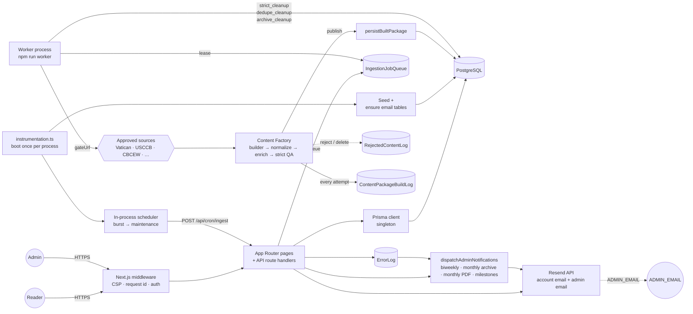

# Via Fidei

> _The Way of Faith._ A multilingual Catholic platform — prayers, saints,
> sacramental guidance, liturgy, and parish discovery — presented with reverence
> and clarity.

**Live site: [etviafidei.com](https://etviafidei.com)**

Via Fidei is a Next.js 15 application that pairs a public, reader-facing site
with an authenticated admin console for curating Catholic content. It supports
twelve locales, persists data in PostgreSQL via Prisma, and ingests material
from a curated allowlist of credible Catholic sources through the **Content
Factory** — a single, strict pipeline (source discovery → source fetch →
SourceDocument → content-type router → builder → normalize → enrich → strict
QA → persistBuiltPackage → public-render + search/sitemap verification) that
either publishes a complete package or records a precise build / QA failure
with a deletion log. Automatic failures never silently divert to a moderation
queue; manual review remains available to admins as an explicit human action.

The public site exposes nine tabs — **Home**, **Prayers**, **Sacraments**,
**Spiritual Life**, **Spiritual Guidance** (the parish finder), **Liturgy**,
**History**, **Saints & Our Lady**, and the authenticated **Profile** — plus an
admin console under `/admin` that operates with its own chrome (the public
navigation is suppressed automatically on every `/admin` route).

## Site, domain, and email facts

A few infrastructure facts that don't change very often and shouldn't be
edited blindly:

- **Official site name.** The official website name is **Via Fidei** and is
  used everywhere in copy, metadata, and templates.
- **Canonical domain.** The canonical production domain is
  **`https://etviafidei.com`**. It is hardcoded in `src/lib/config.ts` and
  used for metadata, sitemap, robots, and email links — no environment
  variable required.
- **Admin dashboard.** The admin console is served at **`/admin`** and only
  at `/admin`. The login screen is at `/admin/login`. Admin credentials are
  managed exclusively through the existing `ADMIN_USERNAME` / `ADMIN_PASSWORD`
  server environment variables — there is no admin UI for credential changes.
- **Sitemap.** The sitemap is served at **`/sitemap.xml`**. There is **one**
  authoritative source: `src/app/sitemap.ts`. Next's metadata route handler
  generates the XML dynamically (static public pages plus published-content
  detail entries pulled from the database with `updatedAt` as `lastmod`).
  Do not add a static `public/sitemap.xml` — that creates two conflicting
  sources. Google Search Console fetches `/sitemap.xml`.
- **Google Search Console verification.** The file
  `public/google0292583cfdf40074.html` is intentionally kept in the public
  folder. **Do not rename, move, or remove it** — Google revalidates the
  property by fetching that exact path.
- **Transactional sender address.** The official transactional sender address
  is **`notifications@etviafidei.com`**, hardcoded in `src/lib/config.ts`.
  It is the only address used for account-related email (welcome, password
  reset, email verification) and operational admin email. Email is delivered
  via **Resend** when `RESEND_API_KEY` is set; without it, email features
  are safely skipped and the rest of the auth flow still succeeds.
- **Operational admin mailbox.** Admin email (the biweekly Content Management
  Report, the monthly Archive Cleaning Up digest, the monthly Error Report
  PDF, threshold milestone alerts at 25 / 50 / 75 / 100 percent, Critical
  Failure pages, Security Breach alerts) is delivered to `ADMIN_EMAIL` —
  set in the hosting platform's environment dashboard (Railway, Vercel,
  …). There is **no admin UI for this value** because operational alerts
  must keep working even if the admin console itself is down. When unset,
  every admin notification is logged and silently skipped at the transport
  layer; the rest of the app keeps running.
- **Email DNS records are managed externally.** SPF, DKIM, DMARC, and
  return-path records live at the DNS provider and authoritatively belong
  there. **App code must not generate, write, or overwrite DNS records.**

---

## Stack

| Area               | Choice                                                                                                                                                                                                                              |
| ------------------ | ----------------------------------------------------------------------------------------------------------------------------------------------------------------------------------------------------------------------------------- |
| Framework          | Next.js `15.5.18` (App Router, async cookies/headers, `output: "standalone"`)                                                                                                                                                       |
| Runtime            | Node.js `>= 20`                                                                                                                                                                                                                     |
| Language           | TypeScript `5.6` (strict)                                                                                                                                                                                                           |
| UI                 | React `18.3`, Tailwind CSS `3.4`, Framer Motion                                                                                                                                                                                     |
| Database           | PostgreSQL via Prisma `5.22`                                                                                                                                                                                                        |
| Sessions           | `iron-session` (encrypted cookie, `vf_session`)                                                                                                                                                                                     |
| Password hashing   | `argon2id`                                                                                                                                                                                                                          |
| Validation         | `zod`                                                                                                                                                                                                                               |
| Locale negotiation | `negotiator` + cookie override                                                                                                                                                                                                      |
| Container          | Multi-stage `Dockerfile` (deps → builder → runner)                                                                                                                                                                                  |
| Deployment         | Railway-ready (`railway.json`, healthcheck on `/api/health/live`)                                                                                                                                                                   |
| Email              | Resend transactional sends — account email (welcome, password reset, verification) and admin email (biweekly report, monthly archive cleanup, monthly Error Report PDF, milestone alerts, Critical Failure / Security Breach pages) |
| Startup            | `instrumentation.ts` auto-seeds an empty DB and schedules in-process Vatican ingestion                                                                                                                                              |
| Unit / API tests   | Vitest 3 + v8 coverage (mocked Prisma, Next route handler imports)                                                                                                                                                                  |
| Component tests    | React Testing Library 15 + jsdom + jest-axe                                                                                                                                                                                         |
| End-to-end tests   | Playwright (chromium + mobile-chromium) with visual + perf smoke                                                                                                                                                                    |

---

## Engineering highlights

The repository is intentionally scoped as a portfolio-grade reference for the
kind of trade-offs a small team makes when they want a production-leaning
Next.js application that is honest about its boundaries. The pieces I
would call attention to:

- **Content Factory pipeline** (`src/lib/content-factory/`). The single
  active ingestion execution model is:

  ```
  Source discovery → Source fetch → SourceDocument
    → Builder (one per content type)
    → Normalize → Enrich
    → Cross-source validation (ContentValidationEvidence)
    → Strict QA → persistBuiltPackage()
    → Public render gate → cache revalidation
    → Monitoring (SourceQualityScore + ContentPackageBuildLog)
  ```

  No fallback path bypasses this pipeline. No automatic path saves
  uncertain content as public or failed content as review. The only
  ingestion execution model is Planner → Queue → Worker → Content
  Builder → Cross-source validation → Strict QA → Persistence →
  Public Render Gate → Cache revalidation → Monitoring.
  - **SourceDocument** — every fetched page becomes a normalized
    SourceDocument row with cleaned body / headings / paragraphs /
    lists / links / metadata + content checksums. Builders read
    SourceDocument structures, never raw HTML.
  - **13 builders** (Prayer, Saint, MarianApparition, Parish, Devotion,
    Novena, Sacrament, Rosary, Consecration, SpiritualGuidance,
    Liturgy, History, ScriptureBlock). Each returns
    `built_complete_package` / `build_failed_missing_required_fields` /
    `wrong_content` / `source_not_allowed` / `duplicate` /
    `not_supported_by_source` / `source_exhausted`. Only
    `built_complete_package` proceeds to strict QA.
  - **Field provenance** — every required field carries a snippet
    hash + extraction method + extractor version + confidence +
    timestamp. Deterministic rules (slug normalize, sacrament group
    map) skip the snippet hash but still record the rule used.
  - **persistBuiltPackage()** — single canonical persistence function.
    Refuses anything that did not pass strict QA. Sets
    `status=PUBLISHED`, `publicRenderReady=true`,
    `isThresholdEligible=true`, `packageValidationStatus="valid"`,
    `contentPackageVersion`, `lastPackageValidatedAt`,
    `sourceUrl`/`sourceHost`, `contentChecksum`, and field provenance.
  - **ContentPackageBuildLog** — one row per build attempt, success
    or failure. Answers "why was this content not created?".
  - **SourceQualityScore** — per-source / per-content-type rolling
    stats (build success rate, QA pass rate, duplicate rate). Auto-
    pauses sources whose failure rate or wrong-content rate cross a
    threshold.
  - **Growth intelligence** — periodic detector that catches "jobs
    running but no packages being built", "builds happening but QA
    failing", "sources producing mostly duplicates", "sources
    exhausted", and either remediates automatically (re-enqueue
    revalidate, demote source) or files an admin alert.
  - **"Why is this content not visible?" admin page** —
    `/admin/ingestion/why-not-visible`. One row per non-public catalog
    entry with the last build attempt, last QA reason, missing fields,
    failed contract, source purpose flags, and a suggested automatic
    next action. Filters cover missing source, missing required
    fields, source not approved, build failed, QA failed, deleted,
    duplicate, waiting for worker, waiting for cleanup.
  - **Content Factory dashboard** — `/admin/ingestion/factory`. Queue
    counts (pending / running / retrying / failed), worker heartbeats
    (active / stale / last heartbeat), pipeline timestamps (last
    source fetch / last package build / last strict QA pass / last
    valid package created / last invalid row deleted), content
    progress (raw rows / built / valid / public / build failures / QA
    failures / threshold-eligible / 24h growth / stalled reason), and
    per-source quality scores. Every metric distinguishes "real zero"
    from "query failed → diagnostic error" so the dashboard never
    silently shows zero because it is disconnected.

- **Production sources + cross-source validation.** A curated
  production source registry configures every source with a
  discovery method, factory role, source-purpose flags, tier,
  license status, and fetch / build / daily caps; a startup task
  loads it into `IngestionSource`. Between the builder and strict
  QA a cross-source validation layer requires that each important
  field of a prayer / saint / novena / devotion / history / etc. is
  either originated by an approved `primary_content_source` or
  validated against a second approved source — evidence is recorded
  in `ContentValidationEvidence`, and a package that a wider source
  supplies but no approved source can validate fails with
  `validation_evidence_missing`. Source roles
  (`primary_content_source` / `validation_source` /
  `enrichment_source` / `discovery_only_source` / `rejected_source`)
  are promoted and demoted automatically from rolling quality
  scores. The production source plan pins minimum factory-ready
  source counts per content type and auto-enqueues discovery
  expansion when a content type is under target.

- **Ingestion as a first-class subsystem.** A curated allowlist of Vatican,
  USCCB, and dicastery hosts gates every fetch (`gateUrl` /
  `isApprovedUrl`). All inbound content runs through the Content Factory
  pipeline above — there is no legacy direct-adapter execution path.
  Legacy job kinds (`source_ingest`, `content_validate`, `content_persist`)
  have been removed from the active set; `content_validate` and
  `content_persist` collapsed into a single combined `content_build`
  stage that runs build + normalize + enrich + strict QA + persist in
  one worker tick. The worker dispatches the **11 active kinds**
  (`source_discovery`, `source_fetch`, `source_freshness`,
  `source_config_repair`, `content_build`, `content_revalidate`,
  `strict_cleanup`, `dedupe_cleanup`, `archive_cleanup`,
  `sitemap_refresh`, `report_generate`). Every queue job has a typed
  zod payload, a stable `dedupeKey`, and writes lifecycle logs; the
  worker emits heartbeat rows and the cron route recovers stale leases.

  The in-process scheduler runs in burst mode while the catalog is
  below target and drops to a maintenance interval afterward — no
  external cron service required. The cron route only **plans** work
  and enqueues jobs; the worker is the **only** system that executes
  them.

- **Operational admin email.** A single dispatcher
  (`src/lib/data/admin-notifications.ts`) is invoked on every cron tick
  and emits, on its own cadence, the **Biweekly Admin Report** (Content
  Management Report table — Content / Added / Edited / Deleted /
  Archived per content type, with `+N` / `-N` / `0` formatting), the
  **Monthly Archive Cleaning Up** digest (Content / Archived Deleted on
  the last day of each month), the **monthly Error Report PDF**
  (generated in-process by a small zero-dependency PDF builder under
  `src/lib/email/pdf.ts`), and per-bucket **threshold milestones** at 25
  / 50 / 75 / 100 percent. **Critical Failure** alerts fire when the
  global error boundary, an uncaught exception, or an unhandled
  rejection blows up; **Security Breach** alerts fire on devtools
  abuse, attempted DOM tampering, CSP violations, and admin-login rate-
  limit blowouts. All admin emails greet the recipient as `Admin` and
  share the same paper / serif design system used by the account emails.
- **Admin diagnostics designed around troubleshooting.** Diagnostics are
  split into five sections — Email; Ingestion & Data Management; Sitemap
  & Link Paths; Accounts; and Homepage Saints Feast Day — and each
  result carries severity (pass / warn / fail / skipped), a timestamp,
  a request id, and a short explanation so failures can be
  cross-referenced against the structured log stream. Secrets, database
  URLs, and token values are explicitly stripped before any value is
  rendered to the browser. Every diagnostic page is backed by a
  matching `/api/admin/diagnostics/...` route.
- **Real per-item Data Management logs.** Every factory build pass
  writes one `DataManagementLog` row per item action — added,
  updated, dedup-skipped, hard-deleted as noise, rejected by strict
  QA with a precise reason, archived by `strict_cleanup`, or purged
  after the 30-day archive window — with the reason, source, job,
  and `triggeredBy` flag. The admin Logs page can answer "why is the
  count not changing?" precisely instead of showing an unexplained
  zero. Automatic failures never silently divert to REVIEW; manual
  admin review remains its own explicit action.
- **Ingestion run logs and per-item action logs are both
  first-class.** `/admin/logs/ingestion` reads from `IngestionJobRun`
  (per-run picture: source, job, status, counts, duration, error
  message). `/admin/logs/data-management` reads from
  `DataManagementLog` (per-item picture: ADD / UPDATE / DELETE /
  DEDUPE / REJECT / CLEANUP / CATEGORY_FIX / FAIL / PURGE). Each
  has its own admin page with filtering.
- **Manual "Run ingestion now" and "Run data cleanup now" buttons.**
  Both surface clear success or failure feedback inline — counts on
  success, error message on failure — and write to AdminAuditLog so
  the action is traceable.
- **Security headers and observability baked into middleware.** The
  edge middleware sets CSP, X-Frame-Options, X-Content-Type-Options,
  Referrer-Policy, Permissions-Policy, and HSTS (production only), and
  generates / validates an `X-Request-Id` header for every request so
  it can ride through every log line.
- **A strict approved-source posture for ingestion.** Anything not on the
  Vatican-allowlist is rejected before it reaches the database. The same
  helper gates outbound fetches so adapters cannot accidentally call an
  off-list host. Tests exercise the allowlist directly so the boundary
  cannot regress quietly.
- **Tooling matches the merge bar.** `npm run verify` is the local
  short-form gate (typecheck + lint + format:check + unit tests).
  `npm run verify:full` adds integration + e2e + production build for
  pre-release runs. CI runs the same checks plus a high-severity audit
  gate and a moderate-severity advisory job.

## Screenshots

> 📷 _Screenshot placeholders — replace with rendered captures of each
> surface before publishing. Suggested filenames live under
> `docs/screenshots/` (gitignored by default; commit only the rendered
> versions you intend to ship)._

| Surface                          | Image                                                        |
| -------------------------------- | ------------------------------------------------------------ |
| Home — public landing            | `docs/screenshots/home.png` _(placeholder)_                  |
| Saints calendar — today          | `docs/screenshots/saints-today.png` _(placeholder)_          |
| Prayers index with rite filter   | `docs/screenshots/prayers.png` _(placeholder)_               |
| Spiritual Guidance parish finder | `docs/screenshots/parish-finder.png` _(placeholder)_         |
| Admin console — data management  | `docs/screenshots/admin-data-management.png` _(placeholder)_ |
| Admin diagnostics                | `docs/screenshots/admin-diagnostics.png` _(placeholder)_     |

## Architecture at a glance



The full content lifecycle — discovery → fetch → SourceDocument → build →
strict QA → persistBuiltPackage → public render — is laid out in
[`## Content injection (ingestion) pipeline`](#content-injection-ingestion-pipeline)
below.

---

## Repository layout

```
.
├── prisma/
│   ├── schema.prisma          # Postgres schema (users, content, ingestion, audit, rate limits)
│   ├── migrations/            # Prisma migrations
│   ├── seed.ts                # `npm run db:seed` entrypoint
│   └── seeds/                 # Domain seed data (prayers, saints, apparitions, devotions,
│                              #                   parishes, liturgy entries, spiritual-life
│                              #                   guides, site settings)
├── public/                    # Static assets (favicon, Search Console verification file)
├── src/
│   ├── app/                   # App Router routes
│   │   ├── (public pages)     # /, /prayers, /prayers/[slug], /saints,
│   │   │                      # /saints/[slug], /saints/today, /devotions,
│   │   │                      # /devotions/[slug], /sacraments, /sacraments/[slug],
│   │   │                      # /spiritual-life, /spiritual-life/[slug],
│   │   │                      # /spiritual-guidance, /spiritual-guidance/[slug],
│   │   │                      # /liturgy, /liturgy-history, /liturgy-history/[slug],
│   │   │                      # /history, /search, /login, /register,
│   │   │                      # /forgot-password, /reset-password, /verify-email,
│   │   │                      # /privacy
│   │   ├── profile/           # /profile, /profile/journal, /profile/goals,
│   │   │                      # /profile/goals/completed (preserved
│   │   │                      # history of finished goals + their
│   │   │                      # checklists and journal entries),
│   │   │                      # /profile/milestones, /profile/prayers,
│   │   │                      # /profile/saints, /profile/apparitions,
│   │   │                      # /profile/devotions, /profile/parishes,
│   │   │                      # /profile/settings
│   │   ├── admin/             # 17-card admin dashboard (see Admin console section)
│   │   └── api/               # Route handlers (auth, admin, cron, internal,
│   │                          # journal, settings, health, search, saints/today,
│   │                          # data-management, ingestion-status)
│   ├── components/
│   │   ├── icons/             # Cross ornament, Marian monogram, search, hamburger,
│   │   │                      # user silhouette, spiritual-life icons, logo
│   │   ├── layout/            # Header, footer, brand, nav, mobile menu, search,
│   │   │                      # user menu, route error
│   │   ├── profile/           # Avatar, save button, unverified-email notice
│   │   ├── SecurityTamperDetector.tsx  # Client-side admin tamper detector
│   │   └── ui/                # ConfirmDialog, PageHero, RemoveSavedButton,
│   │                          # AccountRequiredButton, LoginRequiredPopup,
│   │                          # ExpandablePrayer, ExpandableTimelineEvent
│   ├── lib/
│   │   ├── auth/              # Session, password, schemas, user/admin helpers, tokens
│   │   ├── audit/             # AdminAuditLog writer
│   │   ├── concurrency/       # Lock helpers
│   │   ├── content/           # Review workflow + Catholic-rite filtering
│   │   ├── data/              # Per-entity repositories + admin catalog + goal templates
│   │   │                      # + admin-notifications dispatcher (biweekly /
│   │   │                      # monthly / milestone / critical / security)
│   │   │                      # + admin-notification-state tracker (dedup)
│   │   │                      # + catalog-janitor (always-on repackage / hard-
│   │   │                      # delete / divert pass on every PUBLISHED row)
│   │   │                      # + error-log (runtime error capture)
│   │   ├── db/                # Prisma client, table diagnostics, init
│   │   ├── email/             # Resend client, link builders, account templates,
│   │   │                      # admin templates + admin-send + zero-dep PDF
│   │   │                      # generator, send helpers, locale-aware translations
│   │   ├── http/              # Fetch client, retries, timeouts, JSON responses,
│   │   │                      # admin-catalog + saved-item route factories
│   │   ├── i18n/              # 12-locale dictionaries, negotiator, translator,
│   │   │                      # locale / theme / rite cookies
│   │   ├── ingestion/         # Adapters, registry, runner, scheduler, persist,
│   │   │                      # format (per-kind text normaliser), backlog-prefixes
│   │   ├── observability/     # Structured logger + request-id propagation
│   │   │                      # + page-error / api-error → ErrorLog bridge
│   │   ├── security/          # Rate limit, hashing, crypto, request helpers,
│   │   │                      # cron-auth, key resolution, security-events
│   │   │                      # (admin Security Breach + ErrorLog dispatcher)
│   │   └── startup/           # Auto-seed bootstrap + content seeder
│   ├── instrumentation.ts     # Next.js startup hook (auto-seed + ingestion schedule)
│   └── middleware.ts          # Request-id + CSP / security headers
├── tests/                     # Vitest unit + component + API + ingestion + DB tests
│   ├── auth/                  # Auth module (password, schemas, user, tokens, admin)
│   ├── api/                   # Route handler tests (mocked Prisma)
│   ├── components/            # RTL tests with `@vitest-environment jsdom`
│   ├── data/                  # Repository tests (admin-users, admin-notifications, etc.)
│   ├── db/                    # checkRequiredTables / checkSeedContent
│   ├── email/                 # Resend client, templates, link builders, send helpers,
│   │                          # admin templates, admin send, PDF generator
│   ├── fixtures/              # Factories + mock SourceAdapter / fetch
│   ├── helpers/               # Prisma + cookie mocks
│   ├── ingestion/             # Queue / dispatch / planner / build-enqueue / discovery tests
│   ├── content-factory/       # Builder / normalize / enrich / canary / public-display tests
│   ├── content-qa/            # Strict QA + contract + Confession-folds-into-Reconciliation tests
│   ├── integration/           # Real-DB tests, gated behind VITEST_INTEGRATION=1
│   ├── routes/                # Static route coverage check
│   ├── security/              # Rate limit DB + memory fallback
│   └── middleware.test.ts     # Request-id + security headers
├── e2e/                       # Playwright smoke + visual regression + perf
├── scripts/
│   ├── start.sh               # Container entrypoint (wait for DB → migrate deploy → exec server)
│   └── test-db.sh             # Reset isolated test DB (refuses prod URLs)
├── playwright.config.ts       # E2E + visual regression config
├── vitest.config.ts           # Unit + component test config (coverage thresholds)
├── TESTING.md                 # Test stack reference (commands, layout, isolation)
├── Dockerfile                 # Multi-stage production web image
├── Dockerfile.worker          # Single-stage ingestion-worker image (tsx + Prisma)
├── railway.json               # Railway config for the web service
├── railway.worker.json        # Railway config for the worker service
├── next.config.js             # standalone output, image hosts, security headers
├── tailwind.config.ts         # Liturgical palette + Cormorant/Inter typography
├── tsconfig.json              # `@/*` → `src/*`
└── .env.example               # All recognized environment variables
```

---

## Getting started

### Prerequisites

- Node.js 20+
- npm (the repo ships a `package-lock.json`)
- A reachable PostgreSQL database

### Install and configure

```bash
npm install
cp .env.example .env
```

Edit `.env` and set at minimum `DATABASE_URL`. For local development the
session secret and admin credentials may be omitted (the app falls back to a
dev-only secret), but they are **required** in production — see
[Environment](#environment).

### Database

```bash
npm run db:push     # applies schema.prisma to a fresh database
# or, against a database tracked by Prisma migrations:
npm run db:migrate  # prisma migrate deploy
npm run db:seed     # loads prayers, saints, apparitions, devotions, parishes,
                    #        liturgy entries, spiritual-life guides, site settings
```

`postinstall` automatically runs `prisma generate`.

### Run

```bash
npm run dev         # next dev on http://localhost:3000
npm run build       # prisma generate && next build
npm start           # next start on $PORT (default 3000)
```

### Quality gates

```bash
npm run typecheck         # tsc --noEmit
npm run lint              # next lint (ESLint)
npm run lint:fix          # next lint --fix
npm run format            # prettier --write .
npm run format:check
npm run test              # Vitest: unit + component + API + DB + email + data + route tests
npm run test:watch        # Vitest watch mode
npm run test:coverage     # Vitest with coverage + threshold gate
npm run test:integration  # Real-Postgres tests (requires TEST_DATABASE_URL)
npm run test:e2e          # Playwright (requires `npx playwright install`)
npm run test:db:setup     # Reset the isolated test DB from migrations
npm run verify            # typecheck + lint + format:check + test (CI parity)
npm run verify:full       # verify + integration + e2e + production build
```

CI (`.github/workflows/ci.yml`) runs five jobs on Node 22 LTS:

1. **verify** — `prisma validate`, typecheck, lint, format check, Vitest, production build
2. **audit** — `npm audit --audit-level=high` (high-severity is the merge gate)
3. **advisories** — `npm audit --audit-level=moderate` (advisory only, non-blocking)
4. **integration** — applies migrations to a Postgres service container and runs `tests/integration/**` on PRs and `main`
5. **e2e** — installs Chromium, runs Playwright, uploads the HTML report (push to `main` only)

See [TESTING.md](TESTING.md) for the full layout, fixtures, and test-DB isolation details.

---

## Environment

The app deliberately ships with a **minimal** production environment surface.
Anything that is not a private secret or deployment-specific value lives in
`src/lib/config.ts` as a hardcoded default.

### Required (production)

Only these four variables must be set for a production deployment to start:

| Variable         | Notes                                                                                      |
| ---------------- | ------------------------------------------------------------------------------------------ |
| `DATABASE_URL`   | PostgreSQL connection string. Private and deployment-specific.                             |
| `SESSION_SECRET` | 32+ chars of high-entropy randomness. Encrypts session cookies and derives the cron token. |
| `ADMIN_USERNAME` | Admin login username.                                                                      |
| `ADMIN_PASSWORD` | Admin login password. At least 12 characters.                                              |

### Optional

| Variable         | Purpose                                                                                                                                                                                                                                                                                                                                                                                                                                                                                                                                            |
| ---------------- | -------------------------------------------------------------------------------------------------------------------------------------------------------------------------------------------------------------------------------------------------------------------------------------------------------------------------------------------------------------------------------------------------------------------------------------------------------------------------------------------------------------------------------------------------- |
| `NODE_ENV`       | `development` \| `test` \| `production`                                                                                                                                                                                                                                                                                                                                                                                                                                                                                                            |
| `RESEND_API_KEY` | Resend API key. When unset, transactional email is silently skipped — auth flows succeed without delivering email.                                                                                                                                                                                                                                                                                                                                                                                                                                 |
| `ADMIN_EMAIL`    | Destination address for operational admin email — biweekly Content Management Report, monthly Archive Cleaning Up digest, monthly Error Report PDF, threshold milestone alerts (25 / 50 / 75 / 100 percent of each content target), Critical Failure alerts, and Security Breach alerts. Set in the hosting platform's environment dashboard (Railway, Vercel, …); there is no admin UI for this value because operational alerts must keep working even if the admin console itself is down. When unset, every admin email is logged and skipped. |

`getEnv()` validates these with Zod at first access; in production an invalid
configuration throws, in development it logs a warning and continues.

### Hardcoded configuration (no environment variables)

The following values are baked into `src/lib/config.ts`. They used to be
environment variables; they are now safe internal defaults so production
deployments do not need to set them:

| Setting                             | Hardcoded value                                                                                    |
| ----------------------------------- | -------------------------------------------------------------------------------------------------- |
| Canonical / app URL                 | `https://etviafidei.com`                                                                           |
| Email sender address                | `notifications@etviafidei.com`                                                                     |
| Search provider (echoed by reindex) | `postgres`                                                                                         |
| Server port / hostname              | `3000` / `0.0.0.0`                                                                                 |
| Logger floor                        | `info` in production, `debug` otherwise                                                            |
| Ingestion HTTP timeout              | 15000 ms                                                                                           |
| Ingestion User-Agent                | `ViaFideiBot/1.0 (+https://etviafidei.com/bot; ingestion@viafidei.com)`                            |
| Ingestion initial status            | `PUBLISHED` (auto-publish; soft-validator failures are diverted to `REVIEW`)                       |
| Ingestion scheduler — burst tick    | 2.5 min (1/4 of base 10 min) while any target unmet; initial delay 30 s after deploy               |
| Ingestion scheduler — maintenance   | ≈ 84 hours (twice per week) once every target is met                                               |
| Backlog targets                     | 500 prayers · 7 000 saints · 150 000 parishes · 1 500 church docs · 7 sacraments · 4 consecrations |
| Auto-cleanup of archived rows       | Enabled — archived rows are hard-deleted after 30 days (configurable in site settings)             |
| In-process ingestion scheduler      | **Enabled by default.** Set `appConfig.ingestion.schedulerDisabled = true` to opt out.             |

The list above is the **complete** runtime surface — there are no additional
credentials to configure.

---

## Internationalization

Twelve locales are supported (`src/lib/i18n/locales.ts`):

`en`, `es`, `fr`, `it`, `de`, `pt`, `pl`, `la`, `tl`, `vi`, `ko`, `zh`.

Selection order:

1. The `vf_locale` cookie, if set to a supported locale.
2. `Accept-Language` negotiation via `negotiator`.
3. `DEFAULT_LOCALE` (`en`).

`POST /api/settings/locale` updates the cookie. Each content entity (prayers,
saints, apparitions, devotions, liturgy entries, spiritual-life guides) has a
`*Translation` table keyed by `(entityId, locale)` with `MACHINE` /
`HUMAN_REVIEWED` / `LOCKED` workflow status.

### Catholic rites

Beyond locale, readers can choose a Catholic rite (`src/lib/content/rites.ts`)
so liturgical content can be filtered to their tradition. Twelve rites are
recognised — `roman` (Latin) is the default, with `byzantine`, `maronite`,
`chaldean`, `coptic`, `syroMalabar`, `syroMalankara`, `armenian`, `ethiopic`,
`melkite`, `ukrainian`, and `ruthenian`. The `vf_rite` cookie is set via
`POST /api/settings/rite`. Rite-neutral content is shown to everyone; only
rite-tagged slugs are filtered out when the reader's selection differs.

---

## Authentication

- Reader accounts: `POST /api/auth/register`, `POST /api/auth/login`,
  `POST /api/auth/logout`. Passwords are hashed with `argon2id`
  (memory cost 19456, time cost 2).
- Password reset: `POST /api/auth/forgot-password` issues a token (always
  returns OK so addresses can't be enumerated); `POST /api/auth/reset-password`
  consumes the token, resets the password, and revokes existing sessions.
  Tokens are SHA-256 hashed before storage and expire after 60 minutes.
- Email verification: `POST /api/auth/verify-email` consumes a token;
  `PUT /api/auth/verify-email` issues a fresh one for the signed-in user.
  Verification tokens expire after 24 hours.
- Sessions: encrypted cookie via `iron-session` (`vf_session`,
  `httpOnly`, `sameSite=lax`, `secure` in production).
- Admin: a single operator account configured through `ADMIN_USERNAME` /
  `ADMIN_PASSWORD`. Login at `/admin/login` (`POST /api/admin/login`) sets
  `session.role = "ADMIN"` and `session.adminSignedInAt`. Use `requireAdmin()`
  to gate server logic.
- Rate limiting (`src/lib/security/rate-limit.ts`) is persisted in
  `RateLimitBucket`; if the database is unreachable the limiter falls back
  to an in-memory bucket. Named policies cover `login`, `register`,
  `passwordReset`, `emailVerification`, `adminLogin`, `adminWrite`,
  `userWrite`, `savedItem`, `goalWrite`, `profileWrite`, `mediaUpload`,
  `search`, `publicRead`, and `ingestionTrigger`.

---

## Testing

The test suite lives under `tests/` (Vitest) and `e2e/` (Playwright). For the
full reference — fixtures, factories, mock SourceAdapter helpers, test-DB
isolation guards — see [TESTING.md](TESTING.md). The short version:

- **Unit + component + API + ingestion + DB + route tests** run via
  `npm run test`. Component tests opt into jsdom via the
  `@vitest-environment jsdom` doc-comment at the top of the file.
  Prisma is mocked through `tests/helpers/prisma-mock.ts` so the default
  test run never touches a real database.
- **Integration tests** live under `tests/integration/**` and are excluded
  from the default run. They execute under
  `VITEST_INTEGRATION=1 npm run test:integration` against
  `TEST_DATABASE_URL`. Two layers of safety guards (`scripts/test-db.sh`
  and `tests/setup.integration.ts`) refuse to run if the URL contains
  `prod`, lacks `test` in the database name, or points off-localhost
  (override with `TEST_DB_ALLOW_REMOTE=1`).
- **End-to-end + visual regression + perf smoke** runs via
  `npm run test:e2e` (Playwright). The `e2e/smoke.spec.ts` suite covers
  every primary nav route, asserts the header survives tab navigation
  (regression guard), pins visual snapshots for home / search / login,
  and verifies `/api/prayers` respects its 200-item server cap.
- **Coverage thresholds** (`vitest.config.ts`) require 80% lines / 80%
  functions / 75% branches on the security-critical surface (auth,
  rate-limit, middleware, DB diagnostics, destructive-confirm UI). The
  threshold gate fails the build if coverage regresses.
- **Accessibility smoke** uses `jest-axe` against rendered components
  (`tests/components/ConfirmDialog.test.tsx`).
- **Content-factory coverage** is extensive: the registry, cross-source
  validator, source roles, source plan, builder fixtures (5 valid + 5
  invalid + 5 messy per major content type), normalizers, classifiers,
  cache tags, stall taxonomy, and the worker / cron wiring all carry
  dedicated specs — including end-to-end acceptance tests proving a
  prayer from a wider source publishes only after a second approved
  source validates it, and that a discovery-only source with no
  evidence fails with `validation_evidence_missing`.

---

## Security

The security model has three layers: request hardening, classification

- alerting, and persistent device bans.

### Request hardening

- `src/middleware.ts` ensures every request has an `x-request-id`, sets
  Content-Security-Policy and the usual hardening headers
  (`X-Frame-Options: DENY`, `X-Content-Type-Options: nosniff`,
  `Referrer-Policy: strict-origin-when-cross-origin`,
  `Permissions-Policy`, and HSTS in production). It also issues a
  server-side **device-credential cookie** (`vf_dev_id`, HttpOnly,
  SameSite=Lax, ≥32 chars of opaque random) on every fresh visitor so
  the ban link has a stable target. Only the HMAC fingerprint of this
  value is ever stored server-side.
- `next.config.js` re-asserts security headers at the framework level and
  disables `x-powered-by`.
- `/api/cron/ingest` requires a constant-time match against the per-deployment
  cron token derived from `SESSION_SECRET` (HMAC-SHA-256 with a
  domain-separation tag), supplied via `Authorization: Bearer <token>` or
  `X-Cron-Secret`. The cron route only plans + enqueues — it never
  executes adapters.
- Every admin mutation route is gated by `gateAdminApiCall()` which
  bundles CSRF (same-origin Origin / Referer check), banned-device
  block, admin auth, and the **payload scanner** (`src/lib/security/
payload-scanner.ts`) — the scanner flags script injection,
  `javascript:` URLs, inline event handlers, SQL-injection chains,
  shell redirects, AND any attempt to set the public-gate fields
  (`publicRenderReady`, `isThresholdEligible`, `packageValidationStatus`,
  `contentPackageVersion`, `lastPackageValidatedAt`) from outside the
  factory.
- Admin actions write to `AdminAuditLog` (`src/lib/audit`).
- Password rule, enforced server-side via `passwordSchema` and
  client-side via `checkPasswordStrength()`: **at least 12 characters
  with one uppercase letter, one lowercase letter, one number, and
  one special character.** The register / reset-password forms render
  the spec-mandated red text on validation failure and block submit
  until the password passes.

### Suspicious Activity vs Security Breach

`src/lib/security/security-events.ts` splits inbound events into two
classifications with independent dedup keyspaces:

- **Suspicious Activity** — warning signs. Triggered by `>3` consecutive
  admin password failures (by account + IP + device), sustained
  developer-tool probing (`>3` client tamper events in a 10-minute
  window), admin route-scan bursts (`>5` distinct protected paths in
  60s from one device), and similar low-confidence signals.
- **Security Breach** — active or attempted attack. Triggered by
  payload-scanner hits (script / SQL / shell / factory-gate-bypass),
  brute-force escalation (`>20` user / `>15` admin failures),
  unauthorized admin mutations, CSP violations, DOM / state / storage
  tamper, and unauthorized calls to internal ingestion routes.

Both classifications dedup at the `(kind, IP, route)` level within a
short window so a misbehaving client cannot flood the mailbox.
Suspicious does NOT include a ban link; Breach does (when a device
credential is available).

### SecurityEvent + BannedDevice + signed ban link

- `SecurityEvent` persists every classification with the spec's full
  field set: `eventType`, `severity`, `classification`, `ipAddressHash`,
  `deviceCredentialHash`, `userAgent`, `city`, `region`, `country`,
  `targetRoute`, `httpMethod`, `attemptedAction`, `accountId`,
  `adminAccount`, `requestId`, `createdAt`, `automaticActionTaken`,
  `emailSent`, `banTokenIssued`.
- The Breach email contains an HMAC-signed ban link
  (`/api/security/ban-device/[token]`) carrying the security-event ID,
  device-credential hash, and a 24-hour expiration. Clicking the link
  creates a `BannedDevice` row, revokes every active session for that
  device, and shows a confirmation page. The link is single-use.
- `BannedDevice` rows are queried on every request via middleware-time
  banned-device middleware. There is **no admin UI to unban** — bans
  are permanent by design.
- A read-only `/admin/banned-devices` page surfaces every ban with
  the originating security-event link, city / region / country,
  user-agent summary, and first/last-seen timestamps.

---

## Content model

The Prisma schema (`prisma/schema.prisma`) defines, among others:

- **Identity**: `User`, `Session` (carries `deviceCredentialHash` so the
  ban link can revoke every session for the offending device),
  `Profile`, `PasswordResetToken`, `EmailVerificationToken`.
- **User content**: `JournalEntry` (with an optional `goalId` so entries
  can be attached to a goal and preserved as part of that goal's
  spiritual history), `Goal` (with a `journalEntries` back-relation
  and a `status` of `ACTIVE` → `COMPLETED` / `OVERDUE` / `ARCHIVED`),
  `GoalChecklistItem`, `Milestone`. **Completed goals are never
  deleted automatically** — they leave the active `/profile/goals`
  list the moment they are completed and migrate to a dedicated
  `/profile/goals/completed` page that preserves the original
  checklist, the completion date, and every journal entry the user
  wrote inside the goal. Archived goals remain on the active page
  in a collapsed `<details>` block so they can be un-archived
  without leaving.
- **Catalog**: `Prayer`, `Saint`, `MarianApparition`, `Parish`, `Devotion`,
  `LiturgyEntry`, `SpiritualLifeGuide`, `DailyLiturgy`, each with a
  `*Translation` sibling where applicable. Every catalog model declares
  the public-gate flags (`publicRenderReady`, `isThresholdEligible`,
  `packageValidationStatus`) with `@default(false)` and indexes on the
  first two — only `persistBuiltPackage()` flips them to true.
- **Saved items**: `UserSavedPrayer`, `UserSavedSaint`, `UserSavedApparition`,
  `UserSavedParish`, `UserSavedDevotion`.
- **Curation**: `ContentReview`, `Tag`, `EntityTag`, `Category`,
  `MediaAsset`, `EntityMediaLink`.
- **Pages / settings**: `HomePage`, `HomePageBlock`, `SiteSetting`.
- **Content factory**: `SourceDocument` (every fetched page; carries raw
  - cleaned body, headings, paragraphs, lists, tables, links, metadata,
    source tier, source-purpose permissions, fetch status, HTTP status,
    ETag, Last-Modified, content + cleaned checksums, worker job ID,
    ingestion batch ID), `ContentPackageBuildLog` (one row per build
    attempt — source URL/host, content type attempted, builder name +
    version, build status, extracted fields, missing fields, failure
    reason, candidate slug, worker job ID, ingestion batch ID,
    timestamp), `SourceQualityScore` (per-source / per-content-type
    rolling counters — discovered / fetched / build-success /
    build-failure / QA-pass / QA-fail / deleted / duplicate /
    wrong-content + valid-package-rate + wrong-content-rate +
    average-completeness; `autoPaused` flag + `lastFailureReason`),
    `ContentValidationEvidence` (one row per cross-source validation
    check — package ID or candidate slug, content type, field name,
    source URL + host, evidence type, evidence checksum, matched
    value, match confidence, validation decision, timestamp).
- **Security**: `SecurityEvent` (every Suspicious / Breach
  classification with the spec's 19 fields including
  `ipAddressHash`, `deviceCredentialHash`, `userAgent`, `city`,
  `region`, `country`, `targetRoute`, `httpMethod`,
  `attemptedAction`, `accountId`, `adminAccount`, `requestId`,
  `automaticActionTaken`, `emailSent`, `banTokenIssued`),
  `BannedDevice` (permanent ban registry — `deviceCredentialHash`
  unique, `active` indexed, `securityEventId` link to the originating
  event, `firstSeenAt` / `lastSeenAt`, `banReason`, `createdBy`).
- **Ops**: `IngestionSource` (with `isActive`, `reliabilityScore`,
  `lastSuccessfulSync`, `lastFailedSync`, optional
  `discoveryFeedUrl` for factory-native sitemap-based discovery,
  `discoveryMethod` / `configurationStatus`, per-source
  `fetchLimitPerRun` / `buildLimitPerRun` / `dailyCap`, and the
  factory `role` ∈ `primary_content_source` / `validation_source` /
  `enrichment_source` / `discovery_only_source` / `rejected_source`
  with `roleLastReason` + `roleLastChangedAt`),
  `IngestionJob`, `IngestionJobRun`, `IngestionJobQueue` (the durable
  queue rows that back the worker — typed payload, dedupeKey, lease
  state, retry with backoff), `WorkerHeartbeat` (per-worker rolling
  liveness rows; `>90s` stale), `AdminAuditLog` (per-user admin
  actions, with indexes on `(actorUserId, createdAt)` and
  `(action, createdAt)`), `DataManagementLog` (structured record of
  every automatic / manually-triggered cleanup action — `action` is
  one of `ADD`, `UPDATE`, `DELETE`, `REJECT`, `CLEANUP`, `DEDUPE`,
  `CATEGORY_FIX`, `FAIL`, `PURGE`, with `contentType`, `contentRef`,
  `reason`, and `triggeredBy`), `RejectedContentLog` (one row per
  package the factory refused — kind, reason, source), `ErrorLog`
  (runtime error capture for the monthly Error Report PDF — `source`,
  `kind`, `message`, `stack`, `route`, `requestId`, `severity` ∈
  `warn` / `error` / `critical`), `AdminNotificationState` (per-flow
  dedup state for the operational email scheduler — biweekly send
  timestamps, monthly year-month tags, per-bucket milestone
  thresholds already emailed), `RateLimitBucket`.

Catalog entities all carry a `ContentStatus` (`DRAFT` → `REVIEW` →
`PUBLISHED` / `ARCHIVED`) plus a `contentChecksum` so the ingestion pipeline
can short-circuit unchanged records.

---

## Reader-facing pages

The public site renders entirely from the catalog tables, with a small
in-app fallback spine so pages stay alive if a table happens to be
empty:

- **Prayers** (`/prayers`, `/prayers/[slug]`). Categorised prayer
  catalogue with pagination, filtered by the user's selected Catholic
  rite (rite-neutral prayers always render; rite-tagged prayers from
  another rite are hidden). A single **Filter** dropdown at the top of
  the grid lists the canonical Catholic prayer types — **Marian**,
  **Christ-centered**, **Angelic**, **Eucharistic**, **Sacramental**,
  **Rosary**, **Chaplets**, **Novenas**, **Litanies**, **Liturgical**,
  **Seasonal**, **Daily**, **Lord's Prayer**, and **Traditional
  Prayers**. The dropdown is used on every breakpoint — mobile and
  desktop — so the page stays calm even as the catalog grows.
  Selecting an option is a real server navigation
  (`?filter=<category>`); the matching category is resolved per-prayer
  via `resolvePrayerCategory` (`src/lib/data/prayers.ts`), which runs
  the same `categorizePrayer` heuristic used by the ingestion pipeline
  so the public filter and the seed-time category never disagree.
  Each prayer detail page shows the actual prayer text — pages that
  carry only a source byline (e.g. "Catholic Australia, a work of
  the Australian Catholic Bishops Conference") are now rejected at
  ingestion and never reach this list. At the bottom of every prayer
  / saint / apparition / devotion / liturgy / sacrament detail page
  the `<OfficialSourceLink>` component renders a direct link back to
  the original Holy See / bishops'-conference URL when the row was
  ingested with an `externalSourceKey`.
- **Sacraments** (`/sacraments`, `/sacraments/[slug]`). Surfaces the
  seven sacraments and the four major personal consecrations (Marian
  de Montfort, St. Joseph, Holy Family, Sacred Heart) as
  `SpiritualLifeGuide` rows whose slug starts with `sacrament-` or
  `consecration-`. Each card carries a hand-drawn SVG badge
  (water-and-shell for Baptism, dove for Confirmation, chalice for
  the Eucharist, confessional grille for Reconciliation, vial of oil
  for Anointing of the Sick, chasuble for Holy Orders, interlocking
  rings for Matrimony, crowned M for Marian consecration, lily +
  carpenter's square for St Joseph, three radiating hearts for the
  Holy Family, thorn-wreathed heart for the Sacred Heart). The
  **Reconciliation** card ships with a full Confession guide —
  preparation, examination of conscience against the Ten
  Commandments, contrition and firm purpose of amendment, the rite
  itself (`"Bless me, Father, for I have sinned…"`), the Act of
  Contrition, absolution, the penance, and the spiritual follow-up.
  When a user creates a Confession goal (`monthly-confession`), the
  same nine-step flow is pre-populated as the goal's checklist.
  Consecrations carry their daily readings and prayers (e.g. the
  four-week structure of de Montfort's True Devotion) in the
  guide steps; public copy explains the spiritual purpose of the
  consecration without claiming a profile-badge reward.
- **Spiritual-life guides** (`/spiritual-life`,
  `/spiritual-life/[slug]`). Each guide loads from
  `SpiritualLifeGuide`, with steps stored as structured JSON. When a
  guide references a prayer, the page renders an `ExpandablePrayer`
  block per prayer.
- **Today's Feast Day Saints** — rendered as a section near the
  bottom of `/` and as a dedicated `/saints/today` page. The
  homepage section reads the user's local date from
  `new Date()` in the browser (so the date is in the user's
  device timezone), fetches the matching saints via
  `/api/saints/today`, and surfaces up to five names in
  veneration order with a "See more" link to the full
  `/saints/today` page. Each name links to the saint's detail
  page. Feast-day matching is index-backed: the Saint table
  carries structured `feastMonth` and `feastDayOfMonth` columns
  (added in migration `0009_saint_feast_month_day`, backfilled
  from the legacy freeform `feastDay` text), and
  `listSaintsForFeastDate()` joins those columns first, then
  falls back to a JS pass over the legacy text using
  `feastDayMatchesDate()` so any row whose backfill could not
  populate the structured fields still matches. The matcher
  understands canonical ("August 28"), abbreviated ("Aug 28"),
  ordinal ("October 1st"), trailing-prose
  ("January 28 — Doctor of the Church") and multi-feast
  ("August 4 / 5 (1969 reform)") variants. `parseFeastDayText()`
  is the central parser used by both ingestion and admin edits,
  so the structured columns stay in sync whenever an admin saves
  a Saint row through the admin catalog.
  `/api/saints/today` returns a `diagnostic` field (kind:
  `empty_catalog` / `no_structured_fields` / `no_match_for_date`)
  when the result list is empty so the admin diagnostic page can
  pinpoint the cause without guessing.
- **Saints & Our Lady** (`/saints`, `/saints/[slug]`). The default
  ordering surfaces the most venerable figures first — Mary, Joseph,
  the Twelve Apostles in their traditional order, then Mary Magdalene
  / Stephen / Paul — and falls through to alphabetical for the rest.
  Three pill filters at the top of the page narrow to **Saints**,
  **Our Lady**, or **Angels** (e.g. archangels and the named angels).
  The filtering is two-phase: Postgres performs a coarse
  case-insensitive match on `canonicalName`, and the JS
  `categorizeSaintByName` helper then re-classifies each row so the
  default **Saints** tab never duplicates entries that belong under
  **Our Lady** or **Angels**. Marian apparitions render in a separate
  section underneath with their own pagination. Each saint detail
  page parses the biography into labelled sections
  (`src/lib/data/saint-sections.ts`). List cards display the saint's
  feast day, biography excerpt, and `patronages` so visitors can see
  at a glance who each is the patron of. The ingestion pipeline now
  rejects "EWTN live programming" / "Catholic Australia, a work of"
  / TV-listing pages so unrelated content never lands in the Saints,
  Our Lady, or Angels buckets.
- **Liturgy** (`/liturgy`). New dedicated tab. Surfaces only true
  liturgical content from `LiturgyEntry` — the Mass, the liturgical
  year, the rites of marriage / funerals / ordination, liturgical
  symbolism, and the glossary. Council documents, encyclicals, the
  Catechism, and Church history live under **History**.
- **History** (`/history`). New dedicated tab. Renders an interactive
  slidable timeline from Christ's ministry (27 AD) through the
  current year. The user can drag the slider or type a year directly
  into a numeric input to scrub through the chronology; filter pills
  along the top let them narrow by **Beginnings**, **Councils**,
  **Schisms & Reform**, **Doctrine & Magisterium**, or **Modern
  Era**. Under the slider sits the "Council documents" section —
  collapsible `<details>` cards for every ecumenical council (Nicaea
  through Vatican II), each expanding to the conciliar texts the
  pipeline has ingested. Data merges live `LiturgyEntry` rows of
  kind `COUNCIL_TIMELINE`, slugs starting with `church-history-`,
  `council-`, `vatican-council-`, or `synod-`, and the in-app
  fallback spine in `src/lib/data/church-history.ts`. The legacy
  `/liturgy-history` index now permanently redirects to `/history`;
  the per-document detail route `/liturgy-history/[slug]` stays in
  place for deep-links.
- **Search** (`/search` and the header typeahead). Powered by
  `searchAll()` and `suggest()` in `src/lib/data/search.ts`. Strict
  Postgres `contains` matches run alongside fuzzy candidate sets that
  use 3-letter sliding windows to tolerate single-character typos
  (`rosery` → "Rosary"); results are scored with a Levenshtein-based
  similarity so common misspellings of saint names, prayers, or guides
  still surface a sensible suggestion. The index covers prayers,
  saints, Marian apparitions, parishes, devotions, liturgy / Church
  history entries, and spiritual-life guides. `detectSearchIntent()`
  classifies the query — a "City, State", a parish/church/cathedral/
  diocese keyword, a US state abbreviation, an "Our Lady of" pattern,
  an angel reference, a sacrament keyword, a prayer keyword, or a
  leading saint title — and the `/search` page re-orders the result
  groups so the intent-matched bucket lands first. Each result row
  carries a content-type pill (Parish / Saint / Prayer / Apparition /
  Devotion / Church teaching / Spiritual life) so a mixed list reads
  cleanly. The header typeahead caps suggestions at **2 on mobile**
  (< 640 px) and **3 on tablet and desktop** (≥ 640 px) — driven live
  from `matchMedia` and enforced again server-side via the `limit`
  query param on `/api/search/suggest` so the payload never exceeds
  what is shown.
- **Parish finder** (`/spiritual-guidance`,
  `/spiritual-guidance/[slug]`). Combines manual search and an opt-in
  device-location lookup via the W3C Geolocation API. Location is
  asked for once: the user can accept (the answer is persisted to
  `localStorage` so we don't re-prompt on every visit), decline, or
  ignore the prompt. When granted, `/api/parishes/near` returns the
  closest parishes within a 50 km radius using the haversine formula
  on the published parish set (Postgres handles the `latitude` /
  `longitude` filter, the application sorts by distance). Manual
  parish search via `searchParishes()` (`src/lib/data/parishes.ts`)
  spans **name, city, region / state / province, country, diocese,
  and address** with a token-AND-of-field-ORs predicate so
  "Boston, MA" and "Archdiocese of Boston" both match. Parishes are
  populated through the `vatican.parishes` adapter from approved
  bishops' conference directories; each row carries `name`,
  `address`, `city`, `region`, `country`, `phone`, `email`,
  `websiteUrl`, `diocese`, `latitude`,
  `longitude`, plus the standard ingestion metadata
  (`externalSourceKey`, `sourceHost`, `contentChecksum`).
- **Profile** (`/profile` and the sub-pages under it). Avatar +
  display name + email, followed by a `<ProfileBadgeStrip>` that
  renders every sacrament / consecration badge the user has earned
  (sourced from `Milestone` rows via `listBadgesForUser()`; badges
  persist across logout, login, and refresh; the strip links to
  `/profile/milestones` for the full history). Below the header
  the page groups every user-content area into sections —
  **My Goals** + **Completed Goals** + **Milestones**, **Journal**
  - **Favorites**, **Saved prayers** + **Saved devotions**, **Saved
    liturgical content** (parishes, apparitions), **Saved learning**
    (saints). Each goal card on `/profile/goals` exposes an inline
    journal panel; completed goals migrate to
    `/profile/goals/completed` the moment they're finished, where
    they are preserved indefinitely with their original checklist,
    completion date, and every journal entry the user wrote inside
    the goal.

---

## Content injection (ingestion) pipeline

The factory-native discovery handler walks each source's configured
sitemap / RSS feed, writes each URL as a `DiscoveredSourceItem`, and
enqueues a `source_fetch` job per URL. Source-permission and host
gates run before the fetch even leaves the worker. The
allowlist is the single point of truth for which hosts may populate
doctrine, liturgy, Church history, prayers, saints, devotions,
guides, or catechetical content — anything not on the allowlist is
refused at fetch time. Sources without a usable discovery method
are marked `configurationStatus="not_configured"` by the periodic
`source_config_repair` job, and the planner refuses to enqueue
work for them until they are configured.

### Approved-source allowlist

The full list (≈350 hosts) lives in
`src/lib/ingestion/sources/vatican-allowlist.ts` and is rendered for
admins at **`/admin/sources`**. It is organised in three tiers:

- **Tier 1 — Holy See and Vatican press.** `vatican.va`, `press.vatican.va`,
  `vaticannews.va`, `osservatoreromano.va`, `synod.va`, every Vatican
  dicastery (`dicasteryforevangelization.va`, `doctrineoffaith.va`,
  `dicasterydivineworship.va`, etc.), the Vatican Apostolic Library,
  the Vatican Observatory, the Vatican Museums, and Vatican City State.
- **Tier 2 — Conferences of bishops.** USCCB (United States), CCCB
  (Canada), CBCEW (England & Wales), Irish Bishops, Australian Bishops,
  New Zealand Bishops, CBCP (Philippines), SACBC (Southern Africa), CBCI
  (India), DBK (Germany), Conferencia Episcopal Española, CEI
  (Italy), Église catholique de France, Conferência Episcopal
  Portuguesa, Konferencja Episkopatu Polski, CELAM, CEM (Mexico), CNBB
  (Brazil), Argentine Episcopal Conference, Den katolske kirke i Norge,
  plus major archdioceses (New York, Chicago, Boston, Milwaukee,
  Westminster, Los Angeles).
- **Tier 3 — Pontifical institutes and approved Catholic reference.**
  Pontifical Lateran, Gregorian, and Holy Cross universities;
  EWTN; Bible Gateway, Biblia.com, Douay-Rheims Bible Online; the
  Liturgical Calendar service; iBreviary; Universalis (Liturgy of the
  Hours); Corpus Christi Watershed; ICEL; Magnificat; New Advent
  (Catholic Encyclopedia); the Christian Classics Ethereal Library
  (patristic primary sources only).

`isApprovedHost(...)` and `gateUrl(...)` are called at every fetch site so
a misconfigured adapter cannot accidentally reach an off-list source.

### Adapters and content types

Adapters live under `src/lib/ingestion/sources/vatican-adapters.ts` and are
registered via `registerVaticanAdapters()` / `ensureVaticanSchedule()`.
The system has full ingestion support across the app:

| Adapter               | Target table         | Content                                                                                                                                  |
| --------------------- | -------------------- | ---------------------------------------------------------------------------------------------------------------------------------------- |
| `vatican.prayers`     | `Prayer`             | Liturgical and devotional prayers from the Holy See                                                                                      |
| `catholic.prayers`    | `Prayer`             | Bishops' conference prayer catalogues                                                                                                    |
| `credible.prayers`    | `Prayer`             | EWTN / Catholic Culture / KofC / religious order prayer pages                                                                            |
| `vatican.saints`      | `Saint`              | Saint biographies from the Holy See                                                                                                      |
| `bishops.saints`      | `Saint`              | Saint biographies from bishops' conferences                                                                                              |
| `credible.saints`     | `Saint`              | Saint biographies from EWTN, Catholic Culture, New Advent, religious orders                                                              |
| `vatican.apparitions` | `MarianApparition`   | Approved Marian apparitions                                                                                                              |
| `vatican.devotions`   | `Devotion`           | Devotions and spiritual practices                                                                                                        |
| `catholic.devotions`  | `Devotion`           | Conference-republished devotional material                                                                                               |
| `vatican.parishes`    | `Parish`             | Parish directories                                                                                                                       |
| `vatican.teaching`    | `LiturgyEntry`       | Catechetical / sacramental / liturgical content                                                                                          |
| `vatican.history`     | `LiturgyEntry`       | Church-history events and ecumenical councils                                                                                            |
| `vatican.guides`      | `SpiritualLifeGuide` | Spiritual-life guides (rosary, confession, vocation discernment)                                                                         |
| `vatican.councils`    | `LiturgyEntry`       | Conciliar documents from `/archive/hist_councils/` (slug `council-`)                                                                     |
| `vatican.catechism`   | `LiturgyEntry`       | Full Catechism of the Catholic Church (slug `catechism-`)                                                                                |
| `vatican.canonlaw`    | `LiturgyEntry`       | Full Code of Canon Law (CIC 1983) and Code of Canons of the Eastern Churches (CCEO 1990) in seven Holy-See languages (slug `canon-law-`) |
| `vatican.encyclicals` | `LiturgyEntry`       | Every papal encyclical archive on vatican.va, every pope from Pius IX through Leo XIV (slug `encyclical-`)                               |

Each ingested record carries source metadata: `externalSourceKey` (the
upstream URL — used for duplicate detection), `sourceHost` (parsed from
the URL), `contentChecksum` (SHA-256 of the canonical content — short-
circuits unchanged runs), `category` / `kind` for indexing, and a
`createdAt` / `updatedAt` retrieval timestamp. Curated rows
(`PUBLISHED` / `ARCHIVED`) are protected from automatic overwrites.

### Content-Factory validation flow

Validation is performed by the strict QA pass that runs immediately
after every builder. There is no soft-review bucket — every package
either publishes or is recorded with a precise failure. The factory
is intentionally strict: quality over quantity is an explicit
project priority.

A builder returns exactly one of:

- `built_complete_package` — every required field has provenance,
  the package proceeds to strict QA.
- `build_failed_missing_required_fields` — one or more required
  fields could not be extracted; recorded with the field list.
- `wrong_content` — the page tripped a hard-negative signal
  (livestream, bulletin, event registration, Mass schedule, staff
  page, donation page, school page, news article, press release,
  podcast episode, unrelated blog post) BEFORE the builder ran.
- `source_not_allowed` — the source is missing the per-content-type
  purpose flag (e.g. building a Saint from a source whose
  `canIngestSaints` is false).
- `duplicate` — same `(sourceDocumentId, contentType,
builderVersion, packageContractVersion, sourceChecksum)` tuple
  already produced a current package.
- `not_supported_by_source` — no builder registered for this
  content type from this source.
- `source_exhausted` — source has been marked exhausted.

Strict QA then runs the package contract for that content type
(novena day-completeness, sacrament-key canonicalization,
scripture translation policy, parish identity, etc.). The QA
verdict is one of:

- **publish / update** → `persistBuiltPackage()` writes the row
  with `status=PUBLISHED`, `publicRenderReady=true`,
  `isThresholdEligible=true`, `packageValidationStatus="valid"`,
  `contentPackageVersion`, `lastPackageValidatedAt`, source
  metadata, content checksum, and per-field provenance.
- **reject** → a `RejectedContentLog` row is written with the
  failed-field list and the exact reason; no public row is
  created.
- **delete** → an existing public row is hard-deleted with a
  `DataManagementLog` `DELETE` row and a `RejectedContentLog`
  trace so the admin can see why.

Automatic failures never silently divert to a REVIEW status. The
admin can still manually flip a row to REVIEW via the admin
console for editorial purposes — that path goes through
`POST /api/admin/content/review` and is admin-gated.

### Production source registry

Every source the factory knows about is configured up-front in the
curated **production source registry**
(`src/lib/ingestion/sources/production-source-registry.ts`). Each
entry carries the full configuration the factory needs: source
name, host, base URL, discovery method, supported content types,
source-purpose flags, tier, factory role, the package fields it may
originate, the `canProvidePrimaryContent` / `canProvideValidationOnly`
/ `canProvideEnrichmentOnly` flags, license status, and per-source
fetch / build / daily caps.

A startup task
(`src/lib/startup/production-source-registry-loader.ts`) idempotently
upserts every registry entry into `IngestionSource` so a fresh
deployment boots with a working source registry. The admin
**Source groups** page (`/admin/source-groups`) renders the
registry grouped into the spec's twelve content-type buckets
(Prayer, Saint, Marian Apparition, Devotion, Novena, Sacrament,
Rosary, Consecration, Liturgy, History, Parish, Scripture).

Discovery methods are `sitemap`, `rss`, `fixed_url_list`,
`official_api`, and `factory_handler`. A source with no valid
discovery method is marked `not_configured`, and the planner
refuses to enqueue discovery / fetch / build jobs for it.

### Cross-source validation

Between the builder and strict QA the factory runs a **cross-source
validation layer** (`src/lib/content-factory/cross-source-validation.ts`).
The principle: a wide range of sources may be used for _discovery_,
but only an approved source may _approve final publication_. A
package may pass only when each required field is one of:

1. directly sourced from an approved `primary_content_source`,
2. validated by a second approved source (a `pass` evidence row),
3. filled by a deterministic internal rule, or
4. filled by approved enrichment with provenance.

Evidence is recorded in **`ContentValidationEvidence`** — one row
per (package/candidate, field, validator) tuple, storing the
content type, field name, source URL + host, evidence type,
evidence checksum, matched value, match confidence, validation
decision, and timestamp. The ten evidence types are
`exact_text_match`, `title_match`, `feast_day_match`,
`patronage_match`, `prayer_text_match`, `sacrament_identity_match`,
`scripture_reference_match`, `history_date_match`,
`apparition_approval_status_match`, and `parish_identity_match`
(plus `deterministic_rule` and `approved_enrichment` for the
internal-fill cases).

`CROSS_SOURCE_RULES` lists the required fields per content type
(prayer name / text / type; saint name / feast day / biography
identity; novena name / days / daily prayers; sacrament key / group
/ explanation; history category / date / authority / event
identity; apparition name / location / approval status; parish
name / city / country). When a wider source supplies content that
no approved source can validate, the package fails with
`validation_evidence_missing` — QA standards are never lowered to
increase volume; volume grows by adding better sources and better
evidence. The cross-source evidence collector
(`cross-source-evidence-collector.ts`) gathers evidence inside the
same `content_build` tick, fetching validator documents through an
HTTP fetcher with exponential-backoff retry
(`validator-http-fetcher.ts`).

### Source roles

Every `IngestionSource` carries a **factory role** that gates what
it may do:

- `primary_content_source` — may originate package body fields.
- `validation_source` — may validate another source's fields but
  not provide primary body text.
- `enrichment_source` — may fill enrichment slots only.
- `discovery_only_source` — may surface candidate URLs only; a
  candidate must be validated by an approved source before it can
  publish.
- `rejected_source` — excluded from every factory job.

Roles move automatically: `decideRoleTransition()` promotes a
source up the ladder when its rolling `SourceQualityScore` shows
sustained valid output, and demotes (or rejects) a source that
repeatedly produces wrong content. The cron's `source_config_repair`
job runs `runRoleSync()` each tick. The admin source-configuration
page shows every source's role with filter chips.

### Production source plan

`SOURCE_PLAN_MINIMUMS` pins the recommended minimum number of
factory-ready sources per content type (Prayer ≥5, Saint ≥5,
Devotion ≥4, Novena ≥4, Sacrament ≥3, Rosary ≥3, Consecration ≥3,
Liturgy ≥3, History ≥5, Parish ≥3, Marian Apparition ≥3). The
admin **Production source plan** page (`/admin/source-plan`) shows,
per content type, the required / configured / factory-ready /
validation / enrichment source counts plus source health and the
next automatic repair action. Production readiness _fails_ when any
major content type has zero factory-ready sources and _warns_ when
any is below its minimum. When a content type is under target, the
`source_config_repair` job runs `runDiscoveryExpansion()` and
enqueues `source_discovery` jobs for the next candidate sources.

### Background cleanup pass (Ingestion & Data Management)

The admin module `/admin/ingestion` is named **Ingestion & Data
Management**. The legacy `runCatalogJanitor()` (which used to flip
borderline rows to REVIEW) has been deleted. Cleanup now runs as
three durable queue jobs on every cron tick:

#### 1. `strict_cleanup` (always on)

The factory walks every `PUBLISHED` row and re-runs strict QA
against the current package contract. Two outcomes per row:

- **flag-ready** — the row passes the contract; its strict flags
  (`publicRenderReady`, `isThresholdEligible`,
  `packageValidationStatus="valid"`) stay set or get re-asserted.
- **hard-delete** — the row fails the contract. It is removed
  from the catalog with a `DataManagementLog` `DELETE` row and a
  `RejectedContentLog` trace recording the failed fields. No
  archive step, no demotion to REVIEW: failed rows are deleted
  cleanly and the receipt explains why.

Every `strict_cleanup` pass also runs `pruneOrphanedSaves()` so a
user's saved-content list never references a row the strict pass
just removed.

#### 2. `dedupe_cleanup` and `archive_cleanup` (toggleable)

The settings panel at the top of `/admin/ingestion` controls two
secondary passes:

- **Automatic cleanup enabled** — master switch. When on (default),
  the cron job also enqueues `dedupe_cleanup`
  (`archiveDuplicatePrayers()`) and `archive_cleanup`
  (`purgeArchivedByArchivedAt()`) on every tick.
- **Hard-delete after N days** — how long a row may sit in
  `ARCHIVED` status before `purgeArchivedByArchivedAt()`
  permanently removes it. Default **30 days**, measured from the
  dedicated `archivedAt` column (not `updatedAt`), so editing an
  archived row does not push its deletion date forward. Set to 0
  to disable.

Every hard delete writes one `ArchiveDeletionLog` row (contentType,
contentId, contentSlug, archivedAt, deletedAt, reason, triggeredBy,
actorUsername) so cleanup is fully auditable. The cron route also
writes a `DataManagementLog` `PURGE` row for each delete so the
existing admin reports keep working.

Settings are stored in the `SiteSetting` table under the key
`data_management` and editable via
`/api/admin/data-management` (admin-only) and the toggle UI in
the ingestion admin page.

#### 3. `source_config_repair` (always on)

Cron also enqueues a `source_config_repair` job that re-scans every
`IngestionSource` and:

- marks sources without a usable discovery method as
  `configurationStatus="not_configured"` with a precise reason on
  the admin source-configuration card,
- promotes sources with a sitemap or RSS feed URL to
  `configurationStatus="factory_native"`,
- reports active sources missing purpose flags or supported content
  types.

The planner skips `not_configured` sources deterministically so an
unsetup source never enqueues a job.

#### Manual editor flow (admin-only)

Manual edits are the only path that re-introduces a moderation
step. The seven `update*` functions in `src/lib/data/admin-catalog.ts`
use a shared `resolveStatusForUpdate()` helper: when an admin edits
any content field without explicitly choosing a status, the row
drops back to `DRAFT`. The admin must then click **Publish** on
`/admin/publish-list` (or on the entity's own admin page) for the
change to go live. Status-only flips and explicit "Save and
Publish" actions are honoured as-is. An admin can also explicitly
move a row to REVIEW via `POST /api/admin/content/review` for
editorial inspection — this is an admin action, never the result
of an automatic failure.

### Queue-first architecture — cron plans, worker executes

The ingestion pipeline is split across two processes that share one
Postgres database:

1. **Web service** (the Next.js server) ticks
   `POST /api/cron/ingest`. The cron route is plan-only: it
   recovers stale leases, checks backlog thresholds, calls the
   planner to enqueue due jobs into `IngestionJobQueue`, runs
   cleanup + queue retention + admin notifications, then exits in
   seconds.
2. **Worker service** (`npm run worker`) is the only adapter
   executor. It leases the next queue row, validates the payload
   against its Zod schema, dispatches by `jobKind`, runs the
   adapter, and marks the row `completed` / `failed` / `retrying`.

`runAllActiveJobs()` and the direct-execution path no longer exist
— the cron route never invokes an adapter and the worker is the
sole execution surface.

#### Cron route responsibilities

`/api/cron/ingest` performs short, bounded work on every tick:

- `recoverStaleJobs()` — returns crashed-worker leases to `pending`.
- `getBacklogProgress()` — decides constant vs maintenance mode
  (DB error → constant; fires `threshold_check_failed` warning).
- `enqueueDueIngestionJobs()` — the planner (see below).
- `pruneQueueHistory()` — 30d completed, 90d failed retention.
- Token/audit/error-log pruning, archive cleanup
  (`purgeArchivedByArchivedAt`), goal overdue marking.
- `dispatchAdminNotifications()` — biweekly + monthly + milestones.
- `runAllIngestionAlerts()` + `checkStallSignals()` — alerts.
- `autoEvaluateSourcePauses()` — auto-pauses failing sources.

`maxDuration` stays at 60s — comfortable for cleanup + planning,
but the route never depends on it for ingestion execution.

#### Planner module (`src/lib/ingestion/queue/planner.ts`)

`enqueueDueIngestionJobs()` walks active `IngestionJob` rows and
writes new `IngestionJobQueue` rows at the right priority. Safety
invariants:

- DB error on threshold counting → stay in constant mode, NEVER
  downgrade to maintenance priority, fire
  `threshold_check_failed` admin warning.
- Paused source / paused job / paused content type → counted in
  the summary, not enqueued.
- Source `healthState` of `blocked` / `exhausted` → skipped
  entirely.
- `failing` / `low_quality` / `stale` sources → priority demoted
  (+100 / +50 / +25) regardless of tier so unhealthy sources do
  not camp at the front of the queue.

**Priority bands** (lower = higher priority):

- `10` — Tier 1 source, content threshold unmet (constant burst).
- `30` — Tier 2 source, content threshold unmet.
- `60` — Tier 3 source, content threshold unmet.
- `100` — normal scheduled ingestion.
- `200` — maintenance refresh (all thresholds met).

Caps prevent any one tick / source / content-type from monopolising
the queue:

- `fillCap` — max rows per tick (default 200).
- `perContentTypeCap` — max per content type per tick (default 60).
- `perSourceCap` — max per source per tick (default 10).
- `dailyPerSource` / `dailyPerContentType` — daily ingestion
  ceilings tracked in `DailyIngestionCounter`.

**Planner summary** is returned from `/api/cron/ingest`, logged in
`cron.completed`, and surfaced on the admin queue dashboard:

```json
{
  "jobsScanned": 42,
  "jobsEnqueued": 12,
  "jobsSkippedAlreadyQueued": 30,
  "jobsSkippedSourcePaused": 0,
  "jobsSkippedJobPaused": 0,
  "jobsSkippedContentTypePaused": 0,
  "jobsSkippedSourceUnhealthy": 0,
  "jobsSkippedSourceExhausted": 0,
  "jobsSkippedSourceNotConfigured": 0,
  "jobsSkippedDailyCap": 0,
  "jobsSkippedFillCap": 0,
  "promotedToConstant": 8,
  "assignedToMaintenance": 4,
  "mode": "constant",
  "dbError": false
}
```

#### `IngestionJobQueue` lifecycle

```
pending → running → completed
                  → failed   (terminal — sent to admin review)
                  → skipped  (paused source / job / content type)
                  → retrying → pending (backoff delay applied)
```

- **Exponential backoff** — 30 s base × 2ⁿ, ±25 % jitter, capped
  at 6 h (`src/lib/ingestion/queue/backoff.ts`).
- **Max retries** — 5 attempts; on the 6th attempt the row stays
  in `failed`, `sentToReviewAt` is set, a `DataManagementLog`
  `FAIL` row is written, and the job appears on
  `/admin/ingestion/queue` with a Retry button.
- **Dedupe key** — every planner row carries a stable
  `dedupeKey` of the form
  `ingest|<jobId>|<sourceId>|<adapterKey>|<contentType>|<mode>`. A
  partial unique index in
  `prisma/migrations/0012_queue_transition/migration.sql`
  enforces uniqueness for active rows (`pending` / `running` /
  `retrying`); completed / failed / skipped rows still keep their
  historical records.
- **Cancellation** — `POST /api/admin/ingestion/queue/cancel`.
  Pending / retrying rows cancel immediately; running rows get a
  `cancelRequestedAt` flag that the worker checks between batches.
  Completed rows cannot be cancelled.
- **Audit** — every state transition writes a `QueueAuditLog` row
  (enqueued / leased / completed / retrying / failed / skipped /
  canceled / cancel_requested / stale_recovered).

#### Typed job kinds

`src/lib/ingestion/queue/job-kinds.ts` defines **11 active kinds**,
each with a Zod payload schema validated at enqueue and at
execution:

| Job kind               | Priority default | Purpose                                                                                              |
| ---------------------- | ---------------- | ---------------------------------------------------------------------------------------------------- |
| `source_freshness`     | 50               | ETag / Last-Modified / checksum probe; lightweight.                                                  |
| `source_fetch`         | 100              | Fetch one URL → write a `SourceDocument` → enqueue `content_build`.                                  |
| `source_discovery`     | 110              | Walk sitemap / RSS / API → record `DiscoveredSourceItem`s + fetch jobs.                              |
| `content_build`        | 120              | **Single combined factory stage:** build + normalize + enrich + strict QA + `persistBuiltPackage()`. |
| `content_revalidate`   | 150              | Re-run strict QA against PUBLISHED rows after a contract change.                                     |
| `source_config_repair` | 200              | Periodic source-configuration repair (factory-native / not_configured).                              |
| `strict_cleanup`       | 250              | Strict-QA sweep of every PUBLISHED row + orphan-saves prune.                                         |
| `dedupe_cleanup`       | 300              | Collapse duplicate-checksum rows.                                                                    |
| `archive_cleanup`      | 400              | `purgeArchivedByArchivedAt` — hard delete after 30 days.                                             |
| `sitemap_refresh`      | 450              | Reserved for sitemap regeneration.                                                                   |
| `report_generate`      | 500              | Admin-triggered report regeneration.                                                                 |

`REMOVED_JOB_KINDS` retains the legacy `source_ingest`,
`content_validate`, and `content_persist` entries so the queue
migration script (`scripts/migrate-legacy-queue-rows.ts`) and the
startup safety check (`src/lib/startup/removed-job-kinds-check.ts`)
can detect any pre-migration rows. The runtime translation shim
that used to rewrite legacy rows in-place has been deleted now
that the queue has drained; a legacy row now fails dispatch with a
precise "translation shim deleted — run the migration script"
diagnostic.

The worker's `runJobByKind()` (`src/lib/ingestion/queue/dispatch.ts`)
routes to the matching execution function.

#### Worker process (`scripts/run-worker.ts`)

```sh
npm run worker        # long-running loop
npm run worker:once   # drain queue once and exit (cron-friendly)
npm run worker:status # one-shot CLI status snapshot
```

The worker:

- Leases the next queue row via
  `UPDATE … FROM (SELECT … FOR UPDATE SKIP LOCKED) RETURNING *`
  so multiple workers never claim the same row.
- Writes a `WorkerHeartbeat` row every iteration (workerId,
  startedAt, lastHeartbeatAt, processedCount, failedCount,
  retryCount, currentJobId, status).
- Routes by `jobKind` and validates the payload with Zod before
  executing.
- Honours `IngestionSource.pausedAt`,
  `IngestionJob.pausedAt`, and `ContentTypePause` rows (paused
  rows return `skipped` with no retry consumed).
- Checks `cancelRequestedAt` between batches so a long-running
  job can be cancelled cooperatively.
- On graceful SIGTERM / SIGINT, releases active leases and removes
  its heartbeat row.

#### Per-source cursors, batches, and discovery

- **`IngestionCursor`** — last successful checkpoint per
  `(adapterKey, cursorKey)` pair. A worker restart resumes from
  the last cursor instead of starting over.
- **`IngestionBatch`** — per-batch counts (discovered, created,
  updated, skipped, rejected, archived, deduped, failed).
- **`DiscoveredSourceItem`** — durable record of every URL / feed
  entry / API record a discovery job finds. Status lifecycle:
  `pending` → `processing` → `ingested` / `skipped` / `rejected` /
  `duplicate` / `failed` / `archived`. Item-level retry +
  failure reason + review routing.
- **Adapter-driven exhaustion** — adapters that finish their
  catalog return `{ exhausted: true }`; the runner marks the
  source `exhaustedAt` + `healthState = "exhausted"` and the
  planner stops re-enqueueing it (except for freshness checks).

#### Source health, freshness, and tiering

Every `IngestionSource` carries source freshness metadata
(`lastSuccessfulSync`, `lastFailedSync`, `lastContentUpdateAt`,
`lastHttpStatus`, `lastEtag`, `lastModifiedHeader`,
`consecutiveFailures`, `lowQualityRatio`), per-source coverage
metrics (`estimatedTotalItems`, `discoveredItems`,
`completedItems`), and a `healthState` label (`active` / `stale` /
`failing` / `blocked` / `exhausted` / `low_quality` / `paused`).

**Source tiers** (`src/lib/ingestion/source-tier.ts`):

- **Tier 1** — official Church (`vatican.va`, `usccb.org`, etc.).
  Highest priority in the planner queue; the planner gives Tier 1
  sources a `+0` priority and treats them as first-class when
  content thresholds are unmet.
- **Tier 2** — established publishers (`catholic.com`,
  `newadvent.org`, `ewtn.com`, etc.). Normal-priority queue band
  (`+30`) when below target.
- **Tier 3** — general / blog / news. Demoted (`+60`) so trusted
  sources fill the catalog first.

Tiering only affects **queue priority and source-quality scoring**.
Content visibility itself is gated entirely by the strict-QA pass
— Tier 1 content still has to satisfy its package contract to
become public, and Tier 3 content that satisfies its contract
publishes the same as Tier 1 content. There is no
"auto-publish-at-confidence-X / else REVIEW" behaviour anymore.

Tier changes go through `POST /api/admin/ingestion/sources/tier`
(admin-only, requires a non-empty reason, audited in
`SourceTierChange`).

**Auto-pause** — `autoEvaluateSourcePauses()` runs every cron
tick. Sources with `consecutiveFailures ≥ 8` or
`lowQualityRatio ≥ 0.7` are paused automatically and an admin
email is dispatched. Resume via the admin source-health
dashboard.

#### Per-item quality + content version history

Every persisted content row carries:

- `sourceConfidence`, `formattingConfidence`, `qualityScore` (0–1).
- `theologicalReviewFlag` (boolean).
- `sourceTier` (1 / 2 / 3).
- `outcomeReason` — short string explaining accept / review /
  reject / archive routing.
- `archivedAt` — set the moment status flips to ARCHIVED. The
  retention math uses this column, not `updatedAt`.

When an upstream item with the same `externalSourceKey` arrives
with a different `contentChecksum`, the persister snapshots the
previous row into `ContentVersion` (previous title / body /
source / checksum / status / updatedAt) and updates in place.
Theological / saint / Church-document changes default to
`reviewRequired = true`. The admin diff viewer at
`/admin/ingestion/changes` shows before/after and offers
Approve / Reject / Request revision / Restore previous version
buttons.

#### Rate limits + robots.txt

- **Per-domain rate buckets** (`IngestionRateBucket`) — shared
  across workers. Conservative defaults: 30/min for
  `vatican.va`, 20/min for `newadvent.org`, 40/min for
  `catholic.com` / `ewtn.com`. Tune per source via
  `IngestionSource.rateLimitPerMin` /
  `requestSpacingMs`.
- **robots.txt cache** (`RobotsCache`) — per-domain body + status
  with a 6-hour TTL. Refetched only after expiry; falls back to
  the last cached body on fetch failure so a transient outage
  doesn't block ingestion.

#### Stall detector and admin alerts

Three distinct stall classes fire their own admin emails
(24h cooldown per class):

- `stall_content_below_target_no_jobs` — content type below
  target but planner enqueued nothing.
- `stall_jobs_enqueued_no_worker` — queue has pending jobs but
  no healthy worker heartbeat.
- `stall_workers_complete_no_growth` — workers are completing
  jobs but content counts aren't increasing.

Other alerts: stalled growth, repeated source failures,
low-quality source, review queue too large.

#### Scheduler modes — constant vs maintenance

- **Constant mode** — at least one of the six backlog targets is
  unmet. The planner ticks every ~2.5 min (the in-process
  scheduler `burstIntervalMs`) and promotes priority for sources
  whose content type is below target.
- **Maintenance mode** — every target is met. The planner drops
  to `maintenanceIntervalMs` (≈ 84 h, twice per week) and
  enqueues `source_freshness` jobs instead of full ingests.
  Adapters short-circuit on ETag / Last-Modified 304 responses;
  only genuine upstream changes write to the DB.
- **DB-error guard** — `getBacklogProgress()` catches any count
  error and returns `{ mode: "constant", dbError: true }`. The
  planner stays in constant mode, never downgrades priority, and
  fires the `threshold_check_failed` admin warning.

`/admin/ingestion/progress` shows the current mode with a clear
visual label (amber CONSTANT, emerald MAINTENANCE) and surfaces
the `dbError` flag.

#### Admin dashboards

- `/admin/ingestion` — registered sources + per-source latest run.
- `/admin/ingestion/health` — source health table with coverage
  and auto-paused badges.
- `/admin/ingestion/progress` — content-type progress + mode.
- `/admin/ingestion/queue` — queue counts, failed-needing-review,
  retrying, planner-last-15-minutes snapshot, filter pills (All,
  Failed, Skipped, Review-required, Source errors, Formatting
  errors).
- `/admin/ingestion/queue/[id]` — single-row detail with
  sanitized payload (tokens / secrets / cookies / auth headers
  redacted) and full QueueAuditLog timeline.
- `/admin/ingestion/workers` — heartbeats + 24h metrics
  (processed / failed / retry / avg duration / idle time).
- `/admin/ingestion/changes` — `ContentVersion` feed with diff
  viewer and Approve / Reject / Restore actions.
- `/admin/ingestion/outcomes` — recent persisted items with
  outcomeReason / qualityScore / sourceTier.

#### Admin actions

All manual ingestion actions enqueue jobs (recording actor
username, writing `AdminAuditLog` + `DataManagementLog` rows):

| Action                  | Endpoint                                        |
| ----------------------- | ----------------------------------------------- |
| Run now                 | `POST /api/admin/ingestion/run`                 |
| Reprocess source        | `POST /api/admin/ingestion/sources/reprocess`   |
| Revalidate content type | `POST /api/admin/ingestion/revalidate`          |
| Retry failed job        | `POST /api/admin/ingestion/queue/retry`         |
| Cancel queue row        | `POST /api/admin/ingestion/queue/cancel`        |
| Pause source            | `POST /api/admin/ingestion/sources/pause`       |
| Pause job               | `POST /api/admin/ingestion/jobs/pause`          |
| Pause content type      | `POST /api/admin/ingestion/content-types/pause` |
| Change source tier      | `POST /api/admin/ingestion/sources/tier`        |
| Review content version  | `POST /api/admin/ingestion/changes/review`      |
| Restore version         | `POST /api/admin/ingestion/changes/restore`     |
| List queue (filters)    | `GET  /api/admin/ingestion/queue/list?status=…` |

#### Admin notification dispatch

Each cron tick dispatches `dispatchAdminNotifications()`. Sub-flows
guard their own "is it time?" checks:

- **Biweekly Admin Report** — ≥ 14 days since last send. Body =
  Content Management Report (Added / Edited / Deleted / Archived /
  Deduped / Purged per content type) + Ingestion Health Summary
  (total jobs run / completed / failed / retried / items to review /
  sources failing / items archived / permanently deleted / deduped).
- **Monthly Archive Cleaning Up** — last day of each month. Body =
  Content / Archived Deleted table.
- **Monthly Source Quality Report** — last day of each month. Body
  = per-source counts of accepted / rejected / duplicate / failed
  items ranked by accepted descending.
- **Monthly Error Report PDF** — last day of each month. PDF
  attachment with the month's errors.
- **Threshold milestone alerts** — 25 / 50 / 75 / 100 percent of
  each target. State per bucket advances **even when ADMIN_EMAIL
  is unset**, preventing the "flood when ADMIN_EMAIL configured
  later" surprise.

Subjects are pinned exactly as required: **Biweekly Admin Report**,
**Monthly Archive Cleaning Up**, **Monthly Source Quality Report**,
**Critical Failure**, **Security Breach**, **Error Report**, plus
the per-content-type threshold subjects.

### Connecting prayers to guides

`src/lib/data/guide-prayers.ts` maps each spiritual-life guide slug to an
ordered list of prayer slugs. The detail page renders each one as an
expandable section using `ExpandablePrayer` — the title shows with a
right-pointing arrow when collapsed and a down-pointing arrow when
expanded, with the full prayer text below. Bodies are looked up live in
the `Prayer` table and fall back to in-app canonical English forms when
a slug has not yet been ingested. The same component pattern is reused
for the Church-history timeline at `/liturgy-history/timeline`, where
`ExpandableTimelineEvent` renders every council and history event with
the same arrow / collapse behaviour.

### Factory → database → page contract

Factory-built content lives in PostgreSQL the entire time it is on
the site — nothing renders out of in-memory build state. The
pipeline is:

1. **Discover** — `source_discovery` (factory-native) walks the
   source's configured sitemap / RSS feed, canonicalizes each URL
   (strips fragments, `utm_*` / `fbclid` / `gclid`, normalizes
   host, drops trailing slashes), de-duplicates, and writes one
   `DiscoveredSourceItem` per unique URL.
2. **Fetch** — `source_fetch` runs the host-permission gate
   (source not paused, not `not_configured`, URL host matches
   source host) and fetches the URL. The response body becomes a
   `SourceDocument` row with cleaned body / headings / paragraphs /
   lists / metadata + a content checksum. The fetch handler then
   enqueues one `content_build` job per content type the source
   is permitted for, filtered through the content-type router.
3. **Build** — `content_build` runs the single combined factory
   stage: builder → normalize → enrich → strict QA →
   `persistBuiltPackage()`. Each builder either returns
   `built_complete_package` (with field provenance) or one of the
   precise failure outcomes. Every attempt is recorded in
   `ContentPackageBuildLog`, so "why was this not created?" is
   always answerable.
4. **Persist** — `persistBuiltPackage()` is the single canonical
   writer for the public catalog. It dispatches to the kind-
   specific persistence helper for `Prayer`, `Saint`,
   `MarianApparition`, `Parish`, `Devotion` (also Novena),
   `SpiritualLifeGuide` (Sacrament / Rosary / Consecration /
   SpiritualGuidance), and `LiturgyEntry` (Liturgy / History).
   Every persisted row carries `status=PUBLISHED`,
   `publicRenderReady=true`, `isThresholdEligible=true`,
   `packageValidationStatus="valid"`, `contentPackageVersion`,
   `lastPackageValidatedAt`, source URL / host, content checksum,
   and field provenance. Duplicate checksums short-circuit as
   `skipped` with no DB write.
5. **Verify** — after persistence, the factory runs
   `verifyPublicDisplayAndRepair()` (strict-public-where query)
   and `verifyIndexing()` (search + sitemap queries). If the row
   is not visible via the strict public gate, a render-gate
   cleanup is enqueued so strict QA re-evaluates the row and
   either fixes the flags or deletes it with a precise reason.
6. **Read** — public pages call `listPublished*` and
   `getPublished*BySlug` functions in `src/lib/data/`, which
   always filter by `STRICT_PUBLIC_WHERE_CLAUSE`
   (`status="PUBLISHED"` + `publicRenderReady=true` +
   `isThresholdEligible=true` + `archivedAt: null`). Detail pages
   wrap the lookup in a `safe*` helper that catches DB errors,
   classifies them with `classifyPageError()`, logs through
   `logPageError()` / `logPageMissingContent()`, and falls back
   to `notFound()` so a missing or unpublished slug returns a
   404, never a 500. The `requireUser()` and `isSaved()` calls
   used by the Save button are wrapped the same way: when no
   signed-in user is present they short-circuit to `null` /
   `false` so anonymous traffic sees the page exactly like a
   signed-in reader (minus the Save button pre-checked state).

Field mapping is one-to-one from `ContentPackage` → DB row → page
render. The `Prayer` row carries `slug`, `defaultTitle`, `body`,
`category`, `prayerType`, `language`, `officialPrayer`, the strict
public flags (`status`, `publicRenderReady`, `isThresholdEligible`,
`packageValidationStatus`, `contentPackageVersion`,
`lastPackageValidatedAt`), source metadata (`sourceUrl`,
`sourceHost`, `sourceTier`, `contentChecksum`), and field provenance
embedded in the package metadata blob. The detail page reads
exactly those fields (plus the locale translation). The same pattern
applies to every kind — see `src/lib/content-factory/persist.ts`
for the persistence helpers (single canonical writer) and
`src/lib/data/*.ts` for the read side.

### Persistence after redeploys

Because every record lives in PostgreSQL (not in process memory),
scraped content survives container restarts and redeploys. The
auto-seed at boot only seeds when the public-content tables are empty
and never overwrites existing rows. When the schema changes, run
`prisma migrate deploy` (the Dockerfile entrypoint does this
automatically); the health check at `/api/health` reports
`migration_required` if any required table is missing and a separate
`public_content_unavailable` status if any of `Prayer` / `Saint` /
`MarianApparition` / `Parish` / `Devotion` / `LiturgyEntry` /
`SpiritualLifeGuide` / `DailyLiturgy` are gone — those are the tables
the public site reads from.

### Logging surface for factory runs and page failures

Every factory dispatch emits structured JSON via `logger`
(`src/lib/observability/logger.ts`):

- `worker.source_fetch_to_build` — sourceDocumentId, sourceUrl,
  enqueuedCount, skippedReasons
- `worker.factory_discovery.completed` — sourceId, feedUrlCount,
  discoveredCount, enqueuedCount
- `content-factory.public_display_failed` — slug, reasons
- `content-factory.indexing_verify_failed` — slug, error
- `auto-repair.completed` — actions, errors
- `source-config-repair.completed` — inspected, markedNotConfigured,
  markedFactoryNative, missingPurpose, missingTypes
- `worker.removed_job_kind_seen` — legacy-kind diagnostic when any
  pre-migration row appears

The same numbers are persisted to first-class tables:

- `ContentPackageBuildLog` — one row per build attempt, success or
  failure. Surfaced at `/admin/ingestion/factory` and the
  `/admin/ingestion/why-not-visible` page.
- `QueueAuditLog` — every queue state transition (enqueued / leased /
  completed / retrying / failed / skipped / canceled / stale_recovered).
- `RejectedContentLog` — every strict-QA rejection with the failed
  fields and the reason.
- `DataManagementLog` — one row per ADD / UPDATE / DELETE / DEDUPE /
  REJECT / CLEANUP / PURGE / FAIL action — with the reason, source,
  job, and `triggeredBy` flag. The full timeline is browsable at
  `/admin/logs/data-management`.
- `SourceQualityScore` — rolling per-source / per-content-type
  validPackageRate, wrongContentRate, dupeRate, qaPassRate.

`IngestionJobRun` is retained for historical context (per-source
rollups remain on `/admin/ingestion` and `/admin/logs/ingestion`). Page-side, every detail page calls
`logPageMissingContent()` on a missed lookup (with a
`reason: missing_record | bad_slug | missing_table | db_connection`
classification) and `logPageError()` on caught exceptions, so an alert
on `kind=missing_table` points to a missed migration, `kind=db_connection`
points to the database, and `kind=missing_record` points to either an
unpublished record or a stale link.

## Startup behaviour

When the Node process boots, `src/instrumentation.ts` defers to
`src/lib/startup/auto-seed.ts`, which:

1. Confirms the database is reachable.
2. Verifies that `prisma migrate deploy` produced the required tables.
3. Counts published rows in each public-content table — if any are
   empty, runs `seedAllContent()` from `src/lib/startup/seeder.ts` to
   populate them. The seeder writes 7 sacraments + 4 consecrations,
   50+ papal encyclicals (Mirari Vos → Dilexit Nos), Catechism overview
   - four parts + key topics, all seven books of the 1983 Code of
     Canon Law + the Code of Canons of the Eastern Churches, one
     rite-inception entry per Catholic rite (Roman through Ruthenian),
     plus the standard prayers / saints / apparitions / devotions /
     parishes / liturgy entries / guides.
4. Runs `promoteIngestedOrphans()` — a one-time migration that
   promotes any legacy `REVIEW`-status rows with an `externalSourceKey`
   (i.e. created by ingestion before the auto-publish rule) to
   `PUBLISHED`. Idempotent: a second run touches zero rows.
5. Schedules the in-process ingestion ticker described above. The
   scheduler runs constantly while any backlog target is unmet, and
   drops to a twice-weekly maintenance cadence once every target is
   met. Initial delay is short (~30 s) so the catalog visibly starts
   filling within a minute of a fresh deploy.

All of this work is fire-and-forget — the HTTP server begins accepting
requests immediately so Railway / Docker healthchecks never wait on it.

### Backlog targets

The scheduler stays in constant-fill mode until every one of these
five buckets is at or above its minimum (configured in
`src/lib/config.ts`):

| Bucket           | Minimum | Counts                                                                                                                                                                       |
| ---------------- | ------- | ---------------------------------------------------------------------------------------------------------------------------------------------------------------------------- |
| Prayers          | 500     | `Prayer` rows                                                                                                                                                                |
| Saints           | 7,000   | `Saint` rows                                                                                                                                                                 |
| Parishes         | 150,000 | `Parish` rows                                                                                                                                                                |
| Church Documents | 1,500   | `LiturgyEntry` rows whose slug starts with `encyclical-`, `catechism-`, `code-of-canon-law-`, `council-`, `vatican-council-`, or `synod-`                                    |
| Sacraments       | 7       | `SpiritualLifeGuide` rows whose slug starts with `sacrament-`. Exactly seven — the doctrinal count of the Sacraments of the Church.                                          |
| Consecrations    | 4       | `SpiritualLifeGuide` rows whose slug starts with `consecration-` (Marian, Saint Joseph, Holy Family, Sacred Heart). Tracked separately so the Sacraments bucket stays exact. |

Once all six are met the scheduler switches to maintenance mode and
runs the upstream check on a ~84-hour cadence (~twice weekly).

---

## Operational admin email and incident reporting

Operational alerts go to a single mailbox specified by the `ADMIN_EMAIL`
environment variable (set in the hosting platform's environment
dashboard — there is no admin UI for this value). All admin email
shares the same rendering shell as the account email (paper / serif
aesthetic, cross logo, text + HTML parts), greets the recipient as
`Admin`, and is dispatched through the same Resend transport.
`src/lib/email/admin-templates.ts` owns the rendering;
`src/lib/email/admin-send.ts` owns the per-flow senders;
`src/lib/data/admin-notifications.ts` owns the cadence + dedup state.

When `ADMIN_EMAIL` is unset, every admin email is logged
(`admin.email.skipped_no_address`) and skipped at the transport layer;
the rest of the app keeps running. When `RESEND_API_KEY` is unset,
admin email is skipped with `admin.email.skipped_no_provider`.

### Email subjects (pinned)

| Flow                          | Subject                                  | Cadence                                                                                             |
| ----------------------------- | ---------------------------------------- | --------------------------------------------------------------------------------------------------- |
| Biweekly Admin Report         | `Biweekly Admin Report`                  | Every 14 days                                                                                       |
| Monthly Archive Cleaning Up   | `Monthly Archive Cleaning Up`            | Last day of each month (30/31/Feb-final)                                                            |
| Monthly Error Report          | `Error Report`                           | Last day of each month, ships a generated PDF attachment (`error-report-YYYY-MM.pdf`)               |
| Threshold milestone — partial | `<Content> 25% Threshold Reached` (etc.) | Once per `(content type, threshold)` when the live count crosses 25 / 50 / 75 percent of the target |
| Threshold milestone — final   | `<Content> Final Threshold Reached`      | Once per content type when the live count first reaches 100% of the target                          |
| Critical Failure              | `Critical Failure`                       | Immediately on uncaught exception, unhandled rejection, or React global error boundary firing       |
| Security Breach               | `Security Breach`                        | Immediately (subject to a 5-minute per-(kind, IP, route) dedup) on suspicious activity — see below  |

### Content Management Report (biweekly body)

The Biweekly Admin Report's body is a single section titled
**Content Management Report** containing one table:

| Content                    | Added | Edited | Deleted | Archived |
| -------------------------- | ----- | ------ | ------- | -------- |
| Prayer                     | …     | …      | …       | …        |
| Saint                      | …     | …      | …       | …        |
| Marian Apparition          | …     | …      | …       | …        |
| Devotion                   | …     | …      | …       | …        |
| Liturgy / Church Document  | …     | …      | …       | …        |
| Spiritual Life / Sacrament | …     | …      | …       | …        |
| Parish                     | …     | …      | …       | …        |

Number formatting:

- **Added** — `+N` when N > 0; bare `0` when N = 0.
- **Edited** — bare integer; bare `0` when N = 0.
- **Deleted** — `-N` when N > 0; bare `0` when N = 0.
- **Archived** — bare integer; bare `0` when N = 0.

The numbers are aggregated from `DataManagementLog` over the two-week
window: `ADD` → Added, `UPDATE` → Edited, `DELETE` + `PURGE` → Deleted,
`CLEANUP` → Archived.

### Monthly Archive Cleaning Up body

Last-day-of-month digest summarising the hard-delete pass that runs as
part of `purgeArchivedByArchivedAt()` (uses the dedicated `archivedAt`
column, not `updatedAt`, so editing an archived row never pushes its
deletion date forward). The body is one table:

| Content | Archived Deleted |
| ------- | ---------------- |
| Prayer  | …                |
| …       | …                |

`Archived Deleted` shows `-N` when N > 0 and bare `0` when N = 0.
Archived rows are hard-deleted after **30 days** (configurable in
`/admin/ingestion` settings, persisted in `SiteSetting`).

### Monthly Error Report PDF

Errors are captured into the `ErrorLog` table by:

- `logPageError()` and `logApiError()` — every page render failure /
  API exception is persisted (`source: page|api`, `severity: error`).
- Process-level handlers in `src/instrumentation.ts` — uncaught
  exceptions and unhandled rejections (`source: uncaught`,
  `severity: critical`).
- React global error boundary — `/api/internal/critical-failure`
  receives the boundary's POST and writes a `source: global,
severity: critical` row.
- `reportSecurityEvent()` — every detected security event is also
  persisted (`source: security`, `severity: error`) so it appears in
  the next Error Report.

On the last day of each month, `dispatchAdminNotifications()` reads
every row from the calendar month, builds a paginated PDF
(`src/lib/email/pdf.ts` — small zero-dependency PDF 1.4 generator),
and emails it as `error-report-YYYY-MM.pdf`. `ErrorLog` rows older
than 90 days are pruned by the regular cleanup pass — by then the
month they fell in has already shipped its PDF.

### Threshold milestone alerts

Per-bucket counters compared against the configured targets:

| Bucket           | Target  |
| ---------------- | ------- |
| Prayers          | 500     |
| Saints           | 7 000   |
| Parishes         | 150 000 |
| Church Documents | 1 500   |
| Sacraments       | 7       |
| Consecrations    | 4       |

Each tick computes `count / target × 100` per bucket and emails one
alert per crossing of 25 / 50 / 75 / 100 percent. Per-bucket dedup
state is stored under `AdminNotificationState` flow keys
`milestone:<bucket>` so the same threshold is never re-emailed even if
the count later drops.

### Critical Failure alerts

Reserved for severe issues only — site-crash-class events that mean
the application could not complete a request. The triggers are:

- An uncaught exception (`process.on("uncaughtException")` in
  `src/instrumentation.ts`).
- An unhandled promise rejection
  (`process.on("unhandledRejection")`).
- The React global error boundary firing
  (`src/app/global-error.tsx` POSTs to
  `/api/internal/critical-failure`).

Per-request 4xx responses, ordinary validation errors, and upstream
adapter 5xx do **not** trigger Critical Failure. Those are routine
errors and are carried in the monthly Error Report PDF instead.

### Suspicious Activity vs Security Breach alerts

Two distinct classifications, each with its own dedup keyspace and
email template. Both dedup at the `(kind, IP, route)` level within a
5-minute window so a misbehaving client cannot flood the mailbox.

**Suspicious Activity** (warning signs, no ban link) is triggered by:

- **Admin password failures** — `>3` consecutive failures from the
  same account / IP / device. Counter resets on a successful admin
  login (`src/lib/security/admin-failure-counter.ts`).
- **User-account brute force** — `>5` failures against the same
  user account (`src/lib/security/user-failure-counter.ts`); reset
  on success.
- **Sustained developer-tool probing** — `>3` client tamper events
  in a 10-minute window
  (`src/lib/security/tamper-counter.ts`). A single isolated
  devtools-open ping is benign and does NOT alert.
- **Admin route scanning** — `>5` distinct protected admin paths
  hit from one device in 60s
  (`src/lib/security/admin-route-scanner.ts`).

**Security Breach** (active attack, includes signed ban link) is
triggered by:

- **Payload scanner hits** — script injection, `javascript:` URLs,
  inline event handlers, SQL chains, shell redirects, OR any attempt
  to set public-gate fields (`publicRenderReady`,
  `isThresholdEligible`, `packageValidationStatus`, …) from outside
  the factory (`src/lib/security/payload-scanner.ts`).
- **Brute-force escalation** — `>20` user / `>15` admin password
  failures from the same source.
- **Active client tamper** — DOM tamper
  (`client_dom_tamper`), state tamper, storage tamper, CSP
  violation, or unauthorized action.
- **Unauthorized admin mutation** — any admin route called without
  a valid session.
- **Unauthorized internal route call** — public-route attempt to
  reach `/api/internal/*` or `/api/cron/*` without the required
  authorization.

Both flows write a `SecurityEvent` row with the full spec field set
and a one-line `ErrorLog` entry so the alert also lands in the next
monthly PDF. The Breach email additionally includes an HMAC-signed
`/api/security/ban-device/[token]` link with a 24-hour TTL; clicking
it creates a `BannedDevice` row, revokes every session for that
device, and renders a confirmation page. Suspicious does **not**
include a ban link.

The client → server bridge `/api/internal/security-event` validates
the client tamper-detector's POST, rate-limits per IP, and routes
the event to `reportSuspiciousActivity()` or `reportSecurityBreach()`
depending on the classification rule above.

### End-to-end diagnostics

`/admin/diagnostics/email` exposes an **Admin email diagnostics**
panel that lets the operator trigger a labelled example of each
admin notification flow (biweekly, monthly archive, monthly Error
Report PDF, threshold milestones at 25 / 50 / 75 / 100%, Critical
Failure, Security Breach). Each click POSTs to
`/api/admin/email/admin-test` with the flow name; the route resolves
`ADMIN_EMAIL`, dispatches through the same senders that production
uses, records an `AdminAuditLog` entry, and surfaces the outcome
inline. The page also shows the resolved `ADMIN_EMAIL` value next to
the Resend API-key status so the operator can confirm both pieces of
the pipeline are wired up.

The same diagnostic section runs as a backend check at
`/api/admin/diagnostics/email`: it reports `email.api_key` (Resend
API key configured), `email.admin_email` (ADMIN_EMAIL configured),
`email.from_address` (canonical sender), and `email.db_tables`
(account-email tables present).

---

## Admin console

`/admin` is the only admin surface. Protection is layered:

- **Middleware** (`src/middleware.ts`) redirects any unauthenticated request to
  a path under `/admin` (other than `/admin/login`) back to `/admin/login`
  with a 303. This is a coarse cookie-presence check so unauthenticated
  visitors never even render the page.
- **`requireAdmin()`** (`src/lib/auth/admin.ts`) is called inside every admin
  page server component and every `/api/admin/...` route handler. It verifies
  `session.role === "ADMIN"` and is the authoritative authorization check.
- **`/admin/login`** posts to `POST /api/admin/login`, which redirects to
  `/admin?welcome=1` on success and `/admin/login?error=invalid` on failure.
- **`POST /api/admin/logout`** destroys the session and redirects back to
  `/admin/login`.
- The `/admin` layout sets `robots: { index: false, follow: false }` so no
  admin page (including `/admin/login`) is indexable.

`/admin` shows the catalog editors, the operational dashboards, and
the security pages (`src/app/admin/_dashboard/cards.ts`):

1. Homepage mirror editor
2. Prayers
3. Saints
4. Marian apparitions
5. Parishes
6. Devotions
7. Liturgy content
8. Translations
9. **Ingestion & Data Management** — live-polling content counts,
   24-hour edit overlay per content type (with a precise explanation
   of "0 edits" — disabled, blocked, stale, or skipped-because-no-new-
   content), status indicator (Active / Maintenance / Disabled /
   Blocked / Stale / Running / Failing / Idle), Data Management
   settings panel (auto-cleanup toggle + hard-delete window), a "Run
   ingestion now" button, and a "Run data cleanup now" button. Both
   manual buttons share the same advisory lock as the cron job and
   report inline success or failure detail.
10. **Content Factory dashboard** (`/admin/ingestion/factory`) —
    queue counts (pending / running / retrying / failed), worker
    heartbeats (active / stale / last heartbeat), pipeline
    timestamps (last source fetch / last package build / last
    strict QA pass / last valid package / last invalid row
    deleted), content progress (raw rows / built / valid / public
    / build failures / QA failures / threshold-eligible / 24h
    growth / stall reason), per-source quality scores. Every
    metric card carries a `dataSource` badge naming the new-system
    table or service it reads from. Real-zero is distinguished
    from "query failed → error state" so the dashboard never
    silently shows a stale zero.
11. **Why not visible** (`/admin/ingestion/why-not-visible`) — one
    row per non-public catalog entry showing the last build attempt,
    last QA reason, missing fields, failed contract, source-purpose
    flags, and the suggested automatic next action. Filterable by
    missing source / missing required fields / source not approved
    / build failed / QA failed / deleted / duplicate / waiting for
    worker / waiting for cleanup.

    The content-factory pipeline also exposes a cluster of
    dedicated diagnostic pages, all reachable from the Ingestion &
    Data Management page and the Diagnostics hub:
    - **Content growth** (`/admin/content-growth`) — a rolling
      seven-day production content growth report. Per content type
      it shows the twelve pipeline metrics (source documents
      fetched, build attempts, complete packages, cross-source
      validation passes, strict QA passes, persisted / public /
      search-visible / sitemap-visible packages, deleted-invalid,
      duplicates, net public growth), a daily growth target, a 24h
      and a stronger 7d growth warning, a 0–100 production growth
      score grounded in real public packages created (not raw
      rows), and four daily-trend charts — public package growth,
      QA pass rate, source success rate, builder success rate. The
      all-time pipeline table follows underneath.
    - **Production readiness** (`/admin/production-readiness`) — one
      card per readiness category plus a per-content-type readiness
      table covering all twelve major public tabs (a factory-ready
      source is configured, the canary fixture builds, the strict
      public tab query loads, a cache revalidation tag is mapped).
      Readiness fails when any tab's strict query cannot load.
    - **Builder quality** (`/admin/builder-quality`) — one row per
      builder over a 14-day window: build attempts, complete
      packages, QA pass / failure rate, public render / search /
      sitemap visibility pass rate, duplicate + wrong-content rate,
      top missing fields, top rejected source hosts.
    - **Fixture quality** (`/admin/fixture-quality`) — runs every
      bundled builder fixture through its real builder and reports
      valid-pass / invalid-rejection / false-positive / false-
      negative counts plus missing fixture-coverage areas.
    - **Source onboarding** (`/admin/source-onboarding`) — per
      source: discovery method, role, tier, supported content
      types, allowed fields, license status, fetch / build / daily
      caps, validation + enrichment role, and source health — plus
      the four source-coverage warnings (below minimum, validation
      without primary, primary without validation, sources without
      builds).
    - **Baseline content audit** (`/admin/baseline-audit`) — traces
      every baseline fixture from its source URL through to the
      public catalog (source documents, build attempts, complete
      builds, public packages, failures + reasons).
    - **Production growth runbook** (`/admin/production-runbook`) —
      the single operator page for content-growth operations:
      stalled content types + their automatic next action, paused
      and promoted sources, weak builders, missing validation
      evidence, and failing public display checks.
    - **Source configuration** (`/admin/source-configuration`),
      **Source groups** (`/admin/source-groups`) and **Production
      source plan** (`/admin/source-plan`) — per-source factory-
      ready status with role badges, the curated registry grouped
      into the twelve content-type buckets, and required /
      configured / factory-ready / validation / enrichment source
      counts + health + next repair action per content type.
    - **Validation evidence** (`/admin/validation-evidence`) — the
      cross-source validation dashboard: `ContentValidationEvidence`
      pass / fail / insufficient totals broken down by content
      type, source host, field and source role, the most common
      insufficient-evidence reasons, and a 0–100 health score per
      validation source.
    - **Factory command center** (`/admin/factory-command-center`)
      and **Tab diagnostics** (`/admin/tab-diagnostics`) — the full
      source-to-public observability rollup and per-tab public /
      threshold / hidden counts + stall reason.
    - **Content receipt** (`/admin/content-receipt`) — the full
      source-to-public provenance trace for any single public item,
      including its build log, cross-source validation evidence,
      live search + sitemap verification, and the cache tags that
      revalidate it.
    - **Cache health** (`/admin/cache-health`) — the cache-
      revalidation log plus the last revalidated content type /
      slug / tab, the last sitemap and search-index revalidation,
      failed cache events, and pending cache repairs.

12. Approved sources (allowlist + per-host sync status + optional
    `discoveryFeedUrl` for factory-native discovery)
13. Search index
14. Media library
15. Favicon
16. **Logs** — hub for four sub-views: Account audit (per-user
    actions); Admin actions (homepage edits, content edits, settings,
    diagnostics, data-management toggles); Data Management (every
    addition, update, dedupe-skip, rejection, archive, dedupe, and
    category correction performed by the Ingestion & Data Management
    system, with reason and triggeredBy = automatic | manual);
    Ingestion runs (every IngestionJobRun row: source, job, status,
    per-run counts, duration, error message, filterable by status
    and job name).
17. User accounts
18. **Diagnostics** — hub for the operational dashboards, each backed
    by an `/api/admin/diagnostics/...` route returning a
    `DiagnosticSection` with severity / timestamp / requestId /
    explanation per check. The **System Health** dashboard
    (`/admin/diagnostics/system-health`) renders 14 cards covering
    Queue / Worker / Source discovery / Source fetch / Source
    document / Content factory / Builder / Strict QA / Persistence /
    Cleanup / Growth / Security / Admin email / Database health.
    Every card exposes `lastUpdatedAt`, a `dataSource` badge, and an
    explicit error state when its underlying query throws — no false
    zero. The hub also links the content-factory diagnostic cluster
    described above — Content Growth (the seven-day production
    growth report), Builder Quality, Source Onboarding, Baseline
    Content Audit, Fixture Quality, and the Production Growth
    Runbook — so every step from source to public page is
    observable from one place.
19. **Banned devices** (`/admin/banned-devices`) — read-only ban
    registry surfacing device-credential ID, ban reason, first /
    last seen, city / region / country, user-agent summary, and the
    `SecurityEvent` link that created the ban. There is no admin UI
    to unban — bans are permanent by design.
20. **Publish list (manual admin queue).** `/admin/publish-list`
    surfaces only rows that an admin explicitly placed under review
    (manual edits dropping the row back to `DRAFT`, or an explicit
    `move-to-review` action). Automatic factory failures never
    appear here — they are deleted with a `RejectedContentLog` trace
    instead, surfaced on `/admin/logs/rejected-content` and the
    `/admin/ingestion/why-not-visible` diagnostic.

Content review actions go through `POST /api/admin/content/review` with
`{ entityType, entityId, action, notes }` where `action` is
`approve` | `reject` | `request-revision` | `move-to-review`. These
endpoints are admin-only and audited. Direct CRUD on each catalog
entity is exposed under `/api/admin/<entity>` via the
`makeAdminCatalogIndex` / `makeAdminCatalogItem` factories
(`src/lib/http/admin-catalog-routes.ts`).

---

## API surface

### Public / authenticated reader

| Method            | Path                                                          | Purpose                                                     |
| ----------------- | ------------------------------------------------------------- | ----------------------------------------------------------- |
| GET               | `/api/health`                                                 | Readiness + DB ping + table / seed diagnostics              |
| GET               | `/api/health/live`                                            | Liveness probe (no DB touch). Used by Docker / Railway      |
| POST              | `/api/auth/register`                                          | Create reader account                                       |
| POST              | `/api/auth/login`                                             | Reader login                                                |
| POST              | `/api/auth/logout`                                            | Reader logout                                               |
| POST              | `/api/auth/forgot-password`                                   | Issue a password-reset token (always returns OK)            |
| POST              | `/api/auth/reset-password`                                    | Consume token + set new password (revokes sessions)         |
| POST              | `/api/auth/verify-email`                                      | Consume an email-verification token                         |
| PUT               | `/api/auth/verify-email`                                      | Issue a fresh verification token for the current user       |
| GET / PATCH       | `/api/profile`                                                | Read / update profile (locale, theme)                       |
| POST / DELETE     | `/api/profile/avatar`                                         | Set / clear avatar (`MediaAsset` id)                        |
| GET / POST        | `/api/journal`                                                | List entries (sortable) / create entry                      |
| GET / PATCH       | `/api/journal/[id]`                                           | Read / update entry (ownership-checked)                     |
| POST              | `/api/journal/[id]/favorite`                                  | Toggle favorite flag                                        |
| POST              | `/api/journal/[id]/delete`                                    | Delete entry                                                |
| GET / POST / DEL  | `/api/saved/prayers`                                          | List / save / unsave a prayer                               |
| GET / POST / DEL  | `/api/saved/saints`                                           | List / save / unsave a saint                                |
| GET / POST / DEL  | `/api/saved/apparitions`                                      | List / save / unsave a Marian apparition                    |
| GET / POST / DEL  | `/api/saved/parishes`                                         | List / save / unsave a parish                               |
| GET / POST / DEL  | `/api/saved/devotions`                                        | List / save / unsave a devotion                             |
| GET / POST        | `/api/goals`                                                  | List / create goals (with optional checklist)               |
| GET / PATCH / DEL | `/api/goals/[id]`                                             | Read / update / delete a goal                               |
| POST              | `/api/goals/[id]/complete`                                    | Mark complete + auto-promote to a personal milestone        |
| POST              | `/api/goals/[id]/archive`                                     | Archive a goal                                              |
| POST              | `/api/goals/[id]/checklist`                                   | Append a checklist item                                     |
| POST              | `/api/goals/[id]/checklist/reorder`                           | Reorder checklist items                                     |
| PATCH / DEL       | `/api/goals/[id]/checklist/[itemId]`                          | Edit / delete a checklist item                              |
| GET               | `/api/goals/templates`                                        | List built-in goal templates (novenas, consecrations, OCIA) |
| POST              | `/api/goals/from-template`                                    | Instantiate a goal (with checklist) from a template         |
| GET / POST        | `/api/milestones`                                             | List / create user milestones                               |
| DELETE            | `/api/milestones/[id]`                                        | Delete a milestone                                          |
| GET               | `/api/prayers`, `/api/prayers/[slug]`                         | Published prayers list / detail (locale-aware)              |
| GET               | `/api/saints`, `/api/saints/[slug]`                           | Published saints list / detail                              |
| GET               | `/api/apparitions`, `/api/apparitions/[slug]`                 | Published apparitions                                       |
| GET               | `/api/parishes`, `/api/parishes/[slug]`, `/api/parishes/near` | Parish list, detail, geo-radius                             |
| GET               | `/api/devotions`, `/api/devotions/[slug]`                     | Devotions list / detail                                     |
| GET               | `/api/liturgy`, `/api/liturgy/[slug]`                         | Liturgy/history content                                     |
| GET               | `/api/spiritual-life`, `/api/spiritual-life/[slug]`           | Spiritual-life guides                                       |
| GET               | `/api/daily-liturgy`                                          | Today (or `?date=` / `?from=&to=`) daily liturgical content |
| GET               | `/api/saints/today`                                           | Saints whose feast falls on `?month=&day=` (or today UTC)   |
| GET               | `/api/search`                                                 | Unified search with intent detection                        |
| GET               | `/api/search/suggest`                                         | Typeahead suggestions grouped by content type               |
| POST              | `/api/settings/locale`                                        | Set locale cookie                                           |
| POST              | `/api/settings/rite`                                          | Set Catholic rite cookie                                    |

### Admin

| Method         | Path                                     | Purpose                                                                                                                                                                       |
| -------------- | ---------------------------------------- | ----------------------------------------------------------------------------------------------------------------------------------------------------------------------------- |
| POST           | `/api/admin/login`                       | Admin login                                                                                                                                                                   |
| POST           | `/api/admin/logout`                      | Admin logout                                                                                                                                                                  |
| POST           | `/api/admin/content/review`              | Approve / reject / revise / move-to-review                                                                                                                                    |
| GET / POST     | `/api/admin/prayers`                     | List / create prayers (catalog)                                                                                                                                               |
| PATCH / DELETE | `/api/admin/prayers/[id]`                | Update / delete a prayer                                                                                                                                                      |
| GET / POST     | `/api/admin/saints`                      | List / create saints                                                                                                                                                          |
| PATCH / DELETE | `/api/admin/saints/[id]`                 | Update / delete a saint                                                                                                                                                       |
| GET / POST     | `/api/admin/apparitions`                 | List / create Marian apparitions                                                                                                                                              |
| PATCH / DELETE | `/api/admin/apparitions/[id]`            | Update / delete an apparition                                                                                                                                                 |
| GET / POST     | `/api/admin/parishes`                    | List / create parishes                                                                                                                                                        |
| PATCH / DELETE | `/api/admin/parishes/[id]`               | Update / delete a parish                                                                                                                                                      |
| GET / POST     | `/api/admin/devotions`                   | List / create devotions                                                                                                                                                       |
| PATCH / DELETE | `/api/admin/devotions/[id]`              | Update / delete a devotion                                                                                                                                                    |
| GET / POST     | `/api/admin/liturgy`                     | List / create liturgy entries                                                                                                                                                 |
| PATCH / DELETE | `/api/admin/liturgy/[id]`                | Update / delete a liturgy entry                                                                                                                                               |
| GET / POST     | `/api/admin/spiritual-life`              | List / create spiritual-life guides                                                                                                                                           |
| PATCH / DELETE | `/api/admin/spiritual-life/[id]`         | Update / delete a spiritual-life guide                                                                                                                                        |
| POST           | `/api/admin/ingestion/run`               | Run a single job or all active jobs                                                                                                                                           |
| PATCH          | `/api/admin/ingestion/jobs/[id]`         | Pause / resume or re-schedule a job                                                                                                                                           |
| GET / POST     | `/api/admin/sources`                     | List / create ingestion sources                                                                                                                                               |
| GET / PATCH    | `/api/admin/sources/[id]`                | Read / update an ingestion source                                                                                                                                             |
| GET / POST     | `/api/admin/media`                       | List / register a media asset (Cloudinary URL)                                                                                                                                |
| GET / DELETE   | `/api/admin/media/[id]`                  | Read / delete a media asset                                                                                                                                                   |
| GET            | `/api/admin/users`                       | Paginated, searchable user listing                                                                                                                                            |
| GET            | `/api/admin/audit`                       | Filterable audit log                                                                                                                                                          |
| GET            | `/api/admin/ingestion-status`            | Live snapshot used by the Ingestion admin page (polled)                                                                                                                       |
| GET / POST     | `/api/admin/data-management`             | Read / write Ingestion & Data Management settings                                                                                                                             |
| POST           | `/api/admin/data-management/cleanup`     | Run the cleanup passes on demand (admin "Run cleanup now")                                                                                                                    |
| GET            | `/api/admin/diagnostics/email`           | Email diagnostics section                                                                                                                                                     |
| GET            | `/api/admin/diagnostics/data-management` | Data management diagnostics section + 24h edit counts                                                                                                                         |
| GET            | `/api/admin/diagnostics/ingestion`       | Ingestion diagnostics section + live snapshot                                                                                                                                 |
| GET            | `/api/admin/diagnostics/saints-feast`    | Homepage saints feast-day diagnostics section                                                                                                                                 |
| GET            | `/api/admin/diagnostics/sitemap`         | Sitemap & link-path diagnostics                                                                                                                                               |
| GET            | `/api/admin/diagnostics/accounts`        | Account diagnostics section                                                                                                                                                   |
| GET / POST     | `/api/admin/email`                       | Email configuration check + send a test message                                                                                                                               |
| POST           | `/api/admin/email/ensure-tables`         | Idempotent in-process create of account-email tables                                                                                                                          |
| POST           | `/api/admin/email/self-test`             | End-to-end self-test of welcome / reset / verify flows                                                                                                                        |
| GET / POST     | `/api/admin/email/admin-test`            | Trigger one labelled example of each admin email flow (biweekly / monthly cleanup / monthly Error Report PDF / milestone / Critical Failure / Security Breach) to ADMIN_EMAIL |
| GET            | `/api/admin/publish-list`                | Items currently in REVIEW status across the catalog                                                                                                                           |
| POST           | `/api/admin/publish-list/publish-all`    | Bulk-publish every queued REVIEW row                                                                                                                                          |
| POST           | `/api/admin/search/reindex`              | Trigger reindex / housekeeping                                                                                                                                                |
| GET            | `/api/admin/translations`                | Translation row counts                                                                                                                                                        |
| GET / POST     | `/api/admin/favicon`                     | Read / replace favicon asset                                                                                                                                                  |
| GET / POST     | `/api/admin/homepage`                    | Read / update homepage block config                                                                                                                                           |
| POST (`GET`)   | `/api/cron/ingest`                       | Run scheduler + cleanup pass + housekeeping + admin notification dispatch (cron-secret)                                                                                       |
| POST / GET     | `/api/internal/cleanup`                  | Prune sessions / tokens / rate-limits (cron-secret auth)                                                                                                                      |
| POST           | `/api/internal/critical-failure`         | Receive a Critical Failure escalation from the React global error boundary; writes to `ErrorLog` and emails ADMIN_EMAIL                                                       |
| POST           | `/api/internal/security-event`           | Receive a Security Breach signal from the client tamper detector or other client-side detector; writes to `ErrorLog` and emails ADMIN_EMAIL (5-min dedup)                     |

---

## Deployment

### Docker

The `Dockerfile` builds a slim three-stage image (`node:22-bookworm-slim`),
runs as non-root user `nextjs:nodejs`, and exposes `3000`. The container
entrypoint is `scripts/start.sh`, which:

1. Probes the database for up to 60s so a slow-starting Postgres service
   doesn't crash the container.
2. Runs `prisma migrate deploy`. If the migration fails, the script logs the
   failure but **still** starts the server so `/api/health` can surface
   `migration_required` instead of looping the deploy.
3. `exec`s into `node server.js` so Node owns PID 1 and SIGTERM propagates
   cleanly on restart.

The Prisma CLI is invoked through its file path
(`node node_modules/prisma/build/index.js`) because the Next.js standalone
output does not preserve the symlinks under `node_modules/.bin/`.

A `HEALTHCHECK` polls `/api/health/live` after a 60s start period. That
endpoint deliberately does **not** touch the database — a transient DB blip
must not flip the container unhealthy. `/api/health` is the readiness /
diagnostic endpoint and reports `migration_required` when expected tables
are missing.

`Dockerfile.worker` builds the **ingestion worker** as a separate image.
It is a single-stage `node:22-bookworm-slim` build that — unlike the web
`Dockerfile` — installs `devDependencies` and copies the full `src/` tree,
because the worker runs `scripts/run-worker.ts` through `tsx` rather than a
compiled Next.js standalone bundle. It runs as the non-root user
`worker:nodejs`. The image `CMD` runs `prisma migrate deploy`, then
`scripts/validate-db.js`, then `npm run worker` (the long-running queue
loop). No port is exposed and no HTTP `HEALTHCHECK` is defined — worker
liveness is tracked through `WorkerHeartbeat` rows, not an endpoint.

### Railway

The production deployment runs two services, each built from its own
Dockerfile in this repo:

1. **`viafidei-web`** — built from `Dockerfile`; start command
   `./scripts/start.sh` (Next.js standalone server). Health check
   `/api/health/live` with a 180s timeout and a 5-retry on-failure
   restart policy. Hosts every page, every API route, and the cron
   entry point at `POST /api/cron/ingest`.
2. **`viafidei-worker`** — built from `Dockerfile.worker`. The only
   ingestion-adapter executor. The image's own `CMD` applies
   migrations, validates the schema, then runs the long-running
   `npm run worker` loop. Shares the same production Postgres
   reference as the web service. No external health check needed —
   `WorkerHeartbeat` is the source of truth.

Both services need the same env vars: `DATABASE_URL`,
`SESSION_SECRET`, `ADMIN_EMAIL`, `RESEND_API_KEY`,
`ADMIN_USERNAME`, `ADMIN_PASSWORD`. Each service reads its own
Railway config file: `railway.json` drives the **web** service
(root `Dockerfile`, `./scripts/start.sh`, `/api/health/live`
healthcheck), and `railway.worker.json` drives the **worker**
service (`Dockerfile.worker`, no healthcheck). `railway.worker.json`
declares an explicit `startCommand` (migrate → validate → worker)
mirroring the image `CMD`, so the worker service does not inherit a
stale `./scripts/start.sh` — which would crash the worker image,
whose build has no `server.js` to run. Point the worker service's
config-file path at `railway.worker.json` in its Railway settings;
the web service keeps the default `railway.json`.

See `docs/operations/queue-rollout.md` for the full 7-phase rollout
plan, rollback procedure, and data-safety checklist.

### Build behaviour

All public listing pages (`/`, `/prayers`, `/saints`, `/saints/today`,
`/devotions`, `/sacraments`, `/spiritual-life`, `/spiritual-guidance`,
`/liturgy`, `/liturgy-history`, `/history`, `/search`) export
`dynamic = "force-dynamic"`. They are NOT pre-rendered at build time, so
`next build` never opens a database connection and CI / Docker builds do not
need access to PostgreSQL. Detail pages under `[slug]` are dynamic by default
(no `generateStaticParams`). Admin pages under `/admin/*` and every
`/api/admin/*` route are also dynamic.

### Cron

The cron token is derived from `SESSION_SECRET` at runtime — there is no
separate `CRON_SECRET` environment variable. The **in-process tick driver
is enabled by default** (`ingestion.schedulerDisabled: false` in
`src/lib/config.ts`) — it just POSTs to `/api/cron/ingest` on a cadence
(every ~2.5 min in constant mode, every ~84 h in maintenance mode). It
does NOT execute adapters; the cron route plans and the worker process
executes. To delegate the tick to an external platform, set
`ingestion.schedulerDisabled` to `true` and configure that platform to
POST to `https://<host>/api/cron/ingest` with
`Authorization: Bearer <token>`, where `<token>` is the HMAC-SHA-256 of
the domain-separation tag `viafidei:cron:v1` keyed by `SESSION_SECRET`
(see `src/lib/security/cron-auth.ts#deriveCronSecret`).

`/api/cron/ingest` does six short, bounded things on every tick:

1. Ensures the `IngestionSource` + `IngestionJob` rows for every
   allowlisted host exist.
2. Recovers stale leases (`recoverStaleJobs`).
3. Calls the planner (`enqueueDueIngestionJobs`) to write new
   `IngestionJobQueue` rows for jobs that are due, at the priority
   determined by backlog progress + source tier + source health.
4. Prunes expired rate-limit buckets, expired auth tokens, old
   `IngestionJobRun` / `AdminAuditLog` / `ErrorLog` rows, queue
   history (30d completed / 90d failed), and marks overdue goals.
5. When `data_management.autoCleanupEnabled` is true (default), runs
   `cleanupMiscategorisedContent()` (archive miscategorised rows),
   `archiveDuplicatePrayers()` (dedupe by checksum), and
   `purgeArchivedByArchivedAt(hardDeleteAfterDays)` — the
   `archivedAt`-based retention pass that hard-deletes rows
   30 days after they were archived.
6. Calls `dispatchAdminNotifications()`, `runAllIngestionAlerts()`,
   `checkStallSignals()`, and `autoEvaluateSourcePauses()` — emits
   the Biweekly + Monthly Archive Cleaning Up + Monthly Source
   Quality + Monthly Error Report PDF + Threshold milestone +
   Source-failure + Source-low-quality + Review-queue-large +
   Stall-class alerts. Each sub-flow guards its own "is it time?"
   check so off-cadence ticks are cheap.

A structured `cron.completed` log line captures every counter
(planner summary, prune counts, archive cleanup, janitor totals,
alert outcomes, admin notification deliveries). `maxDuration` is
60s — comfortable for cleanup + planning, never relied on for
adapter execution.

---

## Known limitations and ongoing refinements

This is an honest list of items that are scoped for future polish branches.
None of them affect day-to-day reader behaviour, and each lands behind the
same CI gates that protect the rest of the codebase.

- **High-severity advisories cleared.** All four original high-severity
  items are now resolved. Three were knocked out by an npm `overrides`
  entry that pulls `glob` forward to the patched 10.5.0+ line, and the
  fourth (Next.js core HTTP request deserialization) was cleared by
  bumping Next.js to `15.5.18` and migrating `cookies()` / `headers()`
  to the async App Router API. `npm audit --audit-level=high` now exits
  zero and the CI audit gate passes.
- **Most moderate advisories cleared.** Vitest is now on the 3.x line,
  which removed five of the seven moderate findings from the test
  chain. The remaining two moderate advisories are upstream of Next.js
  itself (postcss < 8.5.10 transitively, only triggered at dev-server
  time) and require Next 16 to fully clear — that bump waits until 16
  is on a stable release.
- **ESLint 8 deprecation.** The repository still uses ESLint 8 with the
  legacy `.eslintrc` config. Moving to ESLint 9 requires migrating to
  the flat config format and revalidating every rule, including the
  `next/core-web-vitals` integration. Tracked as a stand-alone migration.
- **Diagnostics expansion.** The diagnostics admin surface now covers
  email configuration, table availability, ingestion runs, cleanup
  activity, recent failures, 14-card system health, the seven-day
  content growth report, per-content-type production readiness,
  builder and fixture quality, source onboarding, cross-source
  validation + validation-source health, the baseline content audit,
  and the production growth runbook. A few probes remain scoped for a
  later iteration — location-based parish discovery readiness, browser
  timezone reporting, and translation override audit — so their test
  surface lands together with the routes.
- **Screenshot assets.** The `docs/screenshots/` files are placeholders
  in the README table. They will be populated when the next visible UI
  iteration ships so the captures stay current.

---

## License

See `LICENSE`.
